## Application Lifecycle Management - Desktop ##

This use case for Application Lifecycle Management demonstrates the desktop development using *git* client and Oracle Container Pipelines (OCP) command line interface. The scenario is the following:

1. Create local clone of the source repository.
2. Create new branch for application patch.
3. Change the source code.
4. Build (using OCP cli) and test (using Docker) the application locally.
5. Commit changes on branch.
6. Check the OCP workflow result.
7. Merge and commit changes to master branch.
8. Pull the new image from Oracle Container Releases (OCR) and test using Docker

#### Prerequisites ####

- Git client. [https://git-scm.com/downloads](https://git-scm.com/downloads)
- Docker installed and running on your desktop. [https://docs.docker.com/engine/installation/](https://docs.docker.com/engine/installation/)

A pre installed Linux environment including the required components available in [VirtualBox image (cando.v3.1.ova)](https://drive.google.com/open?id=0B0MXC4qaECO6M3lxTGZ1RVZjd1k) format. For use the image needs to be downloaded and imported.

### Install Oracle Container Pipelines CLI (Linux) ###

open a terminal and use the following URL and `curl` command to download `wercker` CLI to `/usr/local/bin/`:

	$ sudo curl -L https://s3.amazonaws.com/downloads.wercker.com/cli/stable/linux_amd64/wercker -o /usr/local/bin/wercker
	  % Total    % Received % Xferd  Average Speed   Time    Time     Time  Current
	                                 Dload  Upload   Total   Spent    Left  Speed
	100 32.6M  100 32.6M    0     0  1742k      0  0:00:19  0:00:19 --:--:-- 2068k
	
Add the execution right:

	$ sudo chmod +x /usr/local/bin/wercker

Test the CLI using the *version* command
	
	$ wercker version
	Version: 1.0.1062
	Compiled at: 2017-11-28 05:39:03 -0500 EST
	Git commit: d1e4586a9263e965c8d53be74031645dc08e99cc
	No new version available

For Mac installation visit [https://www.wercker.com/cli/install/osx](https://www.wercker.com/cli/install/osx). Currently Windows installer is not available.

### Create local clone of the source repository ###

To create local clone of your remote repository execute the following `git` command in a folder where you have right and want to download. Please change the git URL (https://github.com/GITHUB_USERNAME/angular-node-creditscore.git) according to username:

	git clone https://github.com/johnasmith/angular-node-creditscore.git
	Cloning into 'angular-node-creditscore'...
	remote: Counting objects: 283, done.
	remote: Compressing objects: 100% (102/102), done.
	remote: Total 283 (delta 35), reused 95 (delta 18), pack-reused 163
	Receiving objects: 100% (283/283), 4.45 MiB | 1.86 MiB/s, done.
	Resolving deltas: 100% (128/128), done.

Change to the directory *angular-node-creditscore*:

	$ cd angular-node-creditscore	

### Modify the application ###

Each time when a developer wants to commit a bug or a feature, it is recommended to create a new branch for it, which will be a copy of your master (or other) branch. When the feature or fix is ready and tested the developers promote the changes to the master (or other which actually acts as parent) branch.

Create a new branch called e.g. **patch2**:

	$ git checkout -b patch2
	Switched to a new branch 'patch2'

Do the necessary changes. Now just modify the application UI page's text. Open the `views/index.ejs` file in your favourite editor (e.g. `vi`):

	vi views/index.ejs

Add to the panel header (in line 12) e.g. the *Oracle Container Native* text: 

	
Customer Credit Score Application - Oracle Container Native

Save the changes. Use `git status` to check the changes:

	$ git status
	# On branch patch2
	# Changes not staged for commit:
	#   (use "git add <file>..." to update what will be committed)
	#   (use "git checkout -- <file>..." to discard changes in working directory)
	#
	#	modified:   views/index.ejs
	#
	# Untracked files:
	#   (use "git add <file>..." to include in what will be committed)
	#
	#	.wercker/
	no changes added to commit (use "git add" and/or "git commit -a")

Before commit even to private local branch test the change. Use `wercker build` command to execute  **build** pipeline (defined in *wercker.yml*) on the desktop:

	$ wercker build --commit local.creditscore
	--> No Docker host specified, checking: /var/run/docker.sock
	--> Executing pipeline
	--> Running step: setup environment
	Pulling from library/node: 6.10
	Digest: sha256:39c92a576b42e5bee1b46bd283c7b260f8c364d8826ee07738f77ba74cc5d355
	Status: Image is up to date for node:6.10
	--> Copying source to container
	--> Running step: wercker-init
	--> Running step: A step that executes `npm install` command
	npm info it worked if it ends with ok
	npm info using npm@3.10.10
	npm info using node@v6.10.3
	npm info attempt registry request try #1 at 12:25:16 AM
	npm http request GET https://registry.npmjs.org/express
	npm info attempt registry request try #1 at 12:25:16 AM
	...
	...
	...
	npm info lifecycle angular-node@0.0.1~postinstall: angular-node@0.0.1
	npm info lifecycle angular-node@0.0.1~prepublish: angular-node@0.0.1
	npm info ok 
	angular-node@0.0.1 /pipeline/source
	+-- ejs@2.5.7 
	`-- express@3.2.6 
	  +-- buffer-crc32@0.2.1 
	  +-- commander@0.6.1 
	  +-- connect@2.7.11 
	  | +-- bytes@0.2.0 
	  | +-- cookie@0.0.5 
	  | +-- formidable@1.0.14 
	  | +-- pause@0.0.1 
	  | +-- qs@0.6.5 
	  | `-- send@0.1.1 
	  |   `-- mime@1.2.11 
	  +-- cookie@0.1.0 
	  +-- cookie-signature@1.0.1 
	  +-- debug@3.1.0 
	  | `-- ms@2.0.0 
	  +-- fresh@0.1.0 
	  +-- methods@0.0.1 
	  +-- mkdirp@0.3.4 
	  +-- range-parser@0.0.4 
	  `-- send@0.1.0 
	    `-- mime@1.2.6 
	
	--> Running step: Create TLS key and cert
	Generating a 2048 bit RSA private key
	..+++
	.........................................................................+++
	writing new private key to 'tls.key'
	-----
	--> Steps passed: 13.60s
	--> Pipeline finished: 14.60s

The **build** pipeline builds a Docker image. Check the image in the local repository:

	$ docker images
	REPOSITORY          TAG                 IMAGE ID            CREATED              SIZE
	local.creditscore   patch2              7436d6fc67ac        9 seconds ago        674MB

To test the containerized Credit Score Application you need to start the container. By default Docker containers can make connections to the outside world, but the outside world cannot connect to containers. If you want containers to accept incoming connections, you will need to provide `-p SPEC` option to explicitly define port mappings. In this case the application's default port #3000 will be bind to Docker host's port #3000:

	$ docker run -d -p3000:3000 local.creditscore:patch2 node /pipeline/source/app.js
	9ac483cb0a83ec4b6508121bd22a2010705e7ce7c61771126bd3d6c655011155

Now the container is running what you can verify to check the Docker processes and the container log.

	$ docker ps
	CONTAINER ID        IMAGE                      COMMAND                  CREATED              STATUS              PORTS                    NAMES
	9ac483cb0a83        local.creditscore:patch2   "node /pipeline/so..."   About a minute ago   Up 59 seconds       0.0.0.0:3000->3000/tcp   distracted_albattani
	$ $ docker logs 9ac483cb0a83
	Express server listening on port 3000

Please note for `docker logs` you need to provide CONTAINER_ID what you got using `docker ps`. The container and the application inside is running. Open a browser on your desktop and type: http://localhost:3000/

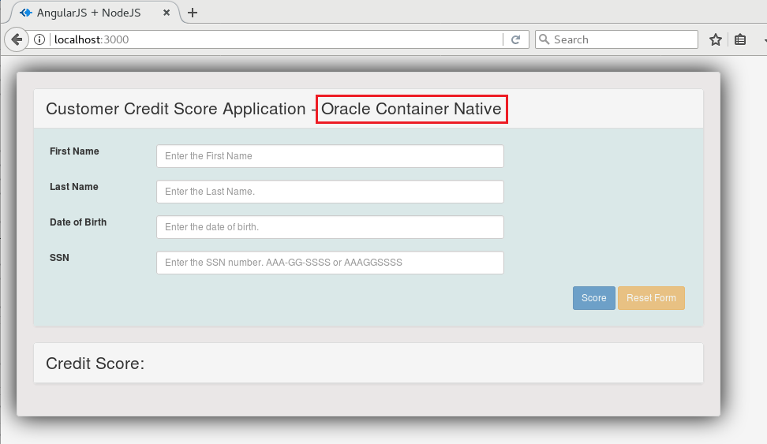

The application runs perfectly and the panel header has to be changed. Before move forward stop the running Docker container.

	$ docker ps
	CONTAINER ID        IMAGE                      COMMAND                  CREATED              STATUS              PORTS                    NAMES
	9ac483cb0a83        local.creditscore:patch2   "node /pipeline/so..."   About a minute ago   Up 59 seconds       0.0.0.0:3000->3000/tcp   distracted_albattani
	$ docker stop 9ac483cb0a83
	9ac483cb0a83

You can use CONTAINER ID and (funny, generated instance) NAME as stop parameter to identify the running image.

The next step is to push the **patch2** local branch to your remote repository on *github.com * what will trigger the Oracle Container Pipelines workflow to test the feature. First commit your changes to **patch2** branch than push to remote repository.

	$ git add views/index.ejs
	$ git commit -m "panel header change"
	[patch2 ea9b8f8] panel header change
	 Committer: oracle <oracle@localhost.localdomain>
	Your name and email address were configured automatically based
	on your username and hostname. Please check that they are accurate.
	You can suppress this message by setting them explicitly:
	
	    git config --global user.name "Your Name"
	    git config --global user.email you@example.com
	
	After doing this, you may fix the identity used for this commit with:
	
	    git commit --amend --reset-author
	
	 1 file changed, 2 insertions(+), 2 deletions(-)
	$ git push origin patch2
	Username for 'https://github.com': johnasmith
	Password for 'https://johnasmith@github.com': 
	Counting objects: 7, done.
	Compressing objects: 100% (3/3), done.
	Writing objects: 100% (4/4), 369 bytes | 0 bytes/s, done.
	Total 4 (delta 2), reused 0 (delta 0)
	remote: Resolving deltas: 100% (2/2), completed with 2 local objects.
	To https://github.com/demo0001/angular-node-creditscore.git
	 * [new branch]      patch2 -> patch2
	
Now you can open browser window/tab sing in to [https://github.com](https://github.com) and check your repository. You have to see your new branch.

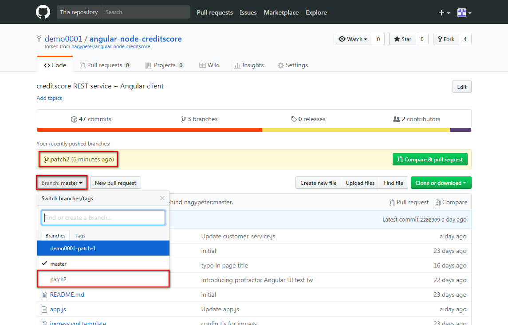

Sign in to [Oracle Container Pipelines](https://app.wercker.com) and check the result of the latest build what was triggered by **patch2** push. Select **Pipelines** and click on your application.

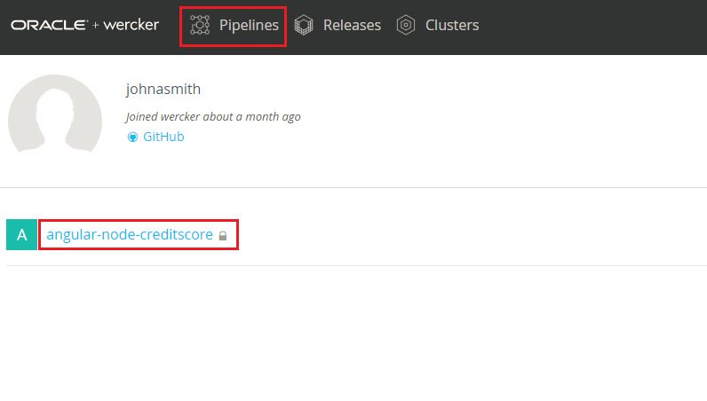

The latest build is related to *"panel header change"* and completes the non-master route of the workflow.

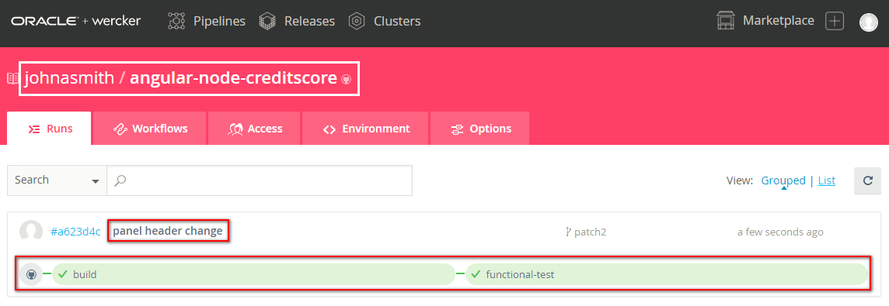

The result has to be successful. Now use *git* client to merge this feature to **master** branch. However usually there has to be an approval process to review the changes what a developer promote to the master branch, but now to simplify the use case the developer (you) are going to merge the tested changes. To do so first check your available branches then switch to **master**, merge **patch2** and push changes to **master** branch on the remote repository (*github.com*):

	$ git branch
	  master
	* patch2
	
	$ git checkout master
	Switched to branch 'master'
	
	$ git merge patch2
	Updating 2208999..fdf35b1
	Fast-forward
	 views/index.ejs | 4 ++--
	 1 file changed, 2 insertions(+), 2 deletions(-)
	$ git status
	# On branch master
	# Your branch is ahead of 'origin/master' by 1 commit.
	#   (use "git push" to publish your local commits)
	#
	nothing to commit, working directory clean
	
	$ git push origin master
	Username for 'https://github.com': johnasmith
	Password for 'https://johnasmith@github.com': 
	Counting objects: 7, done.
	Compressing objects: 100% (3/3), done.
	Writing objects: 100% (4/4), 369 bytes | 0 bytes/s, done.
	Total 4 (delta 2), reused 0 (delta 0)
	remote: Resolving deltas: 100% (2/2), completed with 2 local objects.
	To https://github.com/demo0001/angular-node-creditscore.git
	   2208999..fdf35b1  master -> master	 

Open your browser again where [Oracle Container Pipelines](https://app.wercker.com) is opened and check the result of the latest build what was triggered by **master** push.

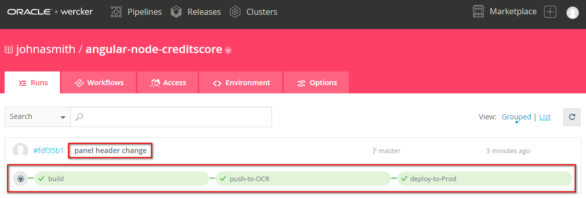

Check the application deployed on Oracle Container Engine. If you don't remember the Public IP address of the NGINX (Ingress Controller) deployed on your Kuberenetes Cluster then click on the **deploy-to-Prod** pipeline.

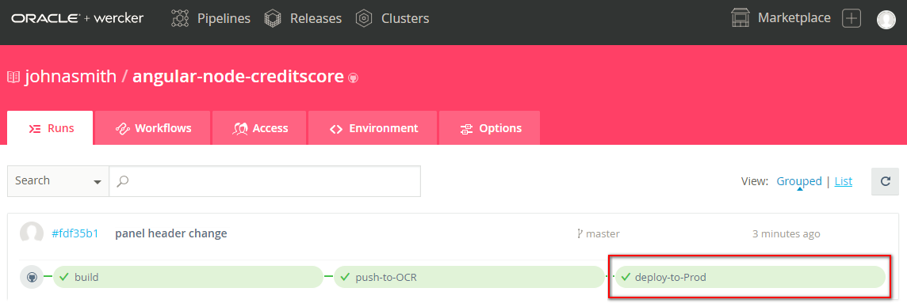

Scroll down to open the *get LoadBalancer public IP address* step and check the log. At the end of the log copy the Public IP address of the Ingress controller.

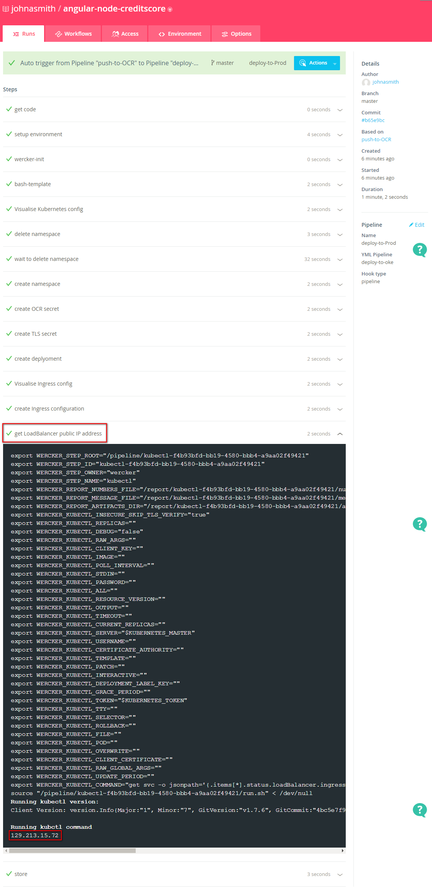

Open a new browser window or tab and open your sample application using the following URL: `https://PUBLIC_IP_ADDRESS/USERNAME/`. Where the USERNAME is your Oracle Container Pipelines (former Wercker) user name. It should be a similar to: `https://129.213.15.72/johnasmith/`

Due to the reason that the proper certification hasn't been configured you get a security warning. Ignore and allow to open the page. Note the change what you made in the panel header.

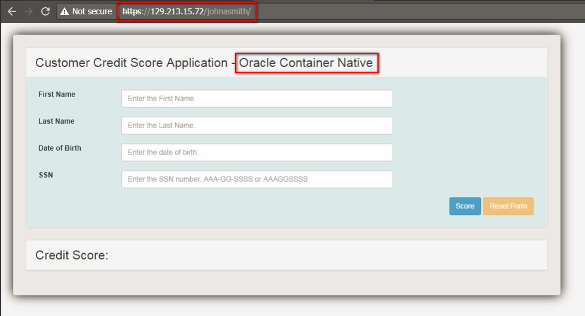

### Run containerized Credit Score sample application from Oracle Container Registry ###

As an extra step which demonstrates interaction with Oracle Container Registry, run your production ready, containerized application directly from the container registry. By default Docker installation connects to Docker's registry (https://registry.hub.docker.com), but using login command you can use other registry to push and pull images. For a successful login you need to provide your username, your authentication token and the simplified URL of the registry. Oracle Container Releases sits on *wcr.io*. You need to have your personal authentication token what was generated and used during the workflow setup. (If you can not find that you can generate a new one. Click on your profile image at the top right corner of the page, select **Your profile** and click on **Manage settings** then select **Personal tokens** menu item. Define a token name e.g. your username and click **Generate**. Make sure to copy your token!)

	$ docker login --username johnasmith --password 0d82df20e90bae7f87840ecc5ac5616c9f44ea8434edadc1a8b63108c56bdf19 wcr.io
	Login Succeeded

If the login was successful use docker run command to start the container available at wcr.io registry under your repository. To find the correct tag name of the latest version of the container open [https://app.wercker.com](https://app.wercker.com) and select Releases. Click on *angular-node-creditscore* image.

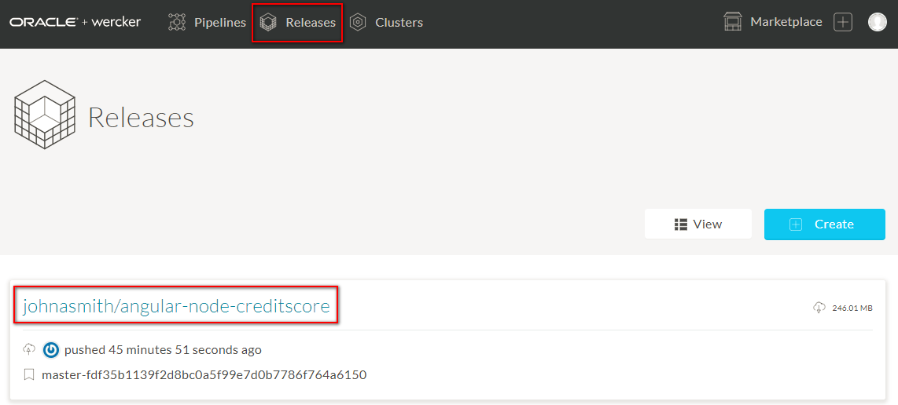

The image tag is constructed in the following way: BRANCH-GIT_COMMIT_SHA. So if you check the latest commit hash in master branch (what was the **patch2** merge) on github.com then you will find the image tag's number part. Open another browser window/tab and go to your repository on github.com and click **commits**.

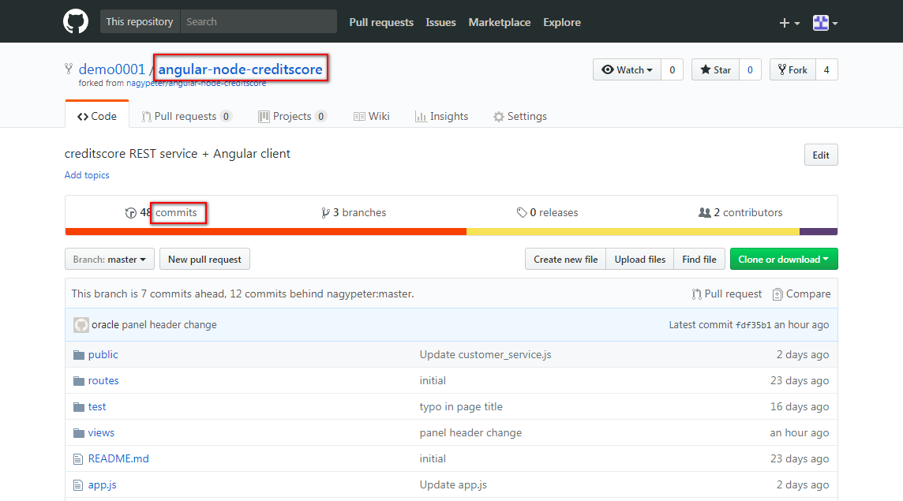

Make sure the master branch is selected and click on the short number which is just the beginning of the SHA number. 

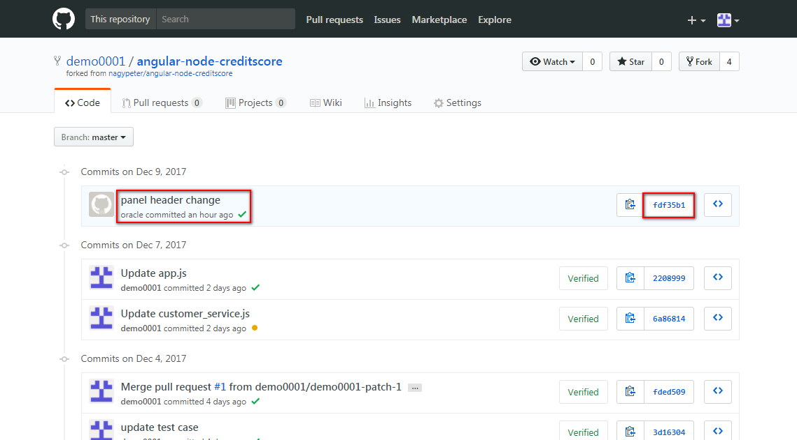

The changes belong to this specific commit appears and you can see the full SHA number. Please note this number.

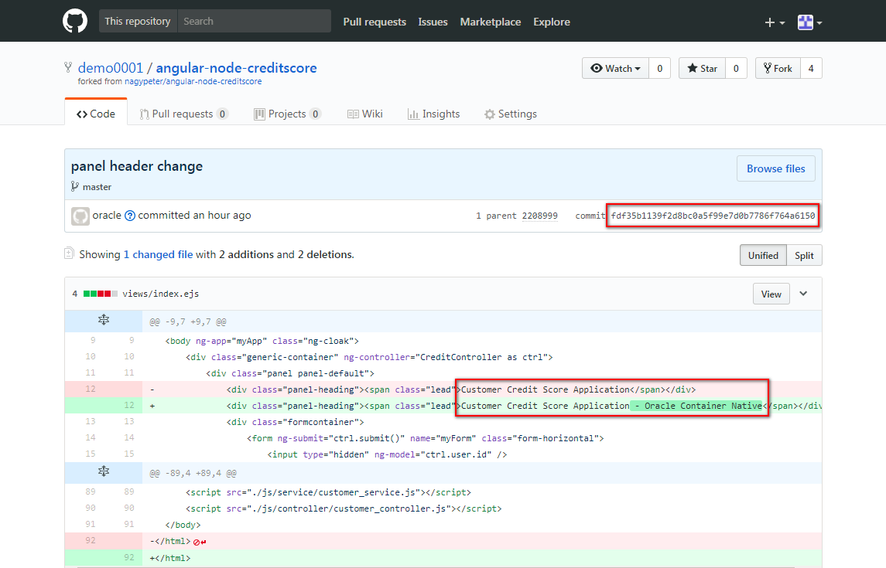

Go back to Oracle Container Releases and find the image which has the same number in its tag. Click the the download icon and copy the full docker pull command using the copy button.

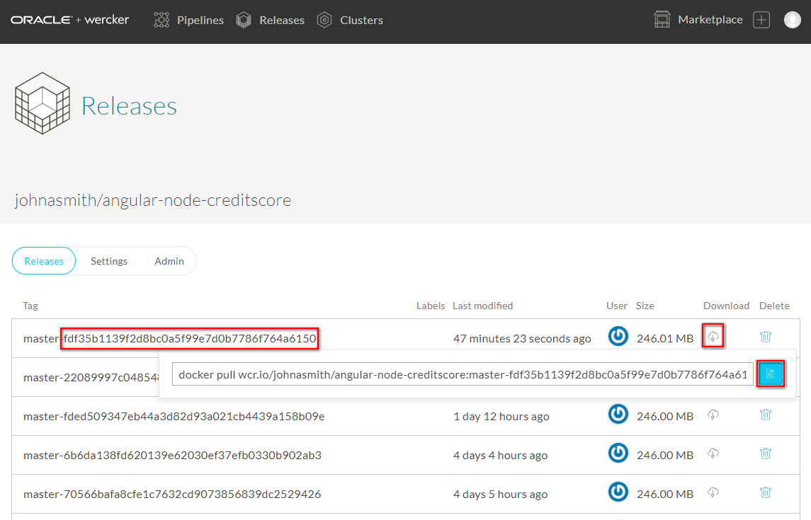

Copy and execute the command in your terminal to pull the image:

	$ docker pull wcr.io/johnasmith/angular-node-creditscore:master-fdf35b1139f2d8bc0a5f99e7d0b7786f764a6150
	cd9a7cbe58f4: Pull complete 
	6b22806153e5: Pull complete 
	da3f2dc8c5f5: Pull complete 
	c4aa92007b30: Pull complete 
	1dee035a3f3e: Pull complete 
	f574b9052ada: Pull complete 
	8399bf571480: Pull complete 
	cb539a5e18fa: Pull complete 
	210888c8fcfb: Pull complete 
	Digest: sha256:6916ba1bff73e5b5a9da4865127161179f2725f416cfcbcfb46f23e4b5c44052
	Status: Downloaded newer image for wcr.io/johnasmith/angular-node-creditscore:master-fdf35b1139f2d8bc0a5f99e7d0b7786f764a6150

List the available docker images on your desktop:

	$ docker images
	REPOSITORY                                   TAG                                               IMAGE ID            CREATED             SIZE
	wcr.io/johnasmith/angular-node-creditscore   master-fdf35b1139f2d8bc0a5f99e7d0b7786f764a6150   cae287ca7505        About an hour ago   662MB
	local.creditscore                            patch2                                            7436d6fc67ac        2 hours ago         674MB

Now run your image what was pulled in the previous step from wcr.io:

	$ docker run -d -p3000:3000 wcr.io/johnasmith/angular-node-creditscore:master-fdf35b1139f2d8bc0a5f99e7d0b7786f764a6150
	5411909415ae530580737a62b6cb2151b3fb95aa90d49f7074895ad24435c313
	
	$ docker ps
	CONTAINER ID        IMAGE                                                                                        COMMAND                  CREATED             STATUS              PORTS                    NAMES
	5411909415ae        wcr.io/johnasmith/angular-node-creditscore:master-fdf35b1139f2d8bc0a5f99e7d0b7786f764a6150   "node /pipeline/so..."   4 seconds ago       Up 3 seconds        0.0.0.0:3000->3000/tcp   ecstatic_heyrovsky
	
Open the application in your browser at [http://localhost:3000](http://localhost:3000) and fill the required data and click **Score**.

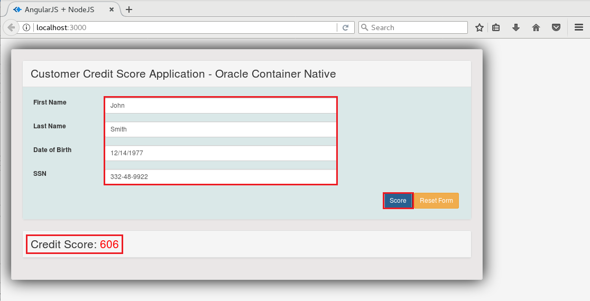

Finally check the application's log using the `docker logs` command. You need the CONTAINER ID of your running container, thus first run `docker ps --format "table {{.ID}}\t{{.Image}}\t{{.Status}}"` using output format focusing on the neccessary information:

	$ docker ps --format "table {{.ID}}\t{{.Image}}\t{{.Status}}"
	CONTAINER ID        IMAGE                                                                                        STATUS
	5411909415ae        wcr.io/johnasmith/angular-node-creditscore:master-fdf35b1139f2d8bc0a5f99e7d0b7786f764a6150   Up 5 minutesovsky
	
	$ docker logs 5411909415ae
	Express server listening on port 3000
	GET / 304 62ms
	GET /js/angular_app.js 200 73ms - 138b
	GET /js/controller/customer_controller.js 200 83ms - 834b
	GET /js/service/customer_service.js 200 83ms - 635b
	GET /stylesheets/app.css 200 87ms - 580b
	Request body: { id: null,
	  firstname: 'John',
	  lastname: 'Smith',
	  dateofbirth: '12/14/1977',
	  ssn: '332-48-9922',
	  score: '' }
	POST /creditscore 200 19ms - 98b

Compare the values in the log what you provided on the user interface.

Stop your container use `docker stop` and the ID of the running container:

	$ docker stop 5411909415ae
	5411909415ae

To remove your local images first use `docker images` to list available images on your desktop and get their IMAGE IDs or REPOSITORY:TAG what is necessary to delete. Execute the remove image command and specify which image you want to remove:

	$ docker images
	REPOSITORY                                   TAG                                               IMAGE ID            CREATED             SIZE
	wcr.io/johnasmith/angular-node-creditscore   master-fdf35b1139f2d8bc0a5f99e7d0b7786f764a6150   cae287ca7505        About an hour ago   662MB
	local.creditscore                            patch2                                            7436d6fc67ac        2 hours ago         674MB
	
	$ docker rmi -f local.creditscore:patch2
	Untagged: local.creditscore:patch2
	Deleted: sha256:7436d6fc67acdf9e673b499ff7561ebd9c95643c06c647106370842f4dbcf8c6
	
	
