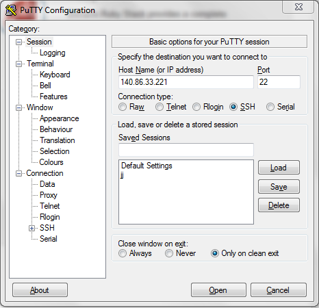
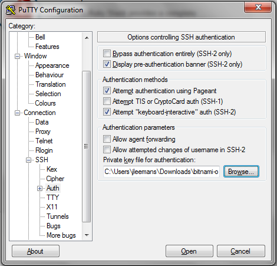
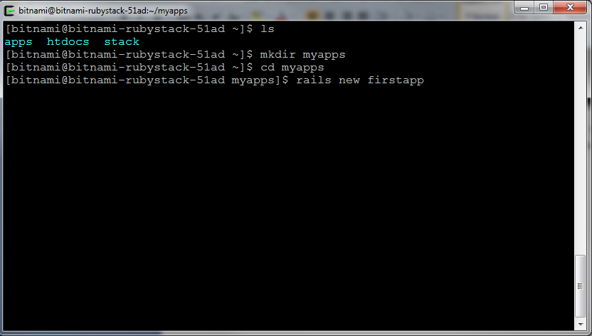
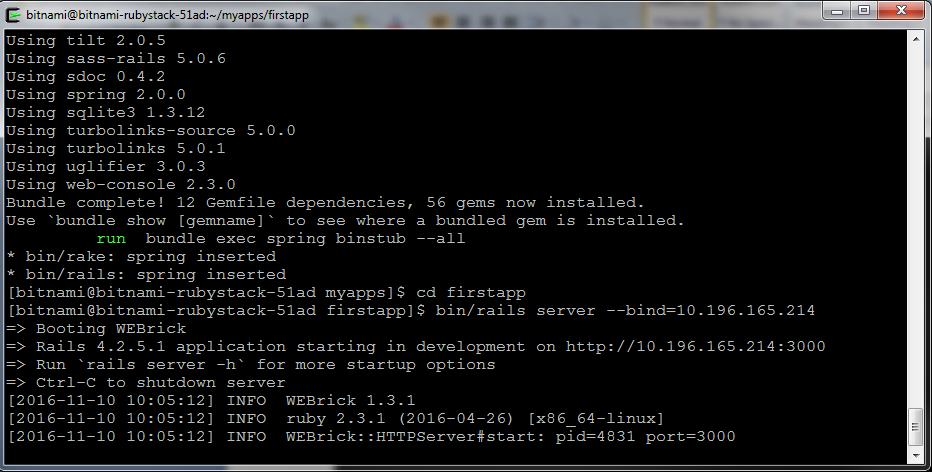
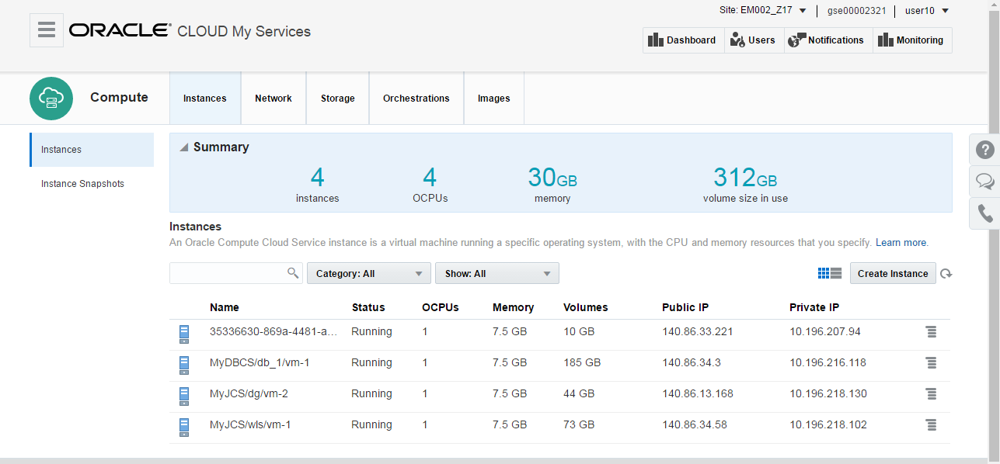
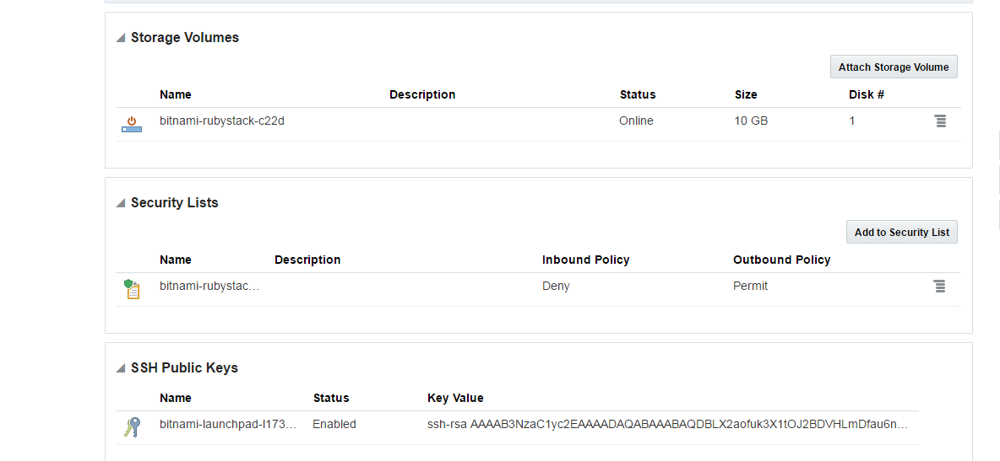
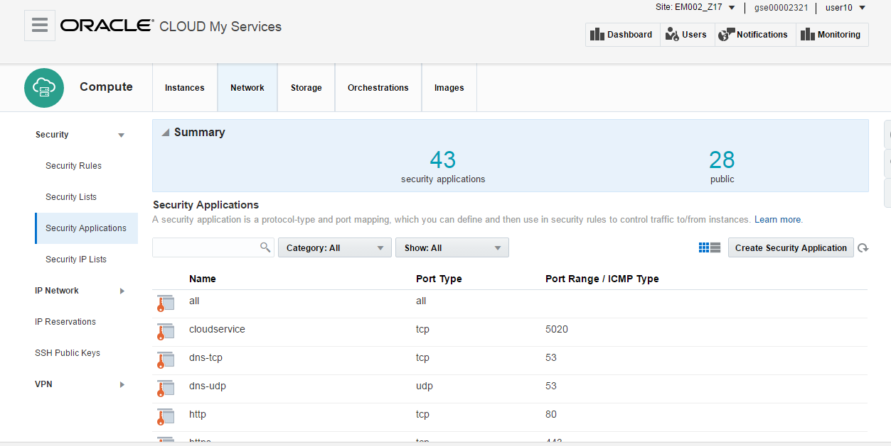
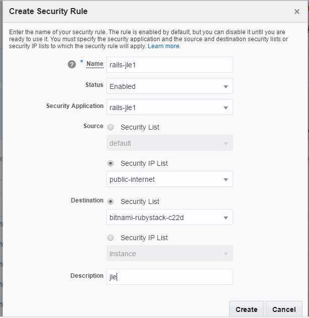
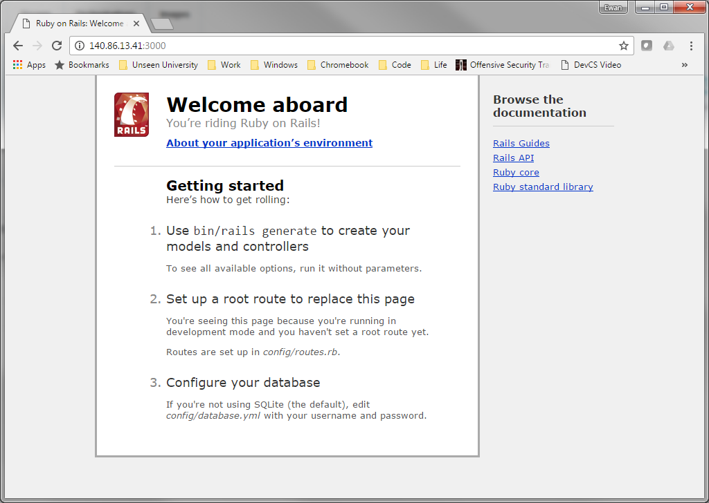

---
### ORACLE Cloud Test Drive Event ###
## Connecting to your Ruby instance on the Oracle Compute Cloud ##

First download the SSH keys of your new instance from the Bitnami Console window (ppk and pem files)

Now make sure you have a ssh tool on your PC.  If you don't have this, you can download [putty](bin/putty.exe) for this.

Use the public IP address of your instance you got from the Bitnami console

Go to the "SSH" and "Auth" menu, and select the private .ppk file you downloaded earlier

when prompted for "login", enter : bitnami

You should now have a command-line on your new instance !

If you run ifconfig, you will see the private ip of the instance and localhost.  Note that the private ip address is the same as the private ip address of the instance when viewed in the Oracle Cloud Compute console.
+ Take a note of this private IP address

Now execute following commands :
+ Create a directory myapp :  mkdir myapp
+ Move into this directory : cd myapp
+ Now create the new app called "firstapp" in Ruby : rails new firstapp

This will create a directory "firstapp", containing a skeleton rails application.

Start the application, substituting the private ip address of your VM for the binding:

+ Move into the firstapp directory : cd firstapp
+ Start the new application using the private IP address for your VM binding : bin/rails server --bind=10.196.165.214

  
WEBrick should start.
Leave the window open and the server running.

Now go back to your Oracle Cloud Console, 
+ Go to the Compute console:
+ Locate your instance - use the public IP address you received on the Bitnami console. If you can't find your instace in the list, try changing the Site in the top right corner of the browser.

Click on the instance and take a note of its security list.
+ You need to hover over the name of the security list, this will look like "bitnami-rubistack-c22d".

Now we will create a new security application (“e.g. rails- <your-user-id>”) for TCP on port 3000:
+ Go to the "Network" tab on the top of the console
+ Select the "Security Applications" on the left side

+ Hit the "Create Security Application button" and fill in following parameters:
+   Name = rails-<your-user-id>
+   Port Type = TCP
+   Port Range Start = 3000
+   Port Range End = 3000
+   Hit the create button

Now we will create a new security rule : 
+ Go to the "Security Rules, on the left of the screen
+ 	Name = rails-<your-user-id>
+   Select the security application you just created
+   For Source, select the type "Security IP List", then select "public-internet" in the drop-down
+   Destination: use "Security list", then select the security list of your bitnami image you wrote down earlier (format "bitnami-rubystack-c22d"

This should have opened your Bitnami VM to traffic from the internet on port 3000.
Check by browsing to the public ip of your image and port 3000.  You should see the “Riding the Rails” page:
 

You're done ! Your Ruby on Rails instance is up and running, and accessible from the internet
