---

### Prerequisite : Compute REST endpoint

As a prerequisite for this lab, you need to collect some information from your Compute Cloud environment.  For this, go to your Cloud Dashboard and click on the “Compute” topic to go to the service Dashboard.
Next copy the “Rest Endpoint” for your Compute Cloud service as shown below:

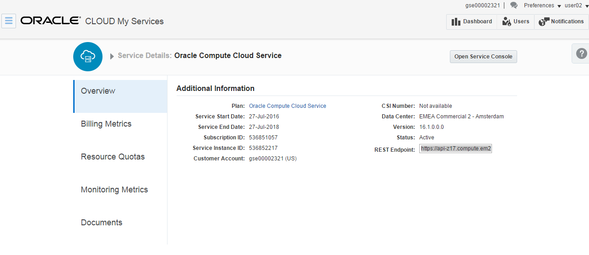

## Create a Bitnami account ##

Bitnami is a company that supplies pre – built images of common application stacks.  These can then be used to develop and run applications.
An extensive range of Bitnami images are available for deployment on the Oracle Cloud Platform IaaS Compute service.  The available stacks include application infrastructure components such as LAMP, Tomcat and Ruby.  The full range of images can be found [here](http://oracle.bitnami.com/).

In this exercise we’re going to walk through deployment of the Ruby image which includes both the Ruby runtime and Rails a popular web application framework that runs on it.
 
The first thing that we need is to log into Bitnami.  Go to http://bitnami.com/sign_in

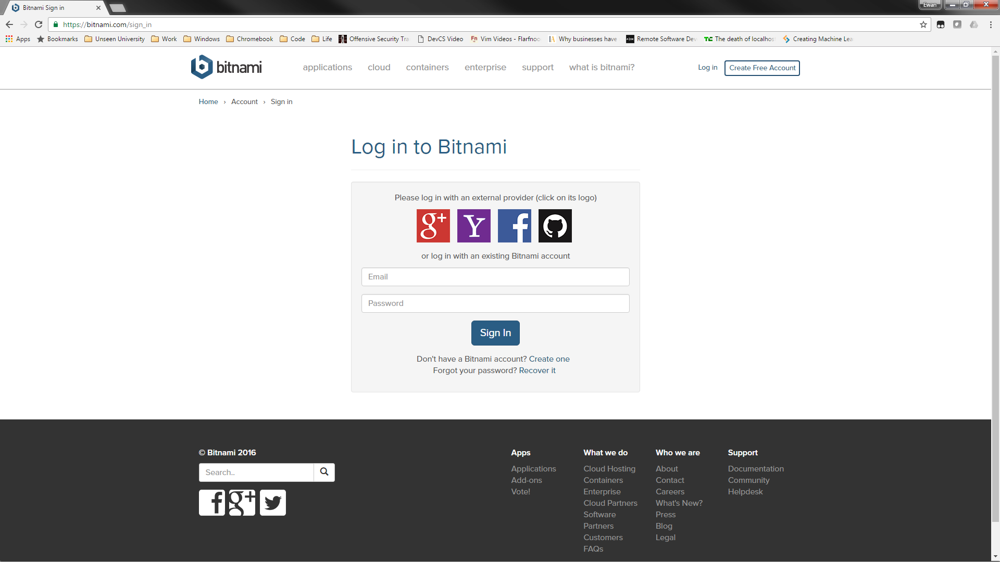

You can either create a Bitnami account here or just use an external provider to log in (I’m going to log in with my Google account).
You’ll get sent an email with a link in to verify your email address.  Once you are logged in, click on “Console”:

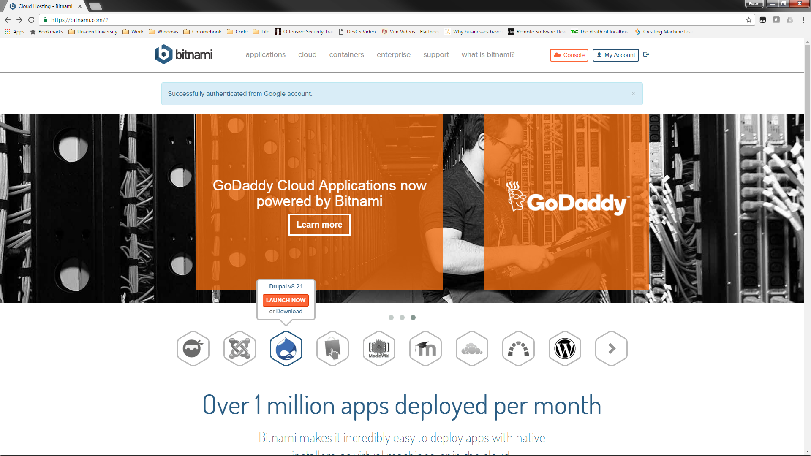
 
This gives you a choice of cloud “launchpads”.  Click on the Oracle Launchpad:
 
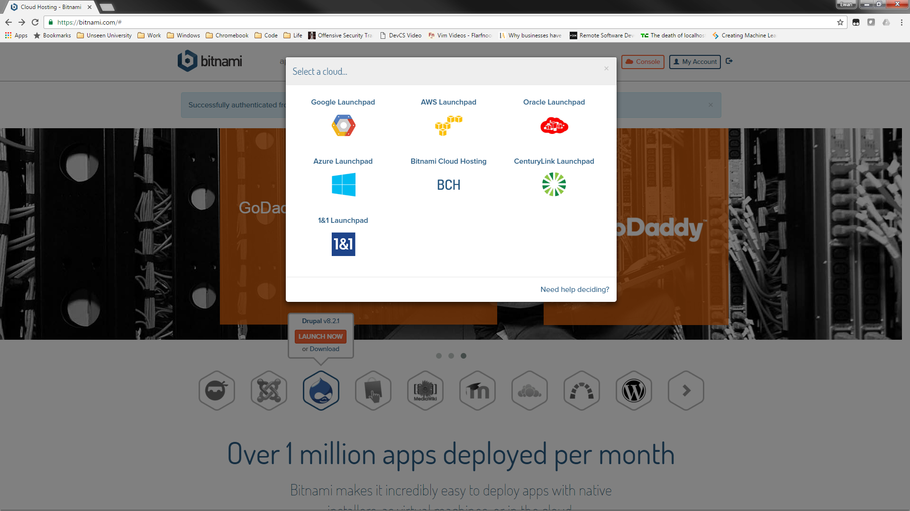
 
This opens the Bitnami library for Oracle.  Scroll down and select Ruby:

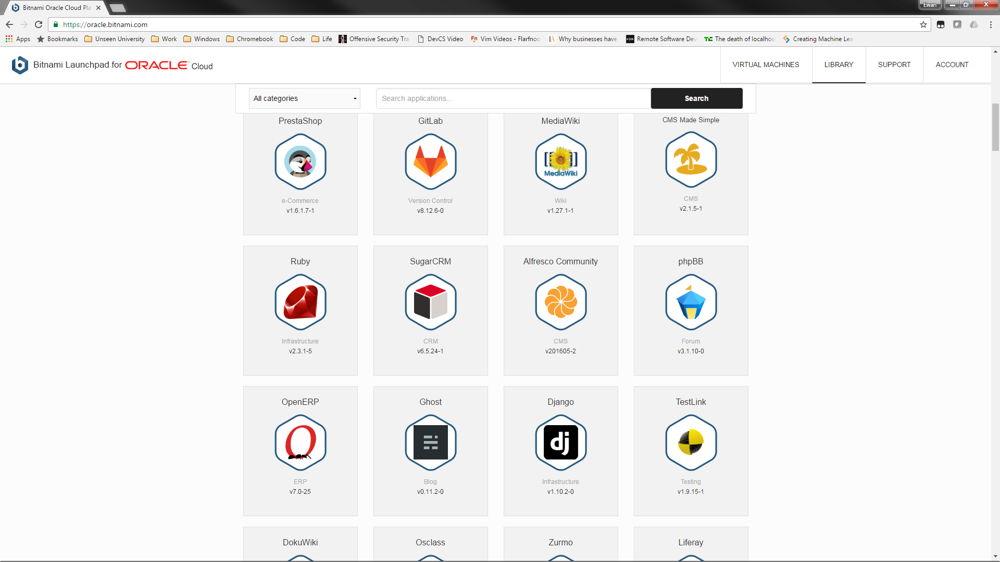

When you hover over it you’ll see a “Launch” button, and a “Learn More” link.

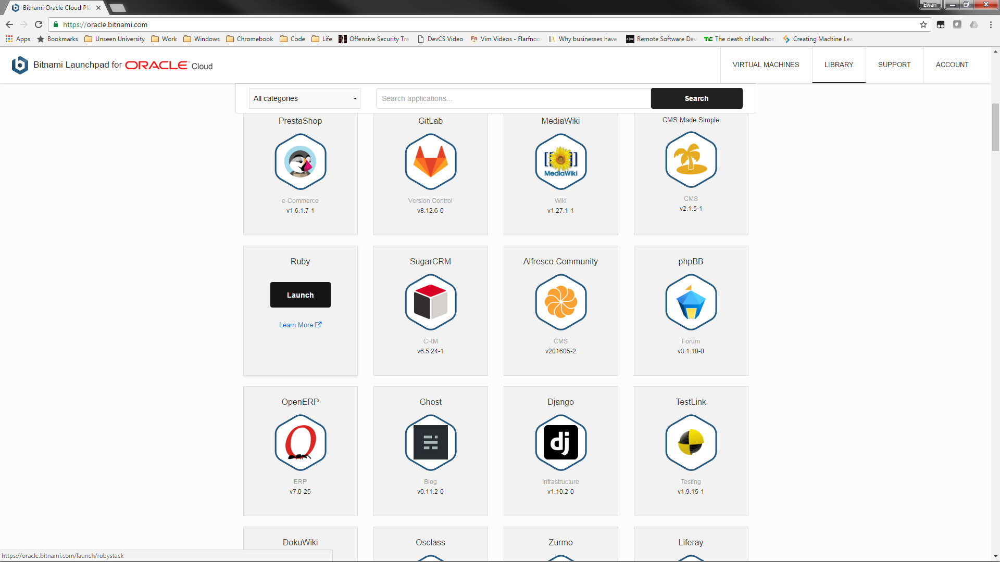
  
Click on “Learn More” and a new tab will open giving you a full description of the image:

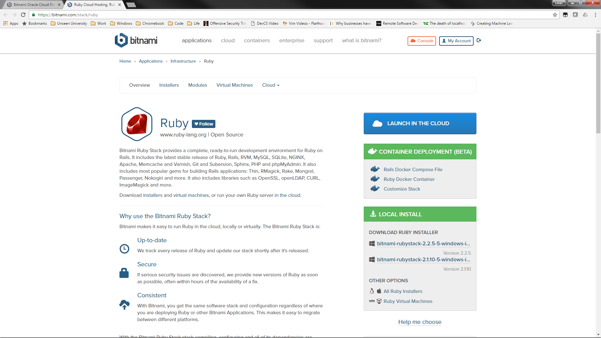
 
We can see that this image offers us a complete Ruby / Ruby on Rails environment.
Go back to the launchpad tab and click on launch:

 
If you already have an account, you will then need to unlock your Bitnami vault where your SSH keys are held:

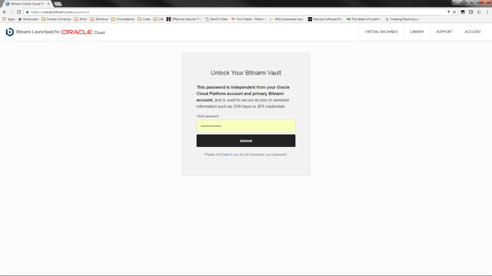

 
Then you need to add your Oracle cloud account so Bitnami can access your cloud environment to create a VM.  Click “Add cloud account”:
 
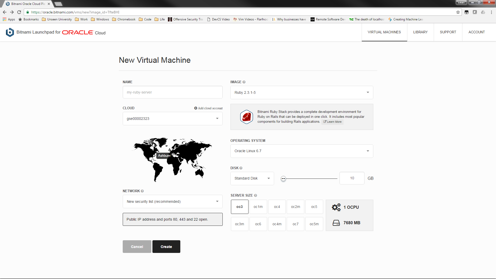
 
If you’re doing this for the first time you will need to set up your Bitnami vault for SSH keys:

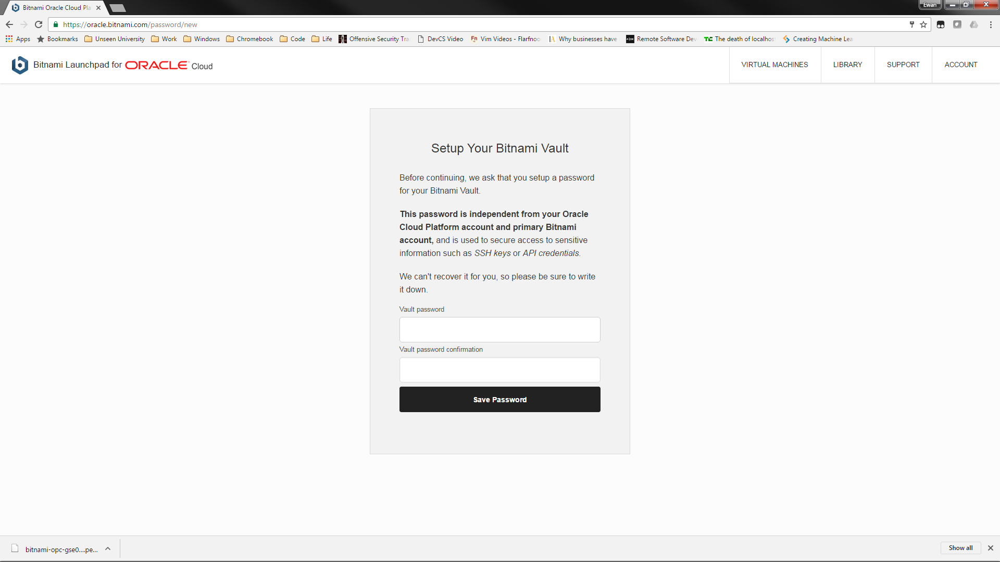
 
Enter the Oracle Cloud identity domain (eg gse000023xx), and your Oracle Cloud credentials (<Userxx> and password), and the Compute REST API endpoint you noted down earlier in the exercise, then click “Continue”:

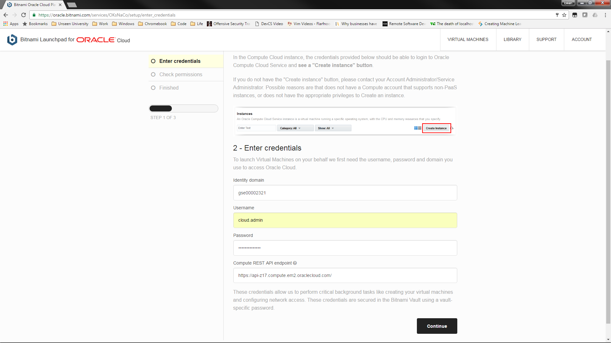

 
You should see this screen:

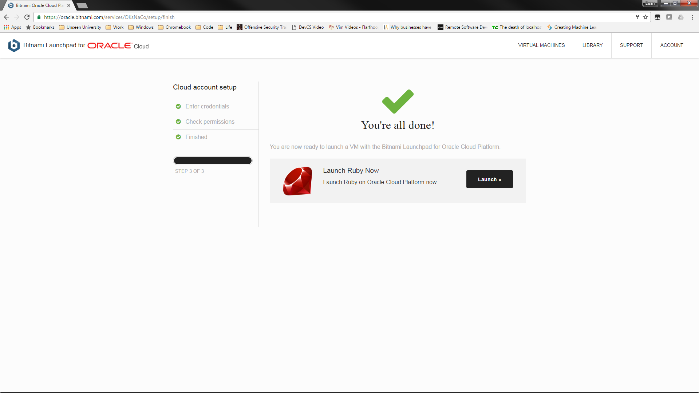
 
Then click “Launch”.  Choose server size, disk capacity and OS (I’m just taking the defaults), then click “Create”:
 
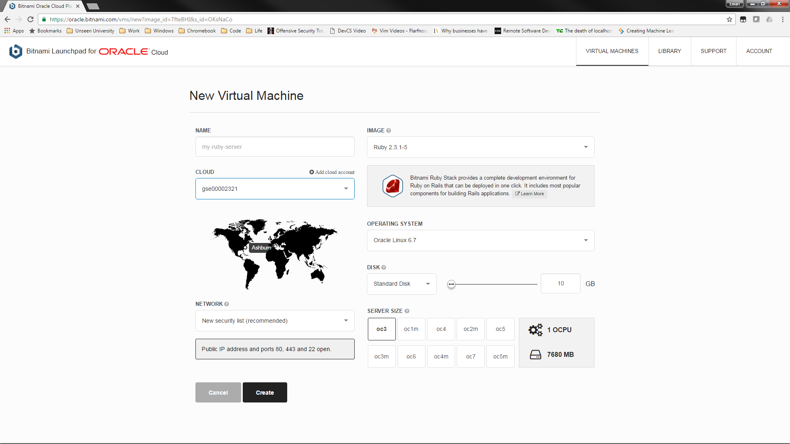
 
The VM will then be created (go for a coffee while this happens : expect this to take approx. 12 minutes):

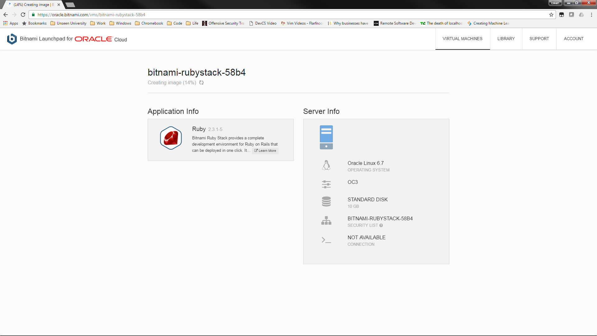

Once it is completed you will see the following:
 
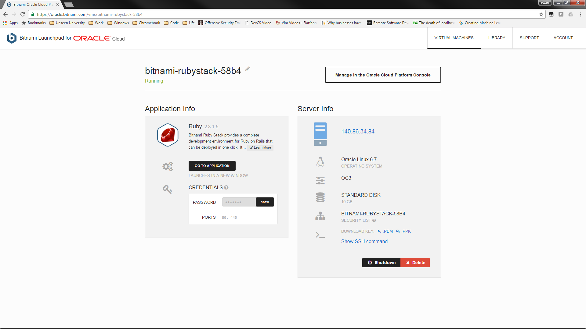

Your Ruby image is now up and running ! Go back to the overview and take the next step to access your Ruby instance.
