---

In this lab we will be using the Marketplace to deploy a Tomcat Image file onto a Compute node on the Oracle Cloud. 

## Using the Create Image wizard ##

Go to your Cloud Console, and click on the "Instance" text in the "Compute" pane

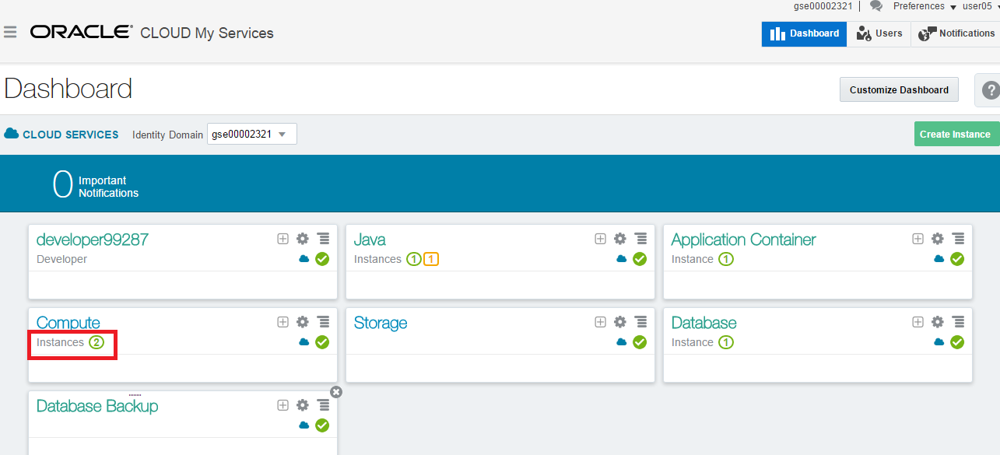

Now you can see the already defined instances, and use the **"Create Instance"*** button to start the creation wizard of a new instance:

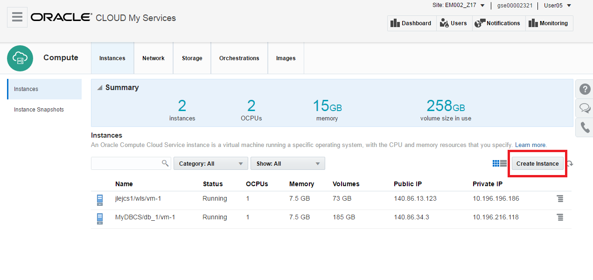

On the image creation creen, select "Marketplace" on the right side
Now you can use the search function to locate all the images containing the word "Tomcat"
Once you have the right selection, you select the Tomcat image on Ubuntu

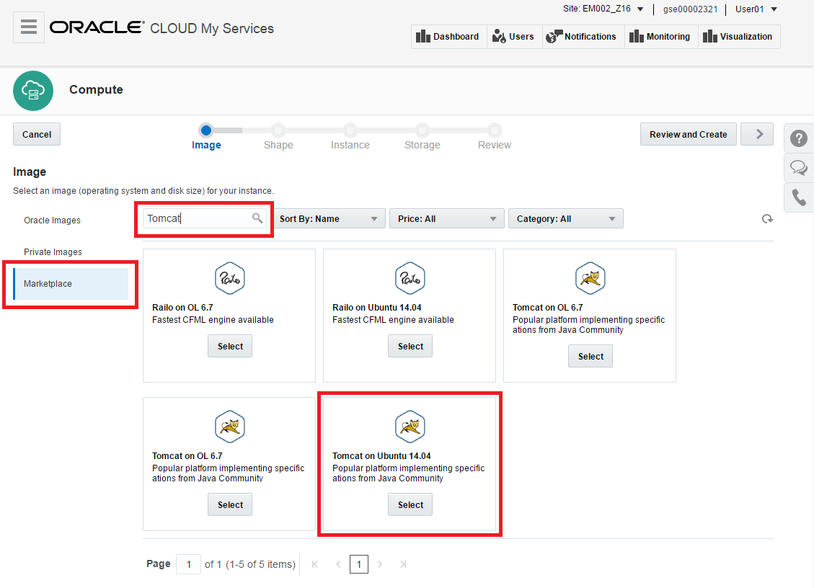

After hitting the "Select" button, you will get a dialog box asking you to accept the Oracle Terms of Use.
Check the checkbox and hit "Install".

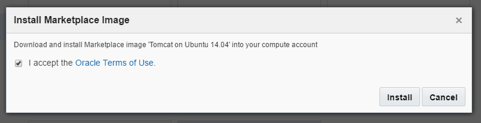

Now  you will see your image is "Selected", click on the right arrow on the top right

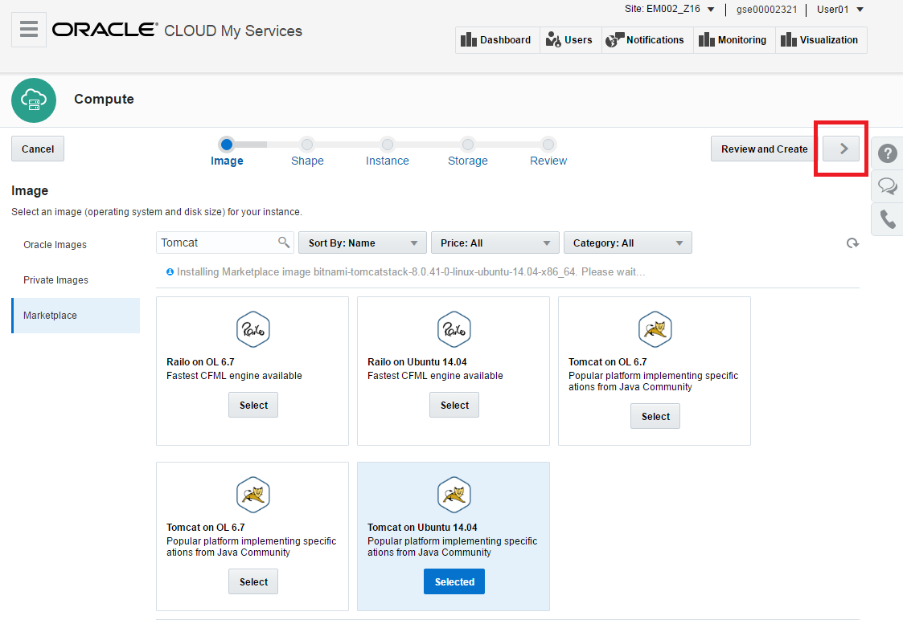

In this screen you can select your compute shape.  To conserve resources, choose the smallest shape (General Purpose, oc3, 1 OCPU, 7.5 GB)
Now hit the "Next " button ">" in the top right.

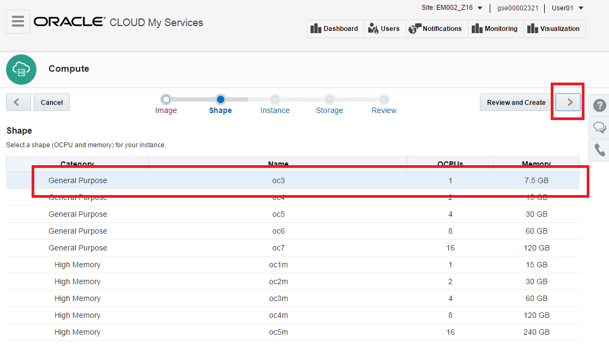

On the next screen, "Instance", you have to enter a few parameters :
+ Name: choose a simple name containing the "userxx" account you are using, so you will recognize your image easily
+ Label: choose the same as the name
+ SSH Keys: in order to manage the instance and access the console, you will use a public/private key when establishing an ssh connection.  You can use the keys we prepared for this lab ([public](bin/ctd_pub.pub) / [private](bin/ctd_priv.openssh)), or create your own key using for example puttygen

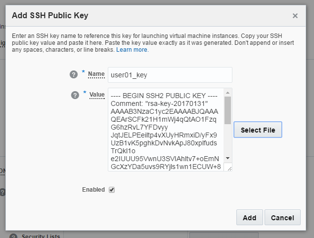

Leave all other parameters as per default, and hit the "next" button ">"

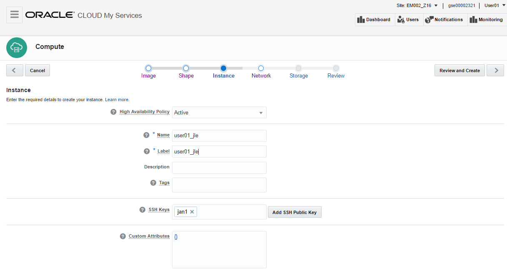

On the "Network" page, you will create a new security list.  
+ Hit the "Create Security List 
+ Enter a name containing your username (e.g. user01_aa)
+ Keep the default parameters for the Inbound and Outbound policies

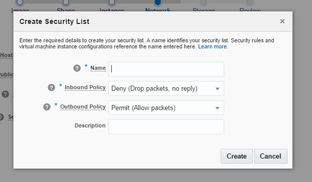

After creating the Security List, hit the **">"** button.

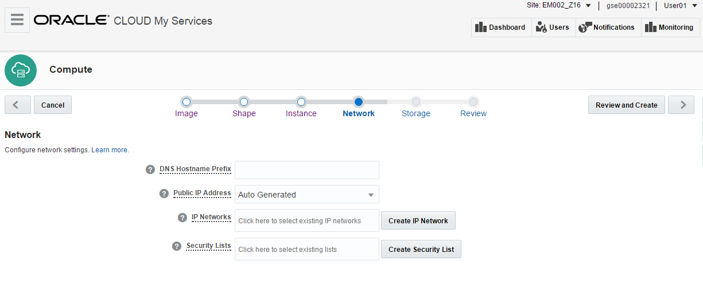

On the storage page, take all default parameters and hit the "next" button ">"

Tou have now arrived at the Review screen.  Check all your paramaters and hit "Create".

## Following the creation process ##
As the image is created (this takes approx. 5 minutes), we will follow the various steps :

+ Check the "Orchestrations", you will see 3 entries containing the name you gave your image

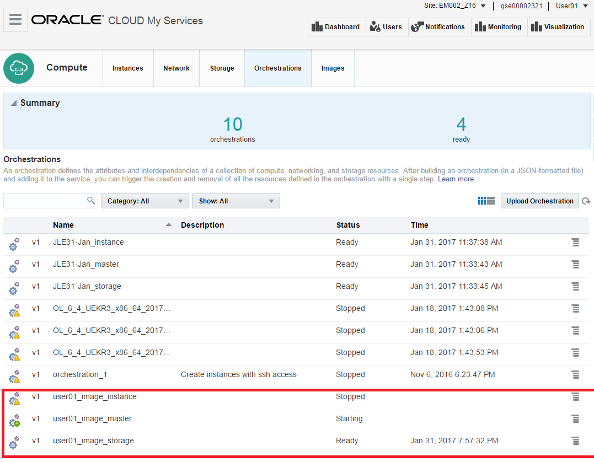

+ Check the "Storage Volume" page, this will contain the storage volume you specified in the wizard
+ Check the "Instances" page, you will see your image appear and go into state "Running".

Now we will open HTTP access to this image to make the Tomcat instance accessible from your browser.

Navigate to the "Network" tab (on the top menu)

We will create a Security Rule and associate it with the Security List you already created earlier.

+ Navigate to the "Security Rule" menu (on the left)
+ Hit the "Create Security Rule" button, and enter the following parameters:

+ Name: pick a name containing your username (example: user01-http-access)
+ Security Application: select "http" from the drop-down menu
+ source: select radio button "Security IP List"
+ then select "public-internet" from the "Security IP List" drop-down menu
+ Destination: select radio-button "Security List"
+ then select the security list you created previously

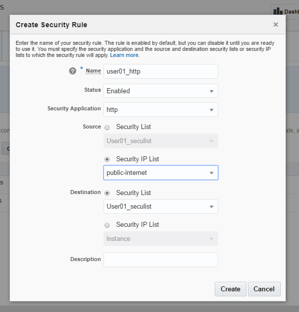

+ On the "Instances" page, use the hamburger symbol besides your image to select "View"

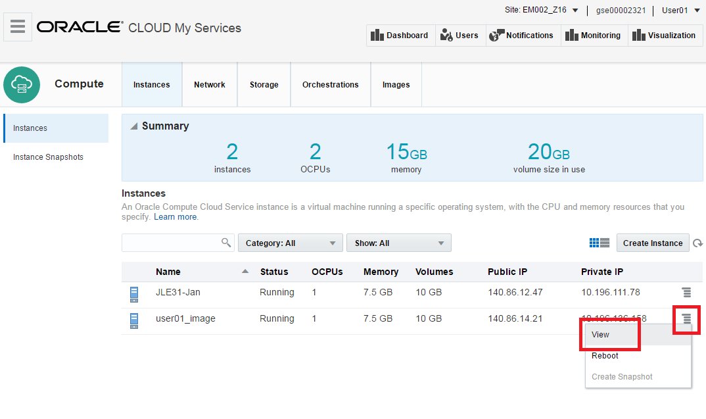

Note the "Public IP Address" value.

You can now use a browser to go to this address, and the Tomcat console should appear:

**ATTENTION !**
If you are executing this Lab in an Oracle office, and you are using the guest network, this last step might get blocked by the security policies on this network.  Just use your mobile phone and enter the URL (http://ip_address) and you should see the welcome screen.  Note the amount of data downloaded in this step is minimal.

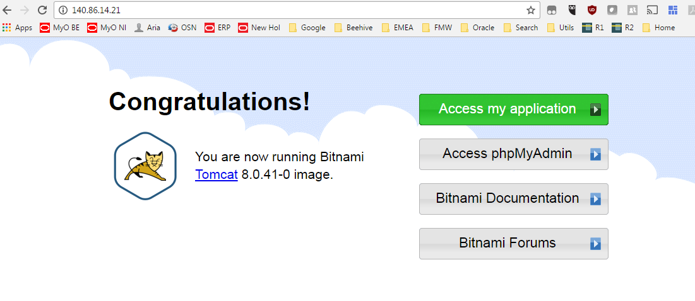

