[Go to Overview Page](../../README.md)

## Container Native lab ##
### Import and deploy a Glassfish Docker image onto Oracle Container Cloud Service ###

### Introduction ###
In this lab we will import and deploy a Glassfish Docker image onto the Oracle Container Cloud Service (OCCS).  The Glassfish image is not included by default, we will download it from the Docker repository.

### Pre - requisite Creation of a Container Cloud Service ###
The instructors will have created a Container Cloud service for your team to use.  The link to the Container Admin Console will be provided in the Access Document you will receive.  If you are doing these labs on your own, make sure to first set up a running Container Cloud instance from the Cloud Services dashboard.

### Open the OCCS console ###
Follow the link provided to the Container Admin console.  At this point your browser may complain about a self signed certificate.  Accept the certificate and proceed to the console.

Enter the credentials supplied by the instructors.

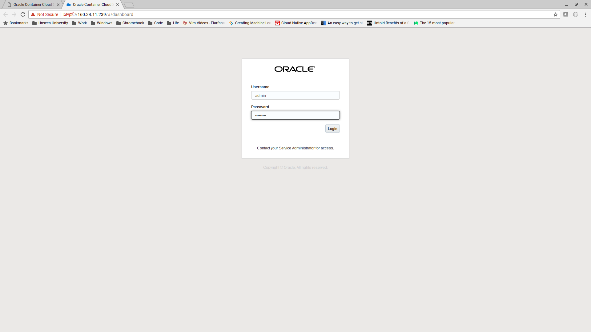

You should now see the Dashboard.

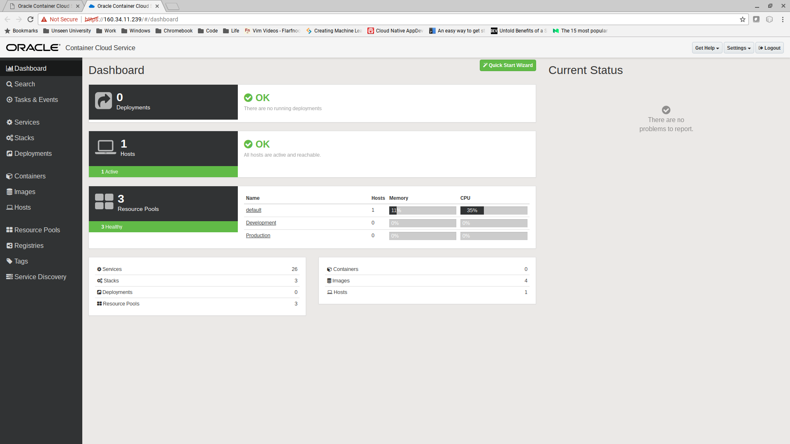

### Create a new service for Glassfish

Click on Services.  Each of the "services" in the list represents a container and configuration ready for deployment onto OCCS.

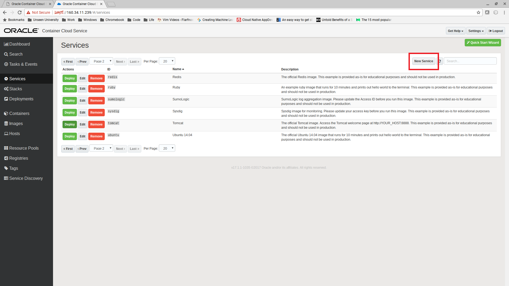

Click "New Service" to go to create a new service for Glassfish.

The service editor dialog box will open.  Fill in the basic details as shown:
- Service name : "glassfish-user01", please use your own user name
- Service description : "glassfish-user01" 
- Image : oracle/glassfish:latest

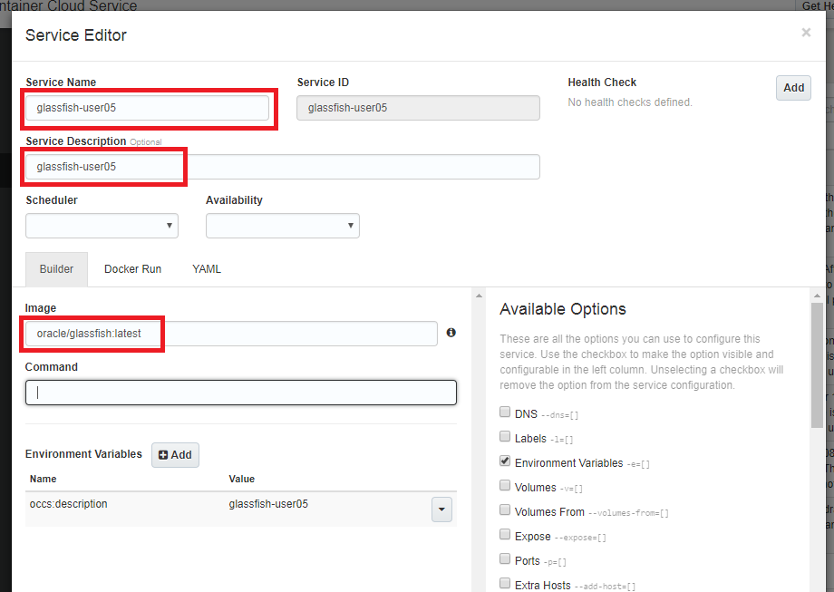

To be able to access the container from the outside world we need to add port mappings.
Each mapping routes traffic from \<host>:\<port> to \<container>:\<port>. But since we are all working on the same instance, we'll calculate an individual Host Port portnumber for each service :

- click on the "Ports" checkbox under "Available Options" on the right side of the screen
- click "+Add" in the "Ports" section that has appeared on the bottom left
- Add the three port mappings:
- - Host Port : Enter the sum of 8080 + your user number for the Host Port : e.g. user05 will use port 8080 + 5 = 8085
- - Container Port : 8080
- - Protocol : TCP
- Repeat this step for the 2 other Port Mappings, each time adding your own user number to the Host Port number:
- - using 8181 for the 2nd
- - using 4848 for the 3rd

For example the 8080 mapping for user 05 should look like this:

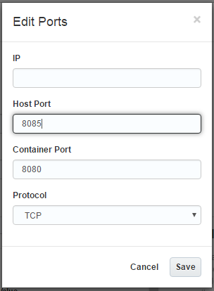

The completed form should look like this:

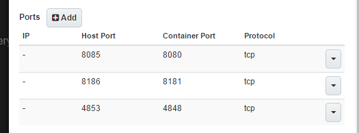

Click on "Save".

The Glassfish service should now be shown in the "Services" list.  
- Click on "Deploy" for the service you just created

Take the defaults in the deploy glassfish dialog and click "Deploy".

The glassfish image should be downloaded and deployed to OCCS.

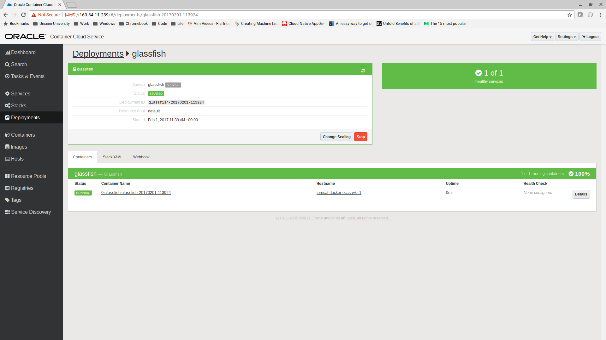

Click on the hostname link.  This is the host on which your image is deployed.

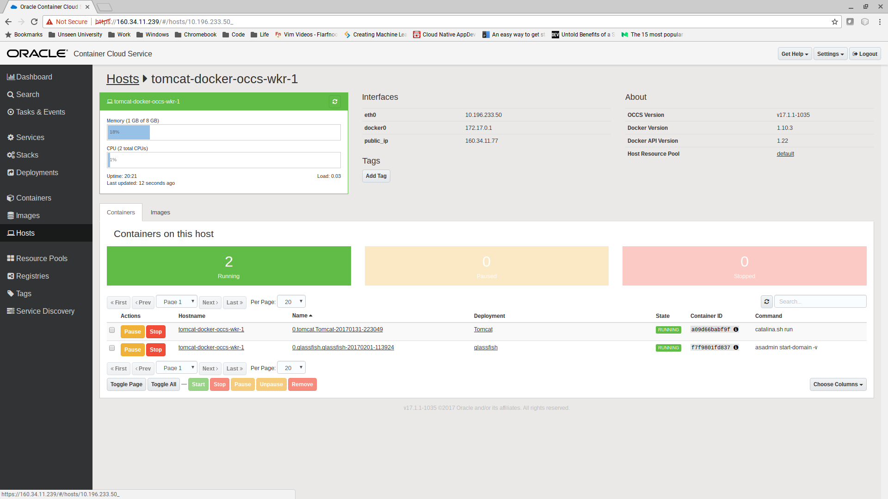

- Take a note of the IP address
- now browse to http://<host-ip-address>:8080 (plus your usernumber, e.g. 8085) to see the Glassfish welcome screen.
- now browse to http://<host-ip-address>:4848 (plus your usernumber, e.g. 4853) to see the Glassfish Administration Console Login form.

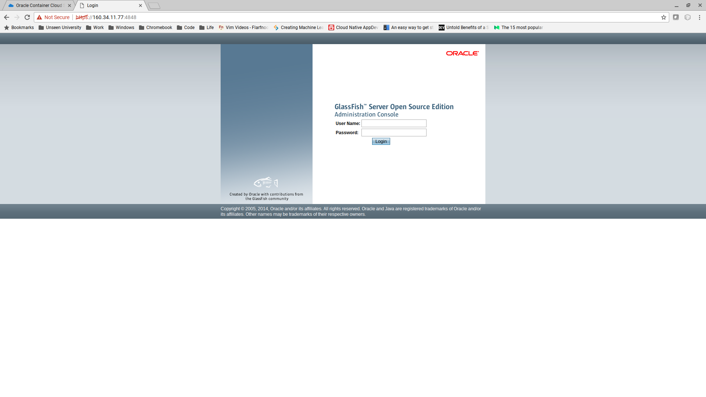

To login you must first copy the password for this instance from the container log file:
- Navigate to the "Containers" menu
- Identify your instance and click on the container name

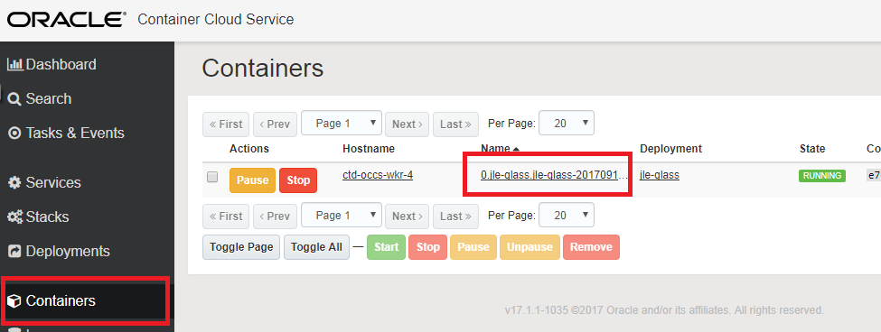

- Click on the "View Logs" button.  The password is in the first line of the logfile

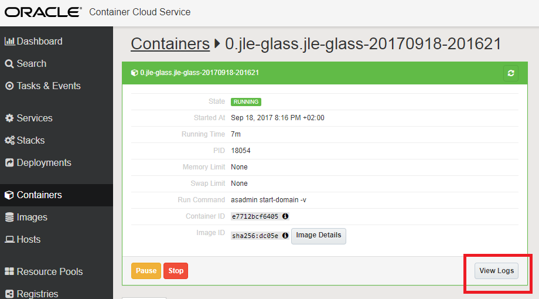

Now you can login with username = admin and the password you just copied from the logfile.  You should now see the login console.

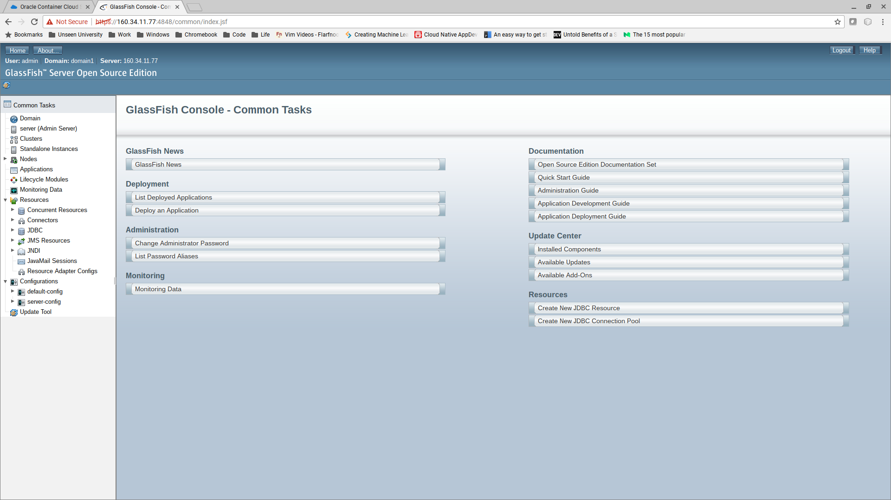

To end the exercise, you can stop and remove the various artifacts you created: 

Go to "Deployments" and click "Stop".

Wait for Glassfish to stop and then click "Remove".

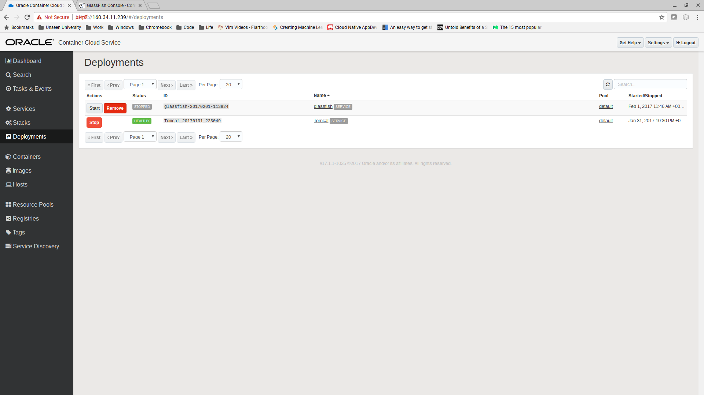

Once the deployment has disappeared, go to "Images" and click "Remove" for the Glassfish image.

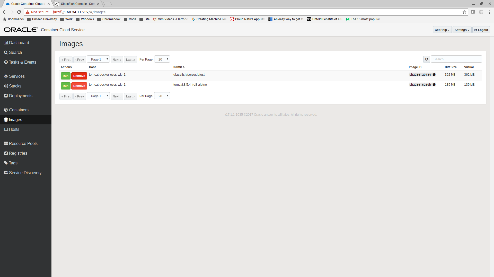

Then go to "Services" and click "Remove" for the Glassfish service.

You can now repeat the lab.

---
[Go to Overview Page](../AppDevInfra.md)
