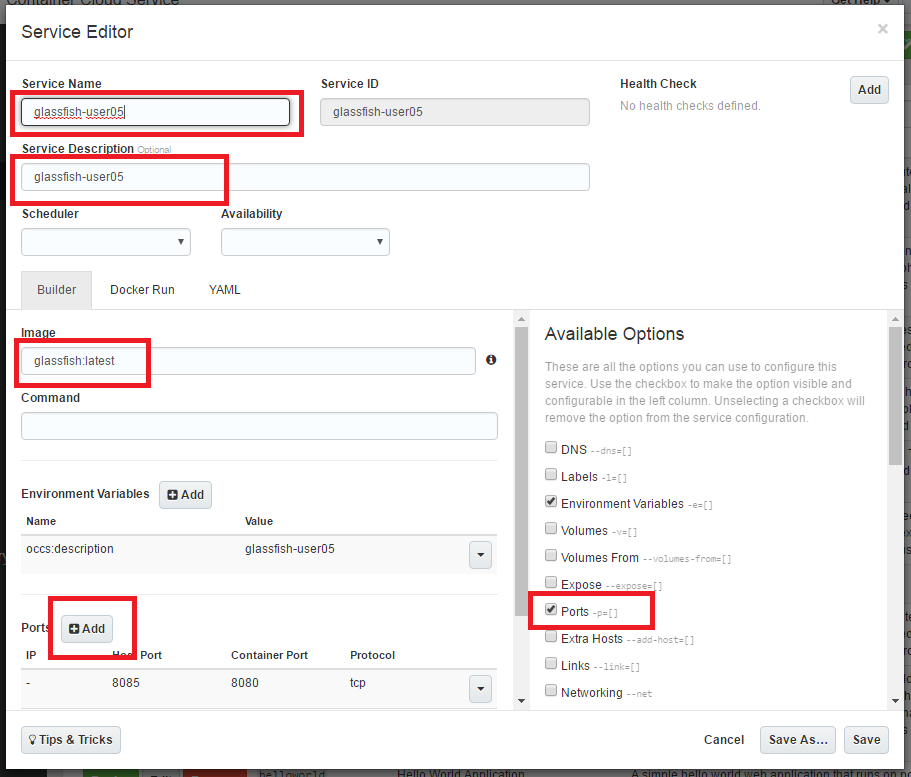

---
# ORACLE Cloud Test Drive Event
----
## Import and deploy a Glassfish Docker image onto Oracle Container Cloud Service

### Introduction
In this lab we will import and deploy a Glassfish Docker image onto the Oracle Container Cloud Service (OCCS).  The Glassfish image is not included by default, we will download it from the Docker repository.

### Pre - requisite Creation of a Container Cloud Service
The instructors will have created a Container Cloud service for your team to use.  The link to the Container Admin Console will be provided in the Access Document you will receive.  If you are doing these labs on your own, make sure to first set up a running Container Cloud instance from the Cloud Services dashboard.

### Open the OCCS console
Follow the link provided to the Container Admin console.  At this point your browser may complain about a self signed certificate.  Accept the certificate and proceed to the console.

Enter the credentials supplied by the instructors.

You should now see the Dashboard.

### Create a new service for Glassfish

Click on Services.  Each of the "services" in the list represents a container and configuration ready for deployment onto OCCS.

Click "New Service" to go to create a new service for Glassfish.

The service editor dialog box will open.  Fill in the basic details as shown:
- Service name : "glassfish-user01", please use your own user name
- Service description : "glassfish-user01" 
- Image : glassfish:latest

To be able to access the container from the outside world we need to add port mappings.
Each mapping routes traffic from \<host>:\<port> to \<container>:\<port>. 

- click on the "Ports" checkbox under "Available Options" on the right side of the screen
- click "+Add" in the "Ports" section that has appeared on the bottom left
- Add the three port mappings, but 
- - 8080:8080 (http)
- - 8181:8181 (https)
- - 4848:4848 (admin console)

For example the 4848 mapping should look like this:

The completed form should look like this:

Click on "Save".

The Glassfish service should now be shown in the "Services" list.

Click on "Deploy".

Take the defaults in the deploy glassfish dialog and click "Deploy".

The glassfish/server image should be downloaded and deployed to OCCS.

Click on the hostname link.  This is the host on which your image is deployed.

Take a note of the IP address and then browse to http://<host-ip-address>:4848 (add security exceptions if required)

You should see the Glassfish Administration Console Login form.

Login as admin/glassfish.  You should now see the login console.

If other members of your team want to try, go to "Deployments" and click "Stop".

Wait for Glassfish to stop and then click "Remove".

Once the deployment has disappeared, go to "Images" and click "Remove" for the Glassfish image.

Then go to "Services" and click "Remove" for the Glassfish service.

You can now repeat the lab.
