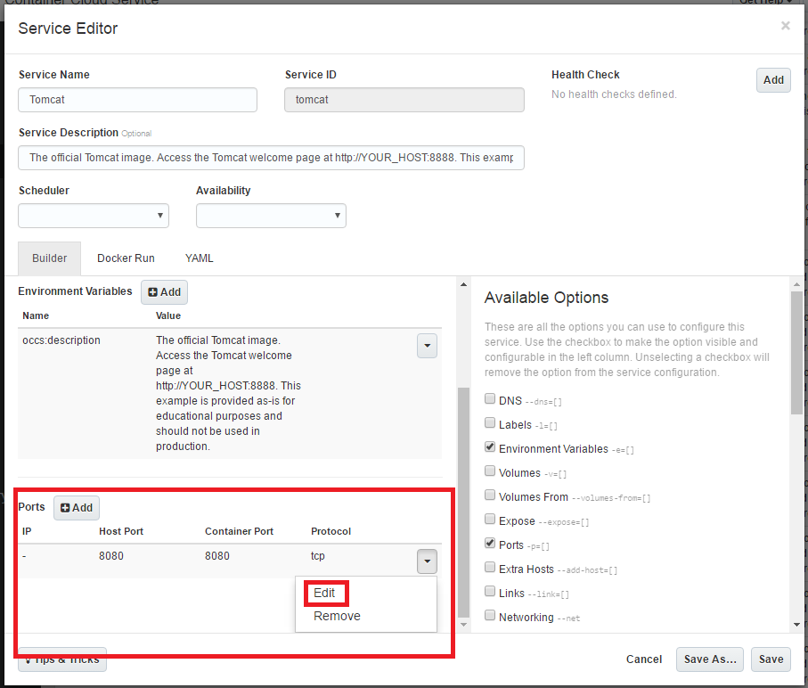
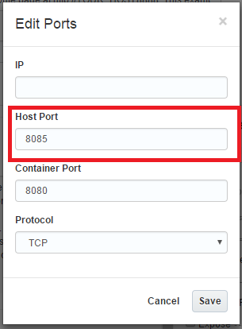
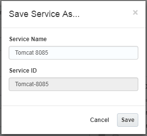
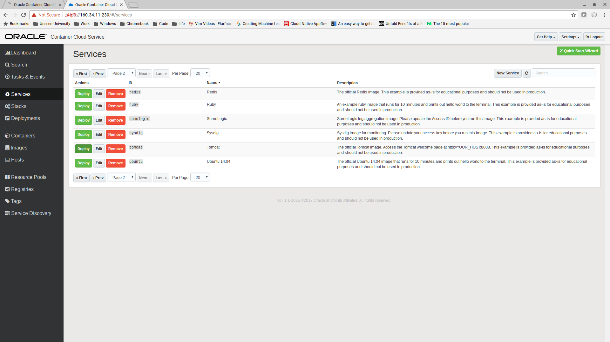
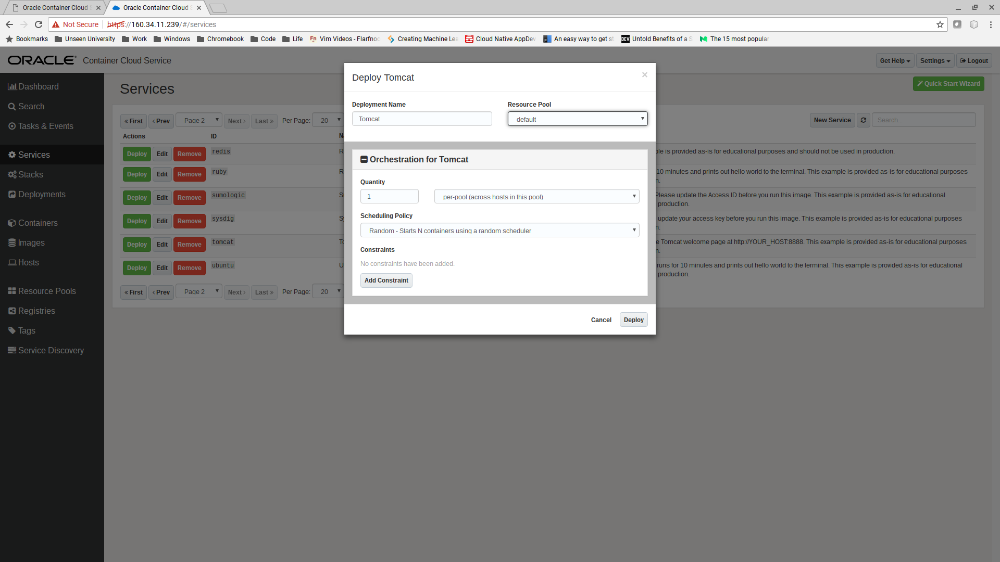
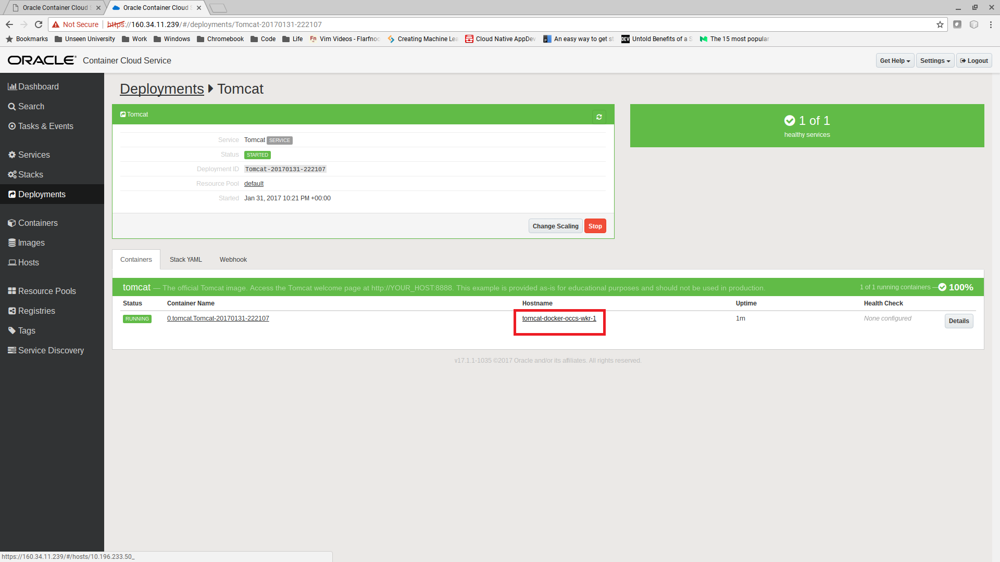
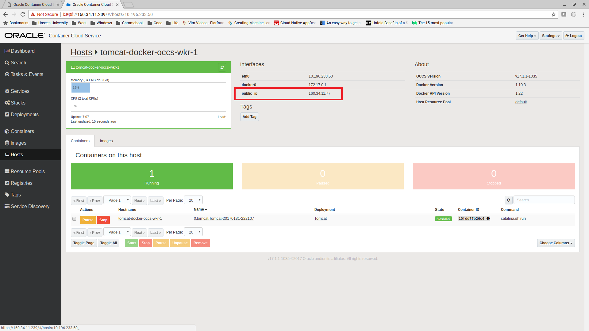
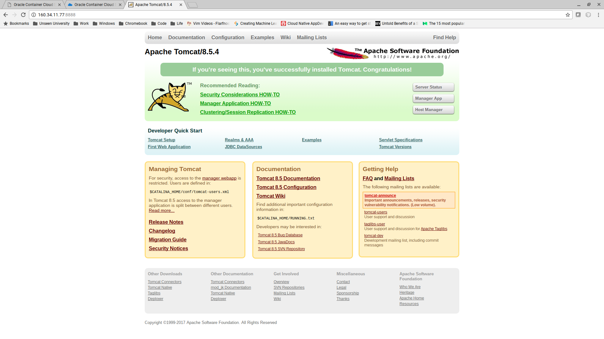
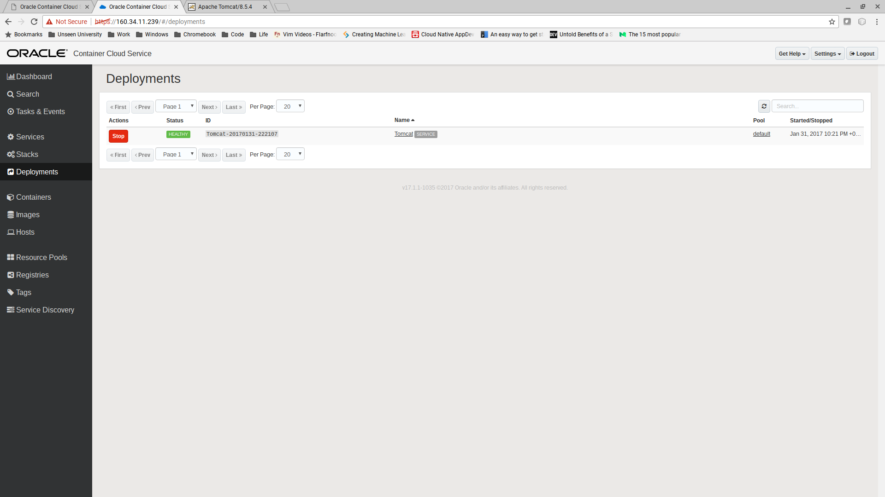

[Go to Overview Page](../AppDevInfra.md)

## Container Native lab ##
## Deploy a Tomcat Docker image onto Oracle Container Cloud Service ##

### Introduction
In this lab we will deploy the Tomcat Docker image that is provided by default onto the Oracle Container Cloud Service (OCCS).

Since cre#ation of Docker containers is fast, and they are lightweight, this will go extremely fast.

### Pre - requisite Creation of a Container Cloud Service
The instructors will have created a Container Cloud service for your team to use.  The link to the Container Admin console will be provided in the Access Document you will receive.  If you are doing these labs on your own, make sure to first set up a running Container Cloud Instance from the Cloud Services Dashboard of your account.

### Open the OCCS console

Follow the link provided to the Container Console.  At this point your browser may complain about a self signed certificate.  Accept the certificate and proceed to the console.

Enter the credentials supplied by the instructors.

You should now see the Dashboard.

### Deploy the Tomcat Docker Image

Click on Services.  Each of the "services" in the list represents a container and configuration ready for deployment onto OCCS.

Click "Next" to go to the second page.  Now click the "Edit" button of the "Tomcat" image.  Because all participants are launching their instance on the same container service, we need to assign a specific port to identify your instance:

- Scroll down to see the paragraph "Ports"
- Click on the little arrow besides the rule that is already there, and choose "Edit"

- Now change the Host Port to the port number assigned to you in the access document : 8080 + No. of your user: example : user05 uses port 8085
- Leave the Container Port unchanged at 8080
- Save the Port configuration by clicking on the "Save" button

- Now save the Service via the "Save As" button, and choose a new name comprising your port number:

You are now redirected back to the list of services, where you will see your newly created service appear.  Click the "Deploy" button for the service you just created, in this example "tomcat-8085"

Take the default options in the dialog box, and click "Deploy".

In a few seconds the container should start.

Click on the hostname link.  This is the host on which your image is deployed.

Take a note of the Public IP address of the host and then browse to http://"host-ip-address":8085
, replacing the port number 8085 with your own port numbeer of course.
You should see the Apache Tomcat title page.

To finish the exercise, stop the instance you just started: 
- go to "Deployments" and click Stop.  
- wait for Tomcat to stop and then click "Remove".

---
[Go to Overview Page](../AppDevInfra.md) 
