[to Step 2](../jcs-create/README.md) | [to Overview Page](../AppDevInfra.md) | [to Step 4](../jcs-autoscale/README.md)

## Application Development Infrastructure lab ##
## Step 3 : Create Database Cloud Service instance using user interface ##

### Introduction ###

Oracle Database Cloud Service provides you the ability to deploy Oracle databases in the Cloud, with each database deployment containing a single Oracle database. You have full access to the features and operations available with Oracle Database, but with Oracle providing the computing power, physical storage and (optionally) tooling to simplify routine database maintenance and management operations.

When you create database deployments, Database Cloud Service creates compute nodes to host the database, using computing and storage resources provided by Oracle Compute Cloud Service. Additionally, it provides access to the compute nodes (and thus to the database) using networking resources provided by Oracle Compute Cloud Service.

### About this tutorial ###
This tutorial demonstrates how to:
	
+ create Database Cloud Service using the user interface.

### Prerequisites ###

- Oracle Public Cloud Service account including Database and Storage Cloud Service

### Steps ###

Go to the Console (see Access inforrmation that was delivered to you in the workshop, or login to your [trial environment](https://cloud.oracle.com/sign-in) ). After a successful login you will see your Dashboard. On the dashboard click the hamburger icon on the Database tile. Select **Open Service Console**.
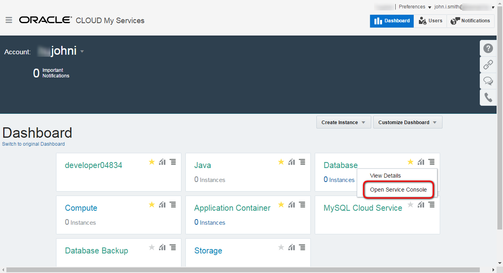

This is the Database Cloud Service Console page. To create new instance click **Create Service** button.
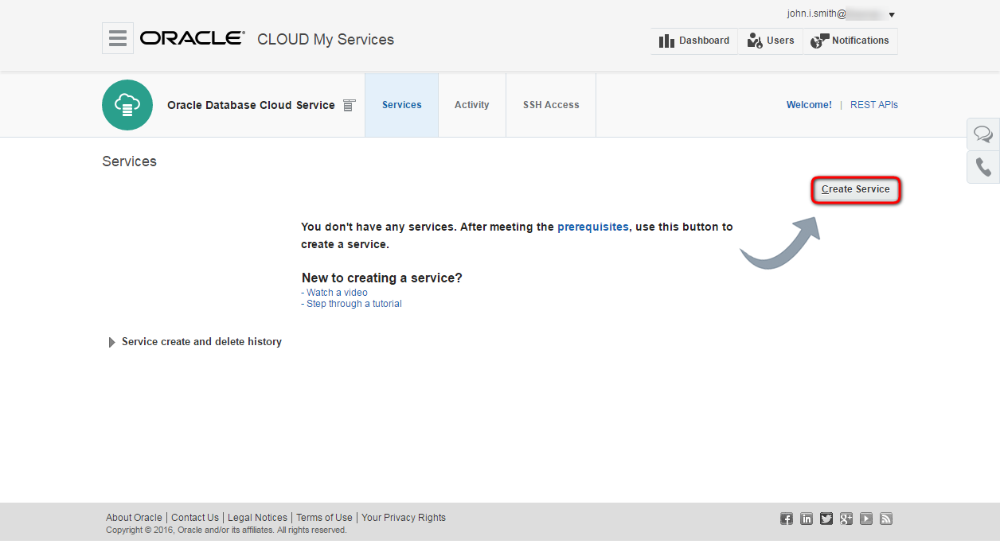

Now you can fill in the key paramaters for choosing the caracteristics of the database you will create : 
+ **Service Name**: the name of the service instance e.g. techcoDB.
+ **Description**: any description for your service.
+ **Subscription type**: Select "Oracle Database Cloud Serice", this is the fully managed Oracle Database Cloud Service
+ **SSH Public Key**: public key which will be uploaded to the VM during the creation. It allows to connect to the VM through ssh connection using the private key. To avoid additional task to create keypairs select Create a New Key option and download the newly generated keypair for later usage. Download the zip file to your `GIT_REPO_LOCAL_CLONE/cloud-utils` folder and unzip for later usage.
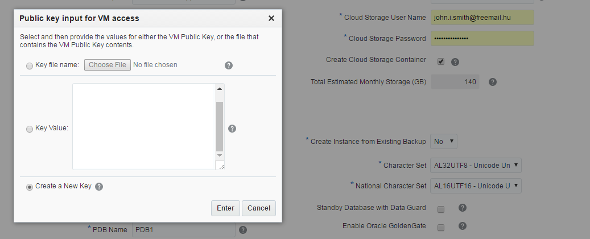 

+ **Software Release**: Select the "Oracle Database 12c Release 1
+ **Billing Frequency**: "Hourly"

For more details about subscription types see the [documentation](https://docs.oracle.com/cloud/latest/dbcs_dbaas/CSDBI/GUID-F1E6807A-D283-4170-AB2B-9D43CD8DCD92.htm#CSDBI3395).
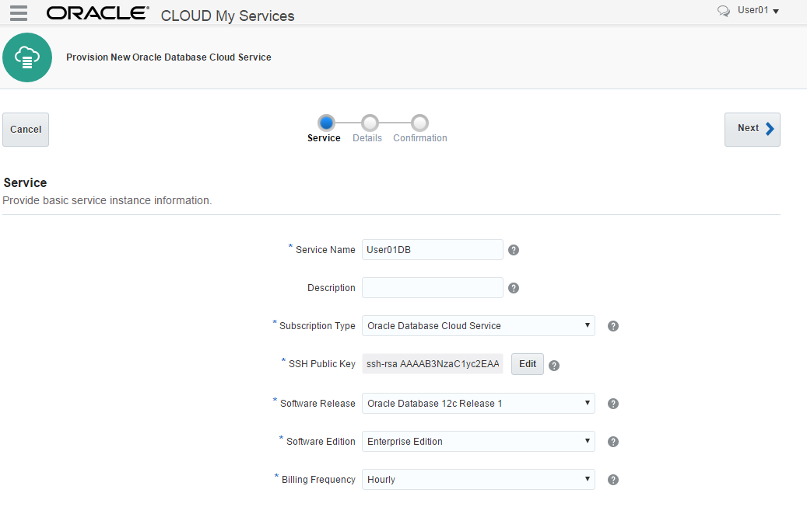

The last input page is the Service Details page. The following parameters have to be provided:
	
+ **Shape**: number of OCPU and size of the RAM. Choose the smallest (default) one.
+ **Timezone**: set your timezone.

+ **Administrator Password**: database instance's system password. Don't forget to note the provided password.
+ **DB Name (SID)**: container database service identifier.
+ **PDB Name**: pluggable database service identifier. You can leave the default PDB1

+ **Backup Destination**: Leave default; Both Cloud and Local Storage
+ **Cloud Storage Container**: the name of the container for database instance. The format is the following: Storage-IDENTITYDOMAIN/CONTAINERNAME, for example Storage-gse00002323/user01. Replace the identitydomain value according to your environment and specify a container name. Container name is up to you. The container don't need to be created in advance, because -see below- there is an option to create automatically.
+ **Cloud Storage User Name and Password**: the credentials for storage. Usually it is the same what was used to sign in to Oracle Cloud Services.
+ **Create Cloud Storage Containers**: check in because the container does not exist what you specified above.
+ **Character Set**: The database character set for the database. Leave default.
+ **National Character Set**: The national character set is used for data stored in SQL NCHAR data types. Leave default.

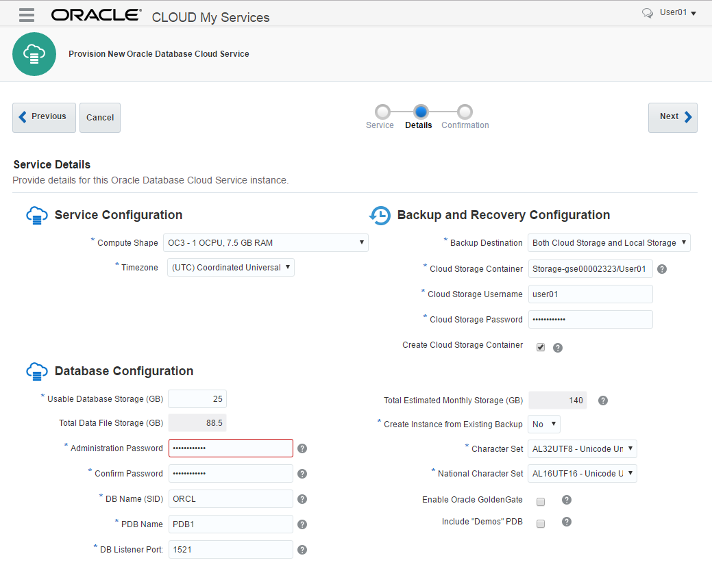
For more details about parameters see the [documentation](https://docs.oracle.com/cloud/latest/dbcs_dbaas/CSDBI/GUID-D4A35763-53ED-4FBB-97BF-0366F21B05E0.htm#CSDBI3401). Click **Next**.

The final page is the summary about the configuration before submit the instance creation request.

ATTENTION : To save resources on our environment and to speed up this exercise, we will NOT create this new dabase.  Instead, we will use the database that is already created.

==> Click "Cancel"
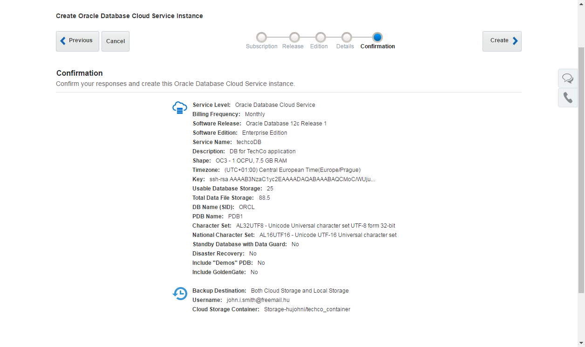

If you should have gone ahead and created the database, the request would have been accepted and the Database Service Console page would  show the new instance. The instance would first be in Maintenance (Progress) mode. 
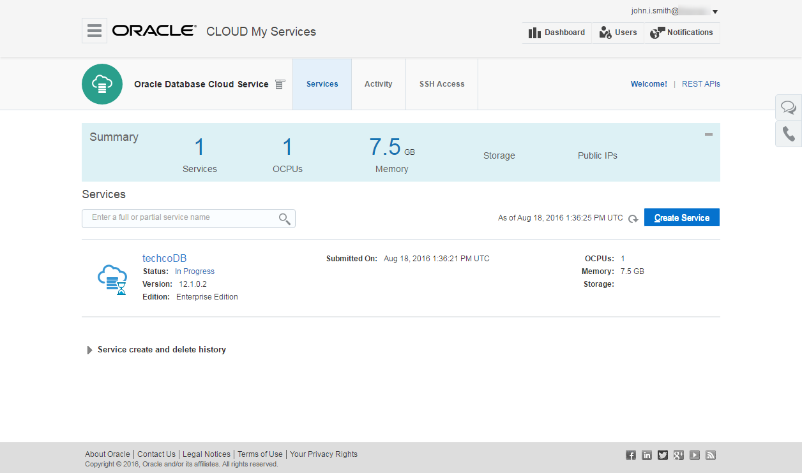

---
## Optional steps using the pre-seeded database ##
Below are some extra exercises you can perform using the already created Database instance. 

+ If you are going through this lab as a 1-hour DBaaS stand-alone exercise, please continue with the below steps.  
+ If you are doing this lab as part of the AppDev Infrastructure lab covering JCS, DBCS, Compute and Container cloud, you can skip these steps.

#### Enabling the Firewall Rules ####

Make sure you are logged-in and the DBaaS Service Console is visible. You should see a window similar to this.  If you are using the "Cloud Test Drive" environment, this pre-seeded database will most likely be called "MyDBCS".

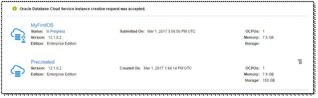

+ Click on the ‘Hamburger’ menu for the pre-created service and select ‘Access Rules’
The following screen or similar should be displayed:

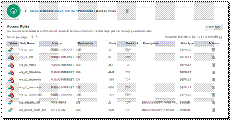
 
This screen allows you to change pre-created firewall access rules or allows you to define new ones. In this example, we will enable the firewall rules that allow us to access our tools. 

+ Click on the ‘Hamburger menu’ at the right of the rule ‘ora_p2_httpadmin’ and port 4848

Attention: all participants in your group will be using this same pre-seeded database. So this rule might already be "enabled" by someone else.  In that case, just look at the options but DO NOT DISABLE the rule again !

The following screen or similar should be visible:
 
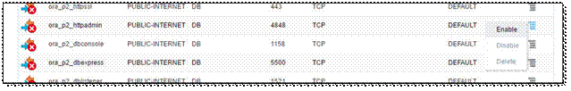

When choosing the "Enable" option, the following pop-up or similar should be displayed:

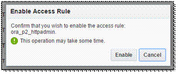

Press ‘Enable’ and wait for the operation to finish.  The pop-up should disappear and the Access Rules page should be updated.

Now please enable the following services in the same way:

+ ora_p2_dbexpress
+ ora_p2_httpssl
 
#### Working with the available Cloud tools ####
In this part of the hands-on, we will walk-through the various tools available by default. Please make sure you have enabled all required firewall rules as demonstrated in the previous chapter and that you are on the DBaaS Service Console Page:

 
Click on the ‘Hamburger Menu’ for the pre-created Database service and select ‘Open EM Console’
If this is the first time you access the EM Express, your browser might give you a warning that the security certificate of the site is not valid or cannot be checked.
 
Please, accept the connection and the certificate. This varies by browser, the workshop-assistants should be able to help in case you do not know how to do this. 
 
If all went well, the following screen should be displayed:

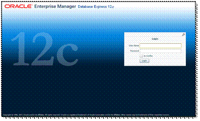
 
Please login with username / password for the database as detailed in account information you received at the beginning of this lab.  The following screen or similar should be displayed:

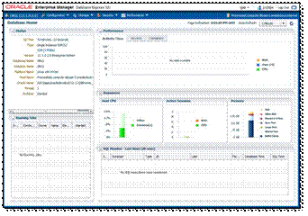
 
In this Enterprise Manager Express screen, you can see the status of the database including the number of ‘Pluggable Databases’ that are plugged into this container database:

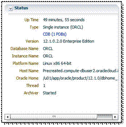
 
Feel free to click around in the Enterprise Manager Express Console. 
When you want to continue, return to the DBaaS Service Console

#### Using the DBaaS Monitor Console ####
This time, we will use another tool available by default, the DBaaS Monitor Console.

+ Return to the DBaaS Service Console
+ Click on the ‘Hamburger Menu’ for the pre-created service and choose Open DBaaS Monitor Console’

You might see a similar certificate error in your browser. Please accept this certificate to continue. The following login-screen should be visible:

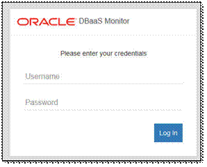
 
Login using username ‘dbaas_monitor’ and password as provided in your account information document.  The following overview screen should be visible:
 
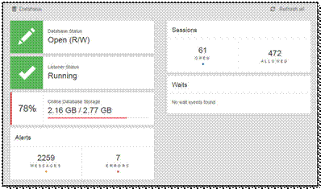

You can click around in this tool to see the various options. 
If you want to continue, click on the ‘Database’ drop down box in the top of the screen

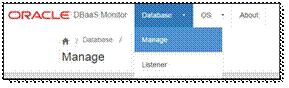
 
Choose ‘Manage’ from the dropdown box
The following screen or similar should be visible:

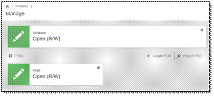
 
As a demonstration, we will clone the existing PDB1 into a new PDB.
 
Click on the ‘Hamburger Menu’ in the PDB1 window
 
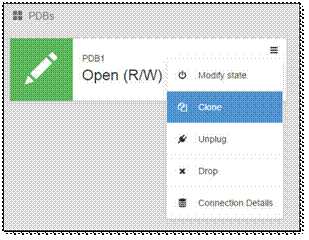

Select the ‘Clone’ option to continue
The following screen or similar should be visible:

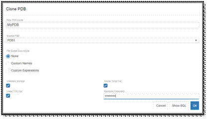
 
Fill in the following values and press Ok:

+ New PDB Name: MyPDB
+ Keystore Password: Welcome_1
+ keep all other values default

After about 30 seconds you will get the confirmation that the PDB has been created successfully. After clicking on Ok, the following screen (or similar) is visible:
 
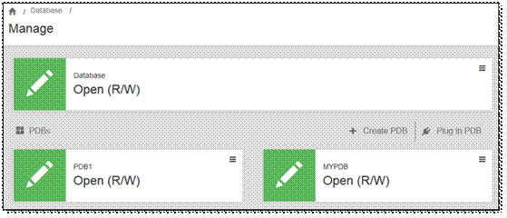

You have successfully cloned a PDB using the available cloud tools.

#### SSH Connection and Image Exploration ####

In the upcoming steps you will record the IP addresses of the prebuilt Database Cloud Service Instance, and connect to this Compute node via SSH.

+ Navigate back to the DBaaS Service Console with the list of available database instances
+ Click on the "MyDBCS" instance from the list of Database Services
+ Note the Public IP address of this instance. You will need this later to connect using SSH.

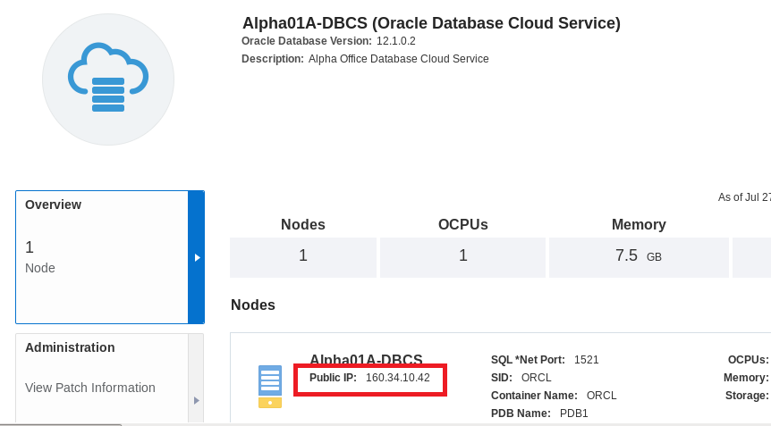
 
The Database Cloud Service is secure by default for connections.  Only the management port 22 used by SSH is open.  All other ports are disabled, such as the SQL Net port 1521.  In this exercise we are going to use the management port 22 to explore the virtual image the Database Cloud Service is running on.

+ Make sure you have an SSH tool like Putty or the browser extension FireSSH to set up an SSH session.
+ In this tutorial, we will assume you are using Putty.  If you are using another tool, please perform similar steps as described below to connect to the instance.
+ Run Putty.exe from your laptop.
+ Enter the public IP address of your Database Cloud Service, and Port 22 for SSH.

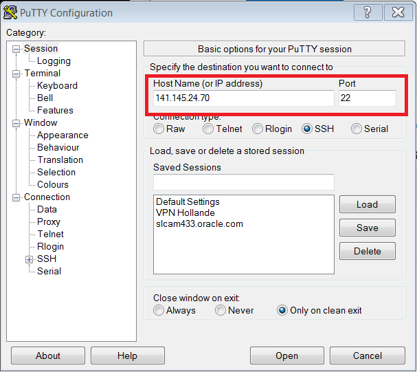

+ From the Connection category, expand SSH and select Auth, and browse for your private key labkey.ppk that is provided by your instructor or downloaded when creating your Database instance in the previous chapter.

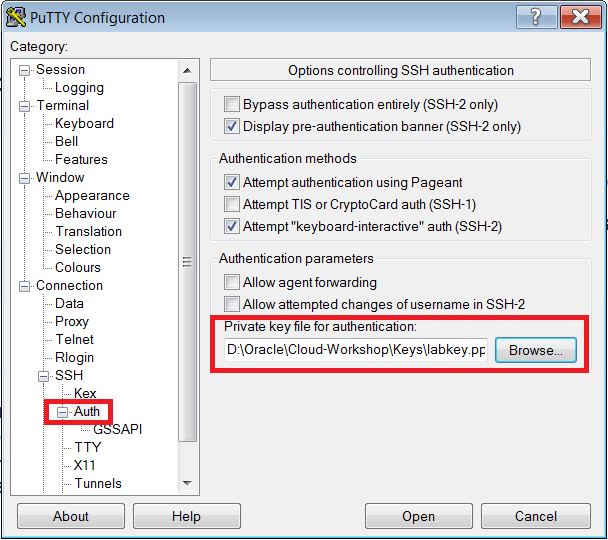

+ Click Open and Login as oracle.
+ You may be prompted for a passphrase when logging in.  If not proceed.  
 
Explore the Database Cloud Service Image

+ Now that you are connected to the instance let’s look around. 
+ Issue a df command to see mounted disks.

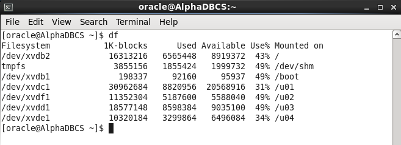

+ Issue the following command to view the Database environment variable : 
	env | grep ORA
 
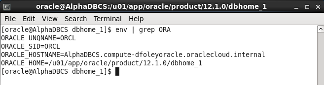

+ Now let’s change directories to the Oracle Home and list the directories.
	cd $ORACLE_HOME
	ls
 
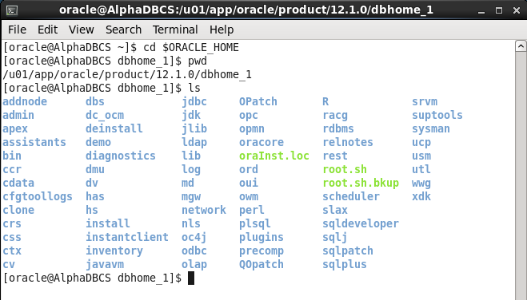

+ Type exit to close the session or explore some more.

---
[to Step 2](../jcs-create/README.md) | [to Overview Page](../AppDevInfra.md) | [to Step 4](../jcs-autoscale/README.md)

