[Go to Overview Page](../AppDevInfra.md)

## Exploring Developer Cloud Service for Building a Docker Container ##

### Building a NodeJS application running in a Docker Container ###

#### Introduction ####

In this lab, you’ll learn how to build a Docker image for a Node.js REST service on Oracle Developer Cloud Service (DevCS), and push it to Docker registries such as Oracle Cloud Infrastructure Registry or DockerHub.  As a final step you can deploy this container on a Managed Kubernetes cluster.

#### Prerequisites ####

To run these labs you will need access to an Oracle Cloud Account.  If you are participating in a live event, your instructor will provide you the required credentials.

If you are running these labs on your own, please check out the instructions on the [Oracle Cloud Adventure page](https://cloudtestdrive.github.io/Trial.html) to learn how to get a [Trial account](https://myservices.us.oraclecloud.com/mycloud/signup?sourceType=:ex:tb:::RC_EMMK181016P00010:Virtual_WS_DEV&SC=:ex:tb:::RC_EMMK181016P00010:Virtual_WS_DEV&pcode=EMMK181016P00010) or how to set up your corporate UC subscription for this lab.

#### Preparation steps for this lab exercise - *<u>only for personal tenancies</u>* ####

In order to run this lab, you need to have a running instance of the Developer Cloud Service in your cloud tenancy.  In case you are executing this lab on an environment provided by an instructor, this setup will most likely have been performed already. 

In case you are running this lab on your own Cloud Tenancy, you need to go through the following steps:

- Enabling DevCS on your Dashboard
- Create a new DevCS instance
- Configure the storage and Build parameters for your instance

[Click here](devcsconfig.md) for a guide describing these steps in detail.

### Why Oracle Developer Cloud Service? 

In recent years, the world of application development has adopted new methodologies that aim to improve the quality and speed with which applications are being delivered. The introduction of innovative development approaches, such as test-driven development and Agile development, gave rise to a set of new techniques and tools that enable those methodologies. Tools such as automatic build utilities combined with continuous integration platforms, as well as enhanced collaborative tools such as wikis and code review utilities, simplify the adoption of these new methodologies. 

However, for many IT shops, setting up these environments and maintaining them was difficult and cost prohibitive, so many organizations stuck to the old way of building applications. Oracle has changed this by introducing a simpler way to adopt modern development methodology and tools with a cloud-based offering known as Oracle Developer Cloud Service.

In this tutorial, you will work with DevCS and learn about some of its most important features.  Specifically, you will: 

- Create a DevCS *project*, which serves as the organizing principle for your software development efforts;
- Pull the code from an existing GitHub repository and use it to populate a DevCS-hosted Git repository;
- Create a task within DevCS and an Agile board to track it;
- Complete the task by branching, making changes to the code using the online editor, then merging the code;
- Build the Docker image with Continuous Integration in DevCS;
- [Optionally] Set up a Managed Kubernetes instance on the Oracle Cloud
- Push the Docker image to Oracle Cloud Infrastructure Registry and DockerHub.

Let’s get started! 

#### Milestone 1: Create a project environment for your team

In this section, you’ll provision a complete development platform for your team by leveraging DevCS’s web interface.

- Navigate to the Developer Cloud Service Instance once it has been created (see prerequisites)

- On the Welcome page, click **New Project**.
  

- Give your project a name that begins with your own name, such as John Dunbar OOW Hello, to make your project unique.  Then: 

  - Enter a **Description**, such as OOW Hello project.

  - Leave the Security setting specified as **Private**.

  - Click **Next**

    

- Click **Empty Project**, then click **Next**.

  

- Select your preferred wiki markup language, then click **Finish**

  

- Wait while the project modules are provisioned, which can take a minute or two. You can see the indicators turn green as the associated modules are provisioned.

  

- When everything is provisioned, the project Home page opens, which contains details about your newly created project:

  

  Let’s take a look at this page (you may need to scroll to see the whole thing): 
  - On the left side is an activity feed. 
  - Tabs on the right side show you where the Git source code and Maven repositories are located.
  - Also on the right you can see project statistics, as well as the UI where you can manage team members.  Let’s take a look at that UI now. 

- Scroll to the right and click the Team tab, then click +**New Member**.

  

- Select another team member from the drop-down list and click **Add**.

  

- Repeat steps 7 and 8 again so that your project team contains two other members besides yourself.

  

Each team member can now log in to the environment and start collaborating on project development.

#### Milestone 2:  Fetch and review code from the Git repository

- On the right side of the home page, click **New Repository**

  

- In the New Repository dialog, enter these details: 
  - NodeJSDocker in the **Name** field

  - Nodejs Docker Repository in the **Description** field

  - Import Existing Repository under **Initial content**

  - Enter <https://github.com/cloudtestdrive/NodeJSMicroDocker> in the text box: 

    

- Click **Create**.

  You should now be on the Code tab, which shows that you have a new DevCS git repository, NodeJSDocker.git.  This new repository contains imported code from the GitHub repository you specified.

  

- Click the **Refs** tab to view the current list of branches.  At this point there’s only one, the master branch:

  

- Click **New Branch**, and create a new branch called feature, based on the master branch.  

  

- Let's go back to the **Files** tab in the upper right.

  You can see all the repository files listed:

  

- Take a look at what’s in each file by clicking each file name successively. In particular, notice that:
  - Main.js contains the Node.js REST API code
  - Dockerfile contains the commands to build a Docker image
  - package.json defines the dependencies for the Node.js code
  - nodejs_micro.yaml contains the Kubernetes services definitions
  - kubescript.sh contains the deployment script to the cluster

- Let’s go back to Main.js, and on the right notice that there are five methods for viewing a file on the Code tab:
  - File
  - Blame
  - Logs
  - Refs
  - Compare

- Click **Blame** tab to view the code and the file’s commit history:

  

- Next, click **Logs**, where you can see the list of the commits for this branch, as well as the code that was pushed with each commit:

  

- Click **Files**, then click **Dockerfile.**  We’ll use this file a bit later, when we build the Docker image.

  

- Click the forward slash next to the Dockerfile name, then click **package.json** to review the Node.js code dependencies.  

  

#### Milestone 3: Track issues for your project

In this section, we’ll start tracking tasks (issues) that our team needs to take care of. We’ll then organize these tasks into a sprint.

- In the left nav bar click **Issues**, then click **New Issue**:

  

- For your first issue:
  - Type Change the message in Main.js in the **Summary** field

  - Type Change OOW in message to my name in Main.js. in the **Description** field

  - Select **Task** in the **Type** drop-down list. 

    

- Scroll down, and from the **Status** drop-down list, select **Assigned**. 

- From the **Owner** drop-down list, select **kevinevans** (your user). 

  

- In the **Story Points** field, enter **3**. 

- Click **Create Issue**.

- Click the **Issues** tab to see the new issue:

  

#### Milestone 4: Create an Agile board and a sprint to track issues

In this section, we explore the DevCS features that help you manage your agile development process.

- In the left nav bar, click **Agile**, then click **New Board**

  

- In the New Board dialog box:

  - Type Hello Board in the **Name** field 

  - Select **Story Points** from the **Estimation** drop-down list 

  - Click **Create**.

    

    You can see the issue you created earlier in Backlog.  Let’s add it to a sprint.

- Click **New Sprint**.

  

- Let’s call our new sprint Sprint 1. In the **Story Points** field enter 5, then click **OK**. 

  

  You can now see the new sprint, along with instructions on how to add issues to it. 

- Drag and drop Task 1 to Sprint 1, taking care to drop it right on top of the instructions.

  

- Click **Start Sprint** to make the sprint active.

  

- In the Start Sprint dialog box, accept the default start and end dates and click **Start**. 

  By default, a sprint lasts two weeks. You can now see the default dates above the issue list for Sprint 1.

  

- Click **Active Sprints** to view the progress of the sprint. You can see at a glance all the tasks considered To Do, In Progress, or Completed. 

  

#### Milestone 5: Edit your code and commit it to the working branch

In this section, we’ll see how DevCS helps you edit your code and commit it to the working branch.  

- Click **Code** in the left nav, then select the NodejsDocker.git repository and the feature branch, as shown here: 

  

- Click **Main.js,** then click the pencil icon to edit the file.

  

- Find where it says “Hello OOW!” and change “OOW” to your own name.

  

- Click **Commit**.

- In the **Commit changes** dialog, click **Commit** to commit these changes to the NodeJSDocker.git’s feature branch: 

  

#### Milestone 6: Configure the Docker build job 

In this section, we’ll see how to use DevCS to build the Docker image for the Node.js REST application, and push it to your OCIR Repository.

Let’s start with the NodeJSDockerOCIR build job. 

- Click **Docker Registry** in the left navigation bar, then click **Link External Repository**.

  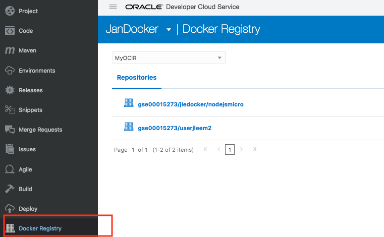

- In the Dialog Box, enter following parameters

  - Registry Name: **MyOCIR**
  - Registry URL: fill in the URL of your OCI Repository.  Example for an instance based in Ashburn: 
    **https://iad.ocir.io**  , but replace the "iad" by the correct code : phx for Phenix, fra for Frankfurt, LHR for London, ...
  - The **Username** is composed of {instance-name}/{username}, for example **gse00014089/api.user** 
  - Type your password **token** in the **Password** field - **attention, this is not the password** ! Typically a string looking like : i!co>5426CWaLZ&_Zh!r

  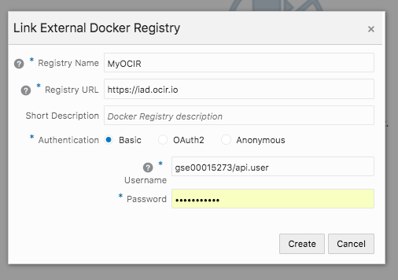

- Now click **Create**.  Your credentials will be checked, and if they are correct you should see the list of objects that are already in the repository (this will look different on your instance)

  - 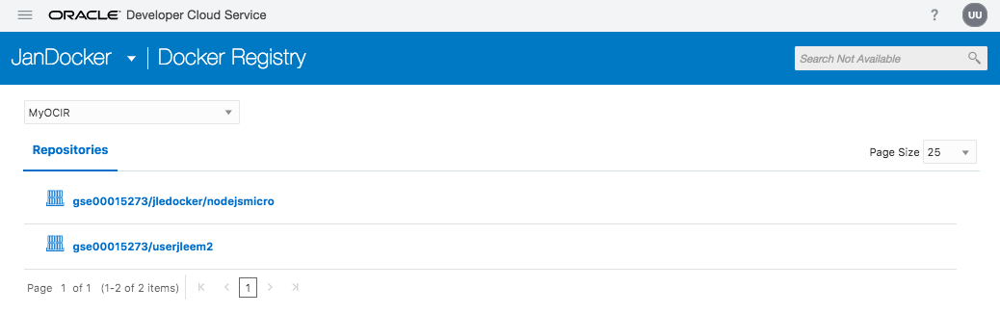

- Click **Build** in the left nav bar, then click **New Job**. 

  

- In the New Job dialog: 
  - Type NodeJSDockerOCIR in the **Job Name** field 

  - Select the **DockerOCIOKE** template you just created from the **Software Template** drop-down  

  - Click **Create Job**.

    

- From the **Add Source Control** dropdown, select Git.

  

- Select NodeJSDocker.git from the **Repository** drop-down.

- Select master from the **Branch** drop-down.

- Click the **Automatically perform build on SCM commit** check box. 

  

- Click the **Builders** tab. 

- From the **Add Builder** drop-down, select **Docker Builder->Docker login**. 
  - Use the dropdown of the field **Registry Host** to select the Repository configuration you just ceated (named **MyOCIR**.  The username and password field are automatically filled in now.

    

- From the **Add Builder** drop-down, select **Docker Builder->Docker build**. 
  - Select the **MyOCIR** registry from the dropdown field of the  **Registry Host** field (should be pre-filled in)
  - Type gse00014089/ctdnode/nodejsmicro**jodu** in the **Image Name** field.  Replace **jodu** with the first two letters of your first and last name, respectively, and replace "gse00014089" by your instance name
  - In the **Source** radio buttons, click **Context root in Workspace**.

- From the **Add Builder** drop-down, select **Docker Builder->Docker push**. 

  - Your **Registry Host** and **Image Name** should be pre-filled with the previously specified values.

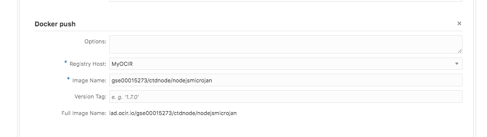

- Click **Save**.

  

Before we move on, we want to ensure the job we just created works correctly. 

- Hit the **Build Now** button to kick off the build.  Note this will trigger the build of the **master** branch, not the **feature** branch we created!

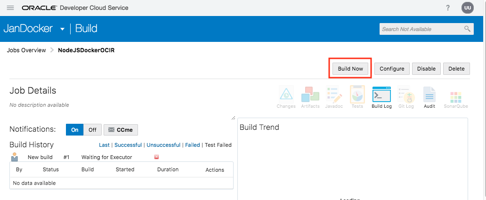

If this is the very first time you invoke the executor, this might take some time ...

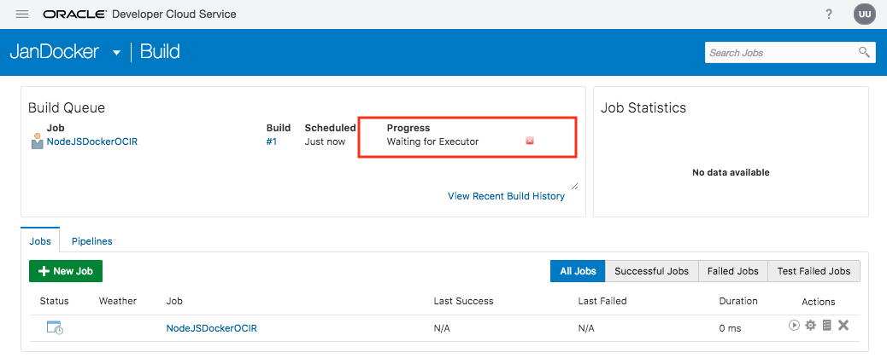

Once the job finished successfully, you should see something like this :

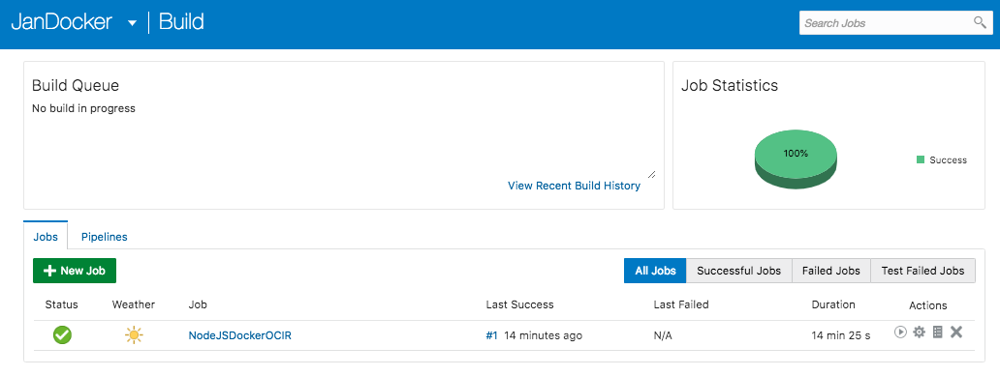

- Navigate to your OCI console to check the container has indeed been uploaded
  - On the menu, select **Developer Services**, and then **Registry**

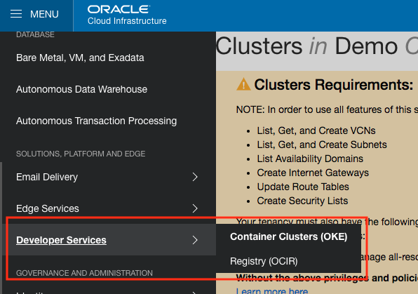

- You should see your container in the list, deployed just a few minutes ago
  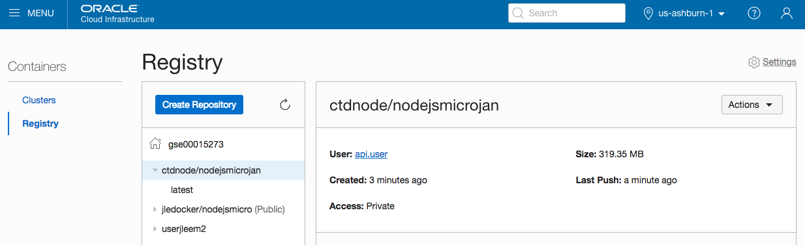

#### Milestone 7: Deploy your container onto an OKE instance

In this section we will create a second build job to run the container we created in the previous step on a Kubernetes Cluster.  For this you will need to have a Cluster instance up and running in your cloud tenancy.

In case you are executing this lab on an environment provided by an instructor, this setup will most likely have been performed already.

In case you are running this lab on your own Cloud Tenancy, you need to go through the following steps:

- Create the tenancy policies to be able to create a Container Cluster
- Create the Cluster and the Worker nodes

[Click here](OKE_Create.md)  for a guide describing these steps in detail.

Once you have an up-and-running cluster, execute the following steps:

- Navigate to the **Build** tab and hit the **New Job** button.

  - Enter a name, for example OKEDeploy
  - Select your build template, we named it DockerOCIOKE in the previous steps

  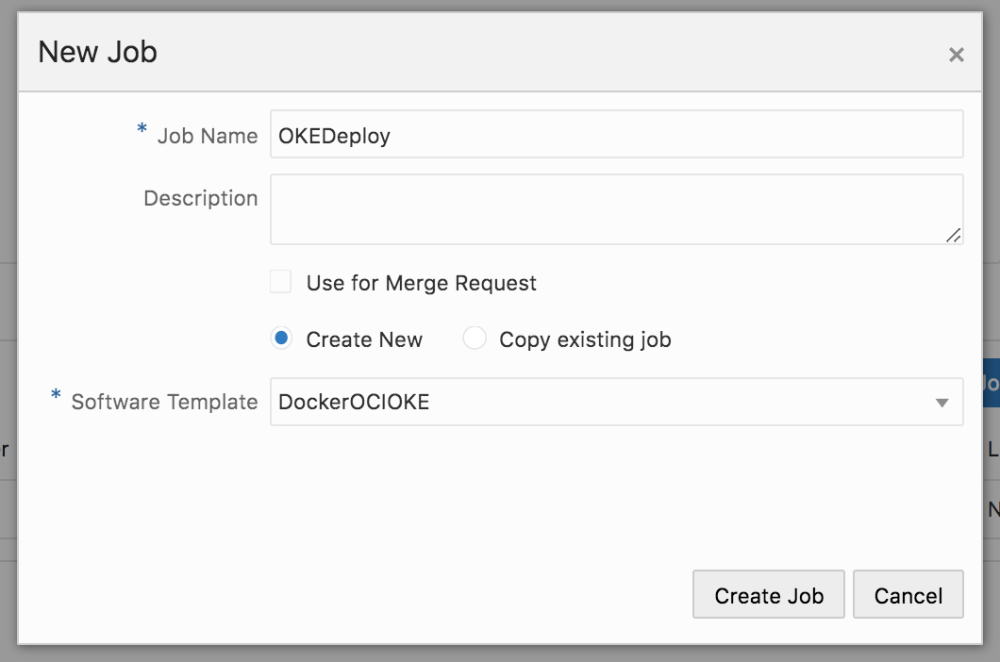

  - Now hit  **Create Job**, and the Job Configuration dialog will pop up. 

- In the Source Control tab, select your git repository.

  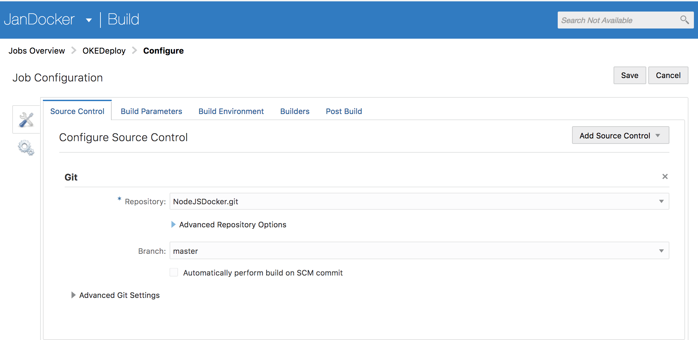

  - Do **not** select the "Automatically perform Build" option for this job, we will link it with the previous job using a pipeline.

- In the Builders tab, add the following Builder steps:

  - Docker Login : use the predefined Repository definition **MyOCIR** as you did in the previous job

  - OCIcli Builder:  This step requires a series of parameters from your OCI instance:

    

  - Unix Shell Builder:

    - launch the script "my script.sh" that is in your repository.  We will edit this script after completing the Build definition to adapt it to your needs.

      ``bash -ex kubescript.sh``

  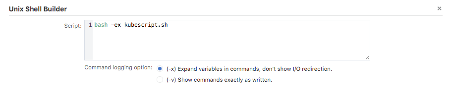

- In the Post Build tab:

  - Add the *Post Build Action* of type **Artifact Archiver**

    - For **Files to Archive**, enter the following:    ``ctd/*``

      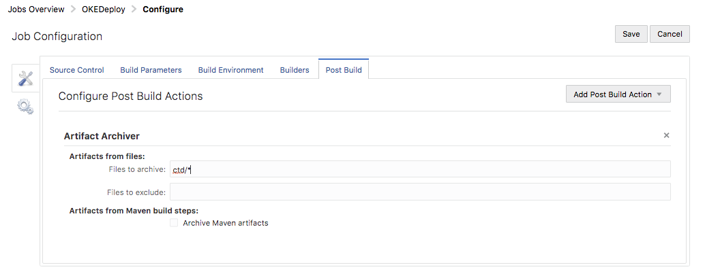

- You have finished setting up the Build job !

  ==> Don't forget to **Save** the job !

- Next we need to make sure the scripts we referenced in the build are referencing our own Container instance:

  - Navigate to the **Code** tab, and make sure you are on the branch **Feature**

  - Open the file **kubescript.sh** by clicking on it, and go into editing mode by clicking on the small pencil in the upper right

  - On line 2, replace the cluster OCID placeholder **<my_OKE_cluster_ocid>** with your OKE cluster OCID. 

  - On line 8 and 10, add your initials in front of the strings beginning with **nodejsmicro**

  - 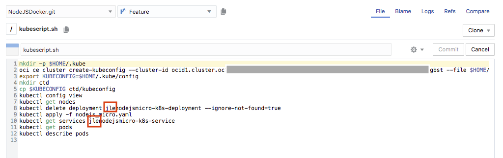

  - Hit **Commit** to save the changes

  - As you could see, this shell script refers to the actual Kubernetes deployment configuration file **nodejs_micro.yaml**.  

  - Click on the file **nodejs_micro.yaml** and hit the pencil.

  - First you need to change line 17 to replace the strings **<my_cloud_tenancy_name>** ,  **<my_repo_name>** and **<my_container_name>** with your values as you have seen them in the initial build step where you pushed the container to the registry.

    - For the tenancy name, this is the actual name of your tenancy.  Instructor-provided tenancies typically have a name like **gse00015172**
    - For the repository name, we used **ctdnode**
    - For the container name, something like **nodejsmicroxx**, where xx are your initials. 

    - prefix all **nodejsmicro** strings with <u>your</u> initials. In the below example, the initials **jle** were added as an example.  You have 6 additions to perform!
    - 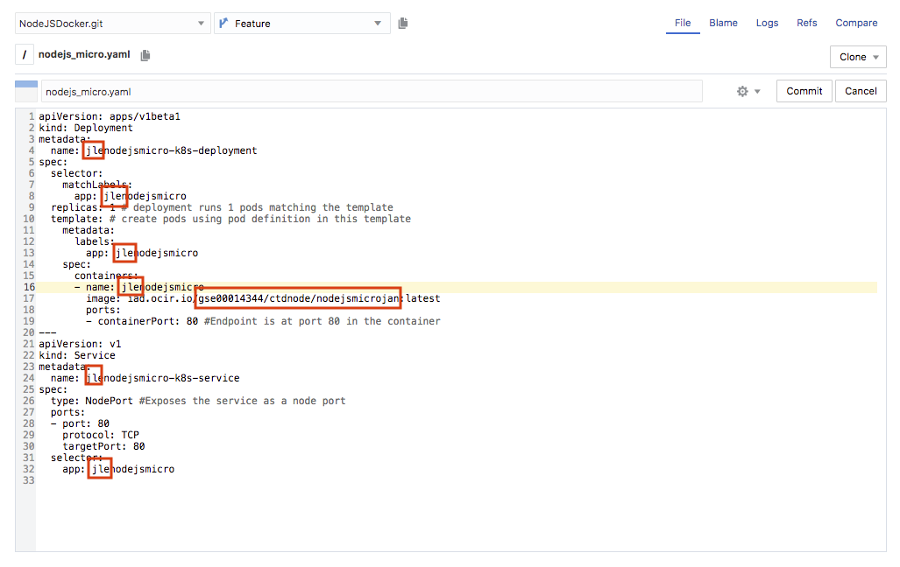

  - 

#### Milestone 8: Create and execute the build pipeline

In this section, we’ll create a pipeline to link the two build jobs we just created.

- Click **Build** in the left nav, then click **Pipelines**:         

  

- Click **New Pipeline**.

- Let’s use **DockerPipeline** as the name. 

- Select both check boxes, as shown here: 

  

- Click **Create**.

- Drag NodeJSDockerOCIR to the gridded area, and drop it right after the **Start** bubble. 

- Drag OKEDeploy and drop it right after NodeJSDockerOCIR. 

- User the cursor to draw an arrow between **Start** and the 2 Jobs, as shown here:   

  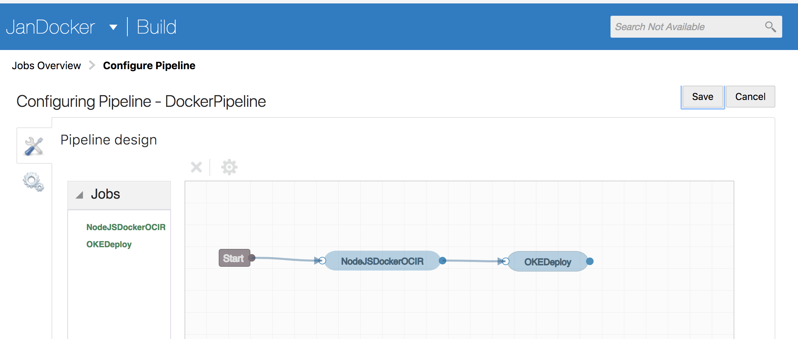

- Double-click the line connecting the two build jobs.

- In the editor, select Successful from the **Result Condition** drop-down:

  

- Click **Apply**. 

- Click **Save**

#### Milestone 9: Merge your feature branch with the master branch of the NodeJSDocker.git repository 

In this section, we explore how to review and merge code in DevCS. 

- Click **Merge Requests** in the left nav bar: 

  

- Click **New Merge Request**:

  

- In the New Merge Request dialog:
  - Select NodeJsDocker.git from the **Repository** drop-down

  - Select master as the **Target Branch** 

  - Select feature as the **Review Branch**

  - Click the commit that appears for the review branch 

  - Click **Next**.

    

- On the Details page: 
  - Select yourself as the reviewer under **Reviewers**

  - In the **Linked Issues** field, type Task until you see the task you created earlier. 

  - Click the task description

  - Click **Next**.

    

- Review the description and click **Create**:

  

- Click the **Changed Files** tab and review the changes:

  

- If the changes look correct, click **Approve**:

  

- Enter OK as a comment, then click **OK**

  

- Click **Merge** to merge the changes into the NodeJSDocker.git repository’s master branch:

  

- Keep the defaults, then click **Create a Merge Commit**.

  

You should now see the Review Status as Approve, with a green tick. 

This merge will trigger the execution of the **NodeJSDockerOCIR** build job, which in turn will trigger the execution of the **DockerPipeline.**  

- Click **Build** in the left nav bar. 

- Click **Jobs**:

  

You should see your two build jobs, waiting to be built. 

- Click the **NodeJSDockerOCIR** build job.

- Click **Build Log**, as shown here: 

  

- Take a look at the log for the NodeJSDockerOCIR build job.

  

- Click the OKEDeploy build job and take a look at its build log too:

  - **ATTENTION : image to be updated**

   

- Inspect the build job:

  - **ATTENTION : image to be updated**

  

- Now navigate to the application you just deployed on Kubernetes, using the correct address
  - **ATTENTION : image still to be created, full explanation of URL to be given**

#### Summary

Now that you’ve finished this lab, you should know how to build a pipeline to build and push a Docker image to Oracle Cloud Infrastructure Registry and DockerHub registry using Developer Cloud.   Specifically, you learned how to: 

- Work with Oracle Developer Cloud Service and its most important features

- Create a project and pull the code from an existing GitHub repository to a DevCS-hosted Git repository
- Create a task within DevCS and an Agile board to track it
- Complete the task by branching the code, editing it using the online editor, and merging the code
- Build the Docker image with Continuous Integration in DevCS
- Push the Docker image to the Oracle Cloud Infrastructure Registry and DockerHub.

---
[Go to Overview Page](../AppDevInfra.md)
