[Go to Overview Page](../AppDevInfra.md)

## Exploring Developer Cloud Service for Building a Docker Container ##

### Building a NodeJS application running in a Docker Container ###

### Introduction ###

In this lab, you’ll learn how to build a Docker image for a Node.js REST service on Oracle Developer Cloud Service (DevCS), and push it to Docker registries such as Oracle Cloud Infrastructure Registry and DockerHub.

#### Prerequisites ####

To run these labs you will need access to an Oracle Cloud Account.  If you are participating in a live event, your instructor will provide you the required credentials.

If you are running these labs on your own, please check out the instructions on the [Oracle Cloud Adventure page](https://cloudtestdrive.github.io/Trial.html) to learn how to get a [Trial account](https://myservices.us.oraclecloud.com/mycloud/signup?sourceType=:ex:tb:::RC_EMMK181016P00010:Virtual_WS_DEV&SC=:ex:tb:::RC_EMMK181016P00010:Virtual_WS_DEV&pcode=EMMK181016P00010) or how to set up your corporate UC subscription for this lab.

#### Preparation steps for this lab exercise ####

In order to run this lab, you need to instantiate a Developer Cloud Service instance.

- Navigate to the PaaS Services dashboard
- On the upper left, select the menu icon and expand the "Services" tab
- Scroll down to the service called "Autonomous Developer Cloud Service" and select it
- Use the "Create Instance" button to launch the creation wizard
- Fill in the name, and hit the "Confirm" and "Create" button.

### Why Oracle Developer Cloud Service? 

In recent years, the world of application development has adopted new methodologies that aim to improve the quality and speed with which applications are being delivered. The introduction of innovative development approaches, such as test-driven development and Agile development, gave rise to a set of new techniques and tools that enable those methodologies. Tools such as automatic build utilities combined with continuous integration platforms, as well as enhanced collaborative tools such as wikis and code review utilities, simplify the adoption of these new methodologies. 

However, for many IT shops, setting up these environments and maintaining them was difficult and cost prohibitive, so many organizations stuck to the old way of building applications. Oracle has changed this by introducing a simpler way to adopt modern development methodology and tools with a cloud-based offering known as Oracle Developer Cloud Service.

In this tutorial, you will work with DevCS and learn about some of its most important features.  Specifically, you will: 

- Create a DevCS *project*, which serves as the organizing principle for your software development efforts;
- Pull the code from an existing GitHub repository and use it to populate a DevCS-hosted Git repository;
- Create a task within DevCS and an Agile board to track it;
- Complete the task by branching, making changes to the code using the online editor, then merging the code;
- Build the Docker image with Continuous Integration in DevCS;
- Push the Docker image to Oracle Cloud Infrastructure Registry and DockerHub.

Let’s get started! 

#### Milestone 1: Create a project environment for your team

In this section, you’ll provision a complete development platform for your team by leveraging DevCS’s web interface.

- Navigate to the Developer Cloud Service Instance once it has been created (see prerequisites)

- On the Welcome page, click **New Project**.
  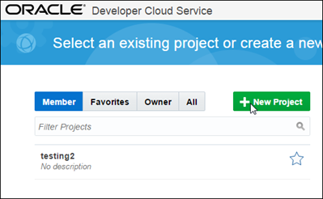

- Give your project a name that begins with your own name, such as John Dunbar OOW Hello, to make your project unique.  Then: 

  - Enter a **Description**, such as OOW Hello project.

  - Leave the Security setting specified as **Private**.

  - Click **Next**

    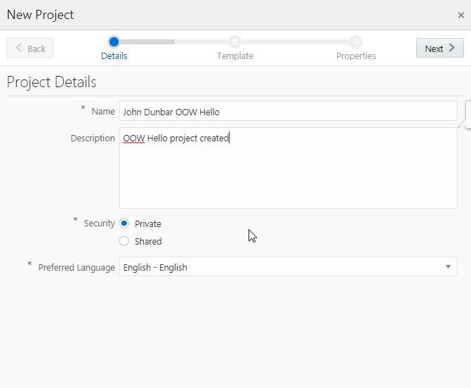

- Click **Empty Project**, then click **Next**.

  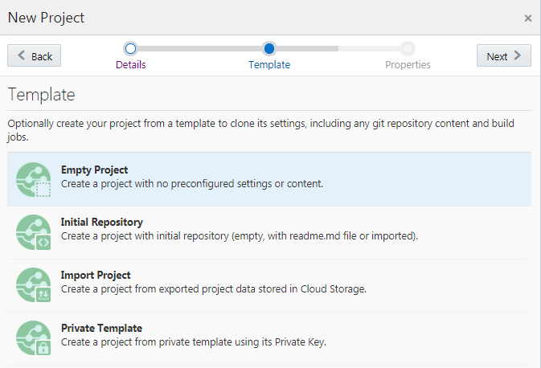

- Select your preferred wiki markup language, then click **Finish**

  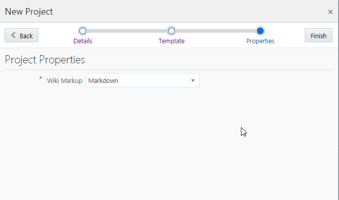

- Wait while the project modules are provisioned, which can take a minute or two. You can see the indicators turn green as the associated modules are provisioned.

  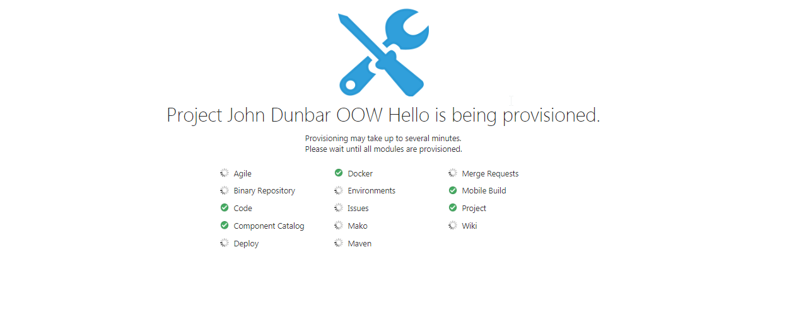

- When everything is provisioned, the project Home page opens, which contains details about your newly created project:

  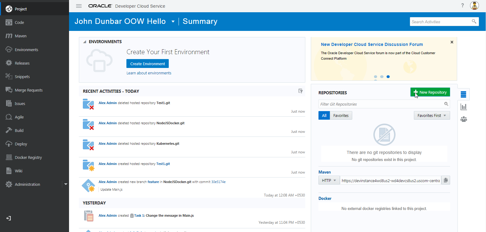

  Let’s take a look at this page (you may need to scroll to see the whole thing): 
  - On the left side is an activity feed. 
  - Tabs on the right side show you where the Git source code and Maven repositories are located.
  - Also on the right you can see project statistics, as well as the UI where you can manage team members.  Let’s take a look at that UI now. 

- Scroll to the right and click the Team tab, then click +**New Member**.

  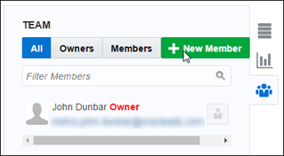

- Select another team member from the drop-down list and click **Add**.

  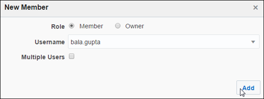

- Repeat steps 7 and 8 again so that your project team contains two other members besides yourself.

  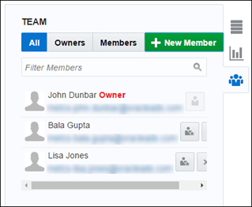

Each team member can now log in to the environment and start collaborating on project development.

#### Milestone 2:  Fetch and review code from the Git repository

- On the right side of the home page, click **New Repository**

  

- In the New Repository dialog, enter these details: 
  - NodeJSDocker in the **Name** field

  - Nodejs Docker Repository in the **Description** field

  - Import Existing Repository under **Initial content**

  - <https://github.com/abhinavshroff/NodeJSMicroDocker> in the text box: 

    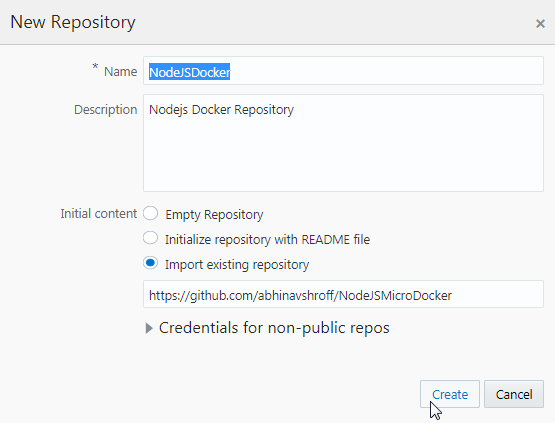

- Click **Create**.

  You should now be on the Code tab, which shows that you have a new DevCS git repository, NodeJSDocker.git.  This new repository contains imported code from the GitHub repository you specified.

  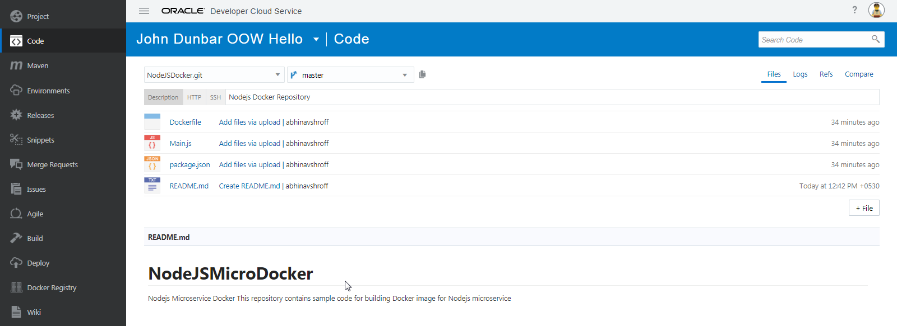

- Click the **Refs** tab to view the current list of branches.  At this point there’s only one, the master branch:

  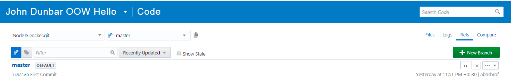

- Click **New Branch**, and create a new branch called feature, based on the master branch.  

  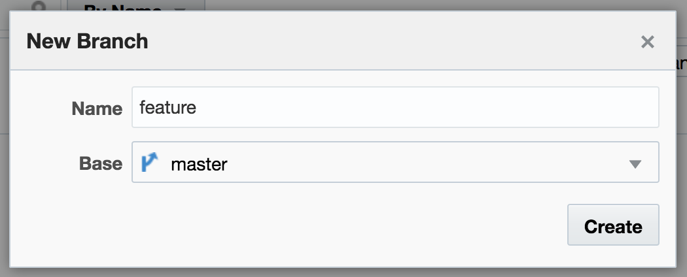

- Click **Files** in the upper right.

  When you create a new branch, four files are automatically created: Main.js, Dockerfile, package.json, and Readme.md, which describes the repository. 

  

- Take a look at what’s in each file by clicking each file name successively. In particular, notice that:
  - Main.js contains the Node.js REST API code
  - Dockerfile contains the commands to build a Docker image
  - package.json defines the dependencies for the Node.js code

- Let’s go back to Main.js, and on the right notice that there are five methods for viewing a file on the Code tab:
  - File
  - Blame
  - Logs
  - Refs
  - Compare

- Click **Blame** tab to view the code and the file’s commit history:

  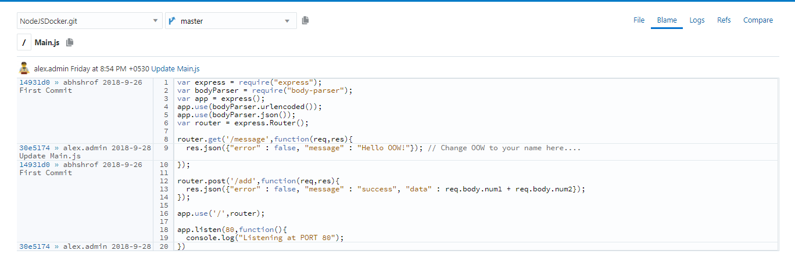

- Next, click **Logs**, where you can see the list of the commits for this branch, as well as the code that was pushed with each commit:

  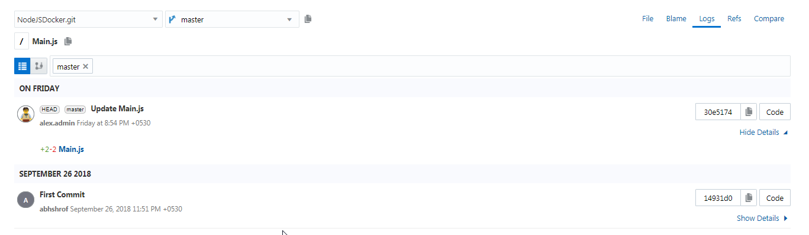

- Click **Files**, then click **Dockerfile.**  We’ll use this file a bit later, when we build the Docker image.

  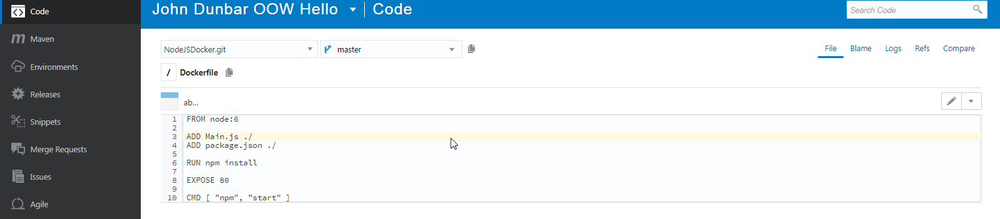

- Click the forward slash next to the Dockerfile name, then click **package.json** to review the Node.js code dependencies.  

  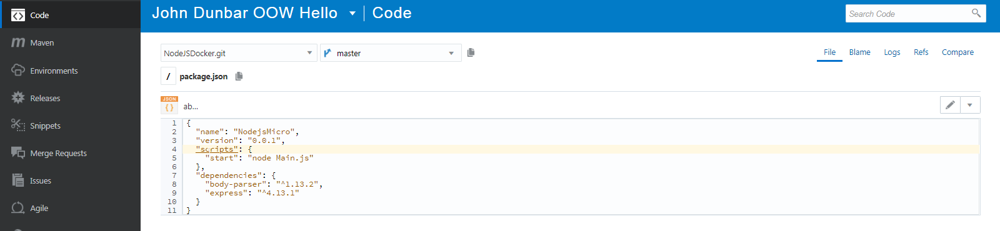

#### Milestone 3: Track issues for your project

In this section, we’ll start tracking tasks (issues) that our team needs to take care of. We’ll then organize these tasks into a sprint.

- In the left nav bar click **Issues**, then click **New Issue**:

  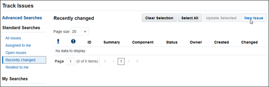

- For your first issue:
  - Type Change the message in Main.js in the **Summary** field

  - Type Change OOW in message to my name in Main.js. in the **Description** field

  - Select **Task** in the **Type** drop-down list. 

    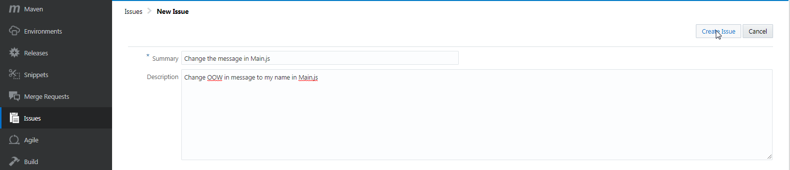

- Scroll down, and from the **Status** drop-down list, select **Assigned**. 

- From the **Owner** drop-down list, select **kevinevans** (your user). 

  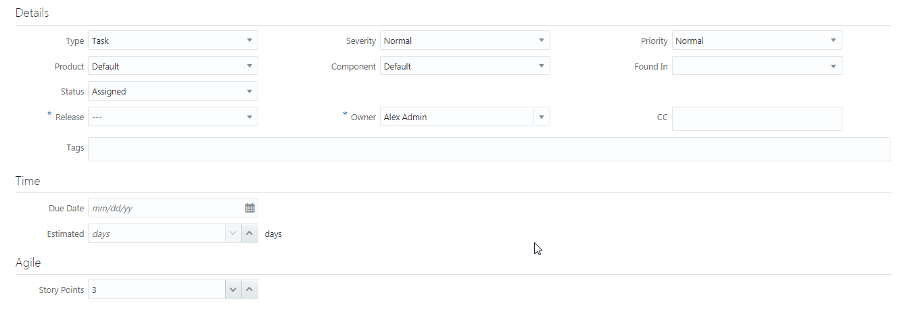

- In the **Story Points** field, enter **3**. 

- Click **Create Issue**.

- Click the **Issues** tab to see the new issue:

  

#### Milestone 4: Create an Agile board and a sprint to track issues

In this section, we explore the DevCS features that help you manage your agile development process.

- In the left nav bar, click **Agile**, then click **New Board**

  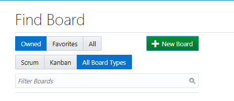

- In the New Board dialog box:

  - Type Hello Board in the **Name** field 

  - Select **Story Points** from the **Estimation** drop-down list 

  - Click **Create**.

    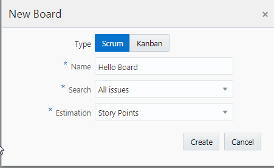

    You can see the issue you created earlier in Backlog.  Let’s add it to a sprint.

- Click **New Sprint**.

  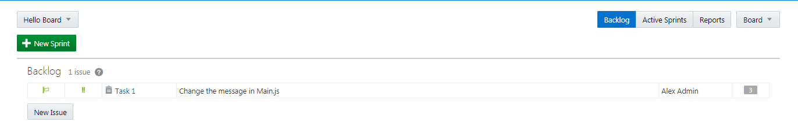

- Let’s call our new sprint Sprint 1. In the **Story Points** field enter 5, then click **OK**. 

  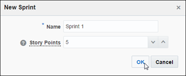

  You can now see the new sprint, along with instructions on how to add issues to it. 

- Drag and drop Task 1 to Sprint 1, taking care to drop it right on top of the instructions.

  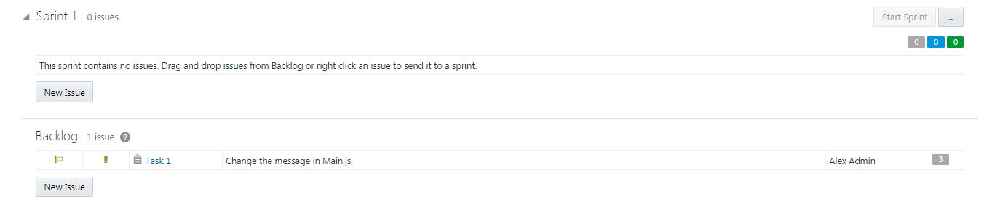

- Click **Start Sprint** to make the sprint active.

  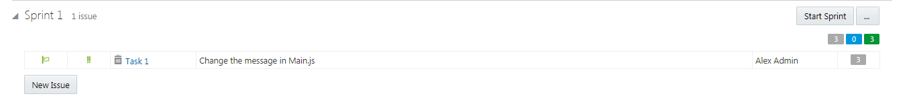

- In the Start Sprint dialog box, accept the default start and end dates and click **Start**. 

  By default, a sprint lasts two weeks. You can now see the default dates above the issue list for Sprint 1.

  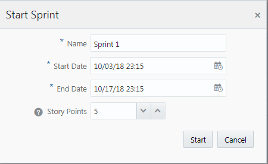

- Click **Active Sprints** to view the progress of the sprint. You can see at a glance all the tasks considered To Do, In Progress, or Completed. 

  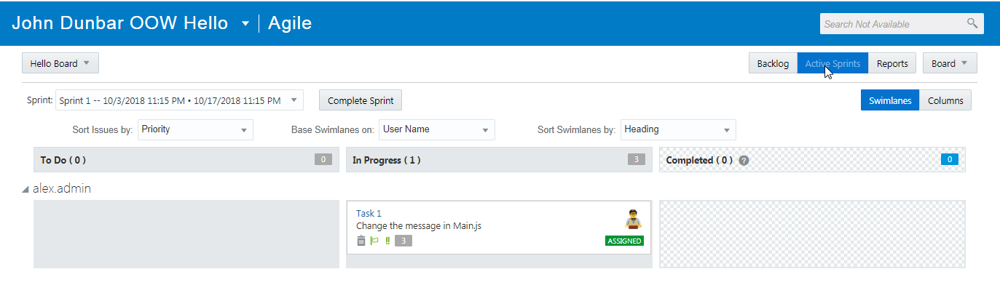

#### Milestone 5: Edit your code and commit it to the working branch

In this section, we’ll see how DevCS helps you edit your code and commit it to the working branch.  

- Click **Code** in the left nav, then select the NodejsDocker.git repository and the feature branch, as shown here: 

  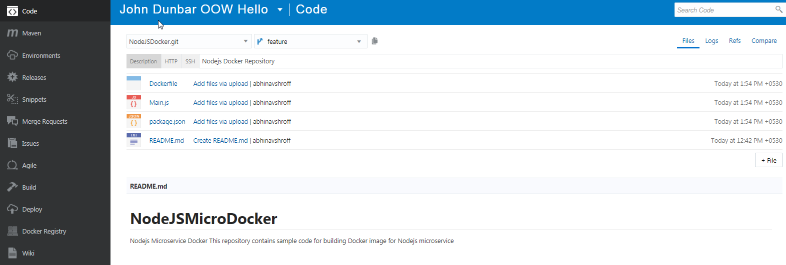

- Click **Main.js,** then click the pencil icon to edit the file.

  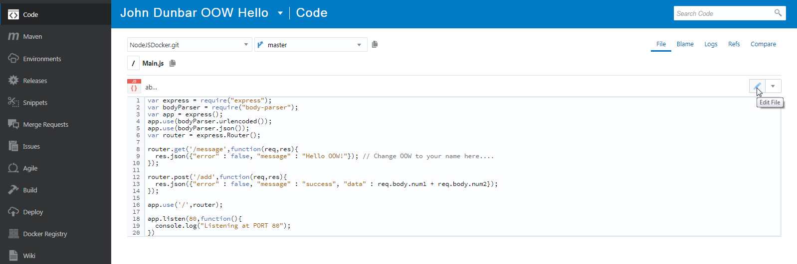

- Find where it says “Hello OOW!” and change “OOW” to your own name.

  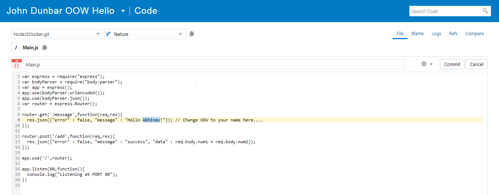

- Click **Commit**.

- In the **Commit changes** dialog, click **Commit** to commit these changes to the NodeJSDocker.git’s feature branch: 

  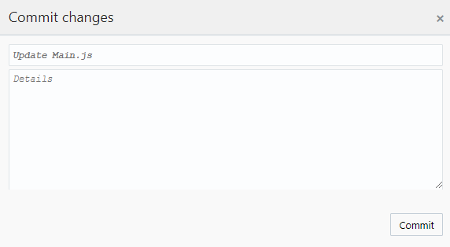

#### Milestone 6: Configure the Docker build job 

In this section, we’ll see how to use DevCS to build the Docker image for the Node.js REST application.   We’ll actually configure two build jobs, one for NodeJSDockerOCIR and one for NodeJSDockerHub.

Let’s start with the NodeJSDockerOCIR build job. 

- Click **Build** in the left nav bar, then click **New Job**. 

  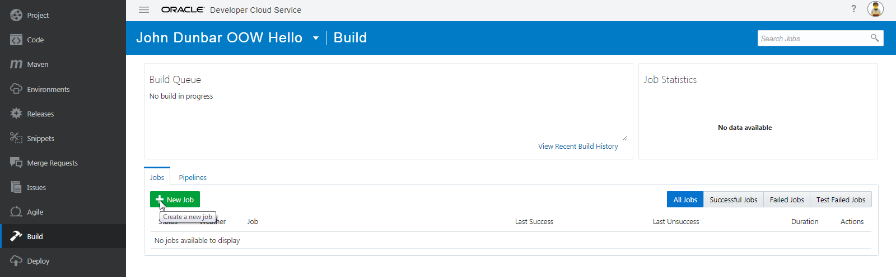

- In the New Job dialog: 
  - Type NodeJSDockerOCIR in the **Job Name** field 

  - Type Build and push Docker image to OCIR in the **Description** field 

  - Select OOW_Template from the **Software Template** drop-down  

  - Click **Create Job**.

    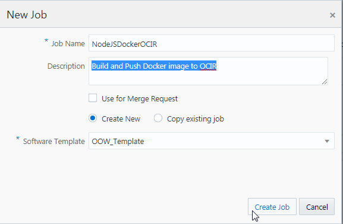

- From the **Add Source Control** dropdown, select Git.

  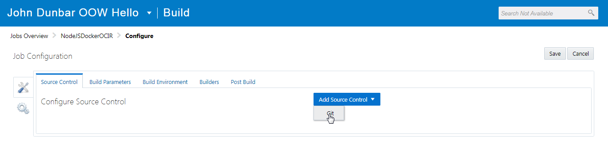

- Select NodeJSDocker.git from the **Repository** drop-down.

- Select master from the **Branch** drop-down.

- Click the **Automatically perform build on SCM commit** check box. 

  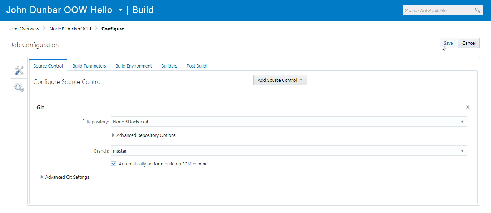

- Click the **Builders** tab. 

- From the **Add Builder** drop-down, select **Docker Builder->Docker login**. 
  - Type iad.ocir.io in the **Registry Host** field

  - Type gse00014089/api.user in the **Username** field 

  - Type 1}UHkK2o[L7nAij7nE{R in the **Password** field.

    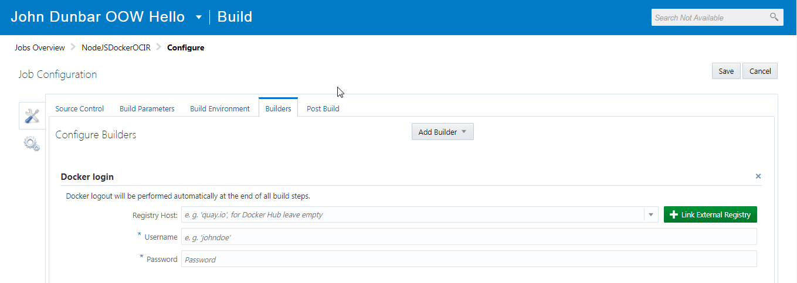

- From the **Add Builder** drop-down, select **Docker Builder->Docker build**. 
  - Type iad.ocir.io in the **Registry Host** field
  - Type gse00014089/oowhol/nodejsmicro**jodu** in the **Image Name** field.  Replace **jodu** with the first two letters of your first and last name, respectively. 
  - In the **Source** radio buttons, click **Context root in Workspace**.

- From the **Add Builder** drop-down, select **Docker Builder->Docker push**. 
  - Type iad.ocir.io in the **Registry Host** field

  - Type Type gse00014089/oowhol/nodejsmicro**jodu** in the **Image Name** field.  Replace **jodu** with the first two letters of your first and last name, respectively. 

    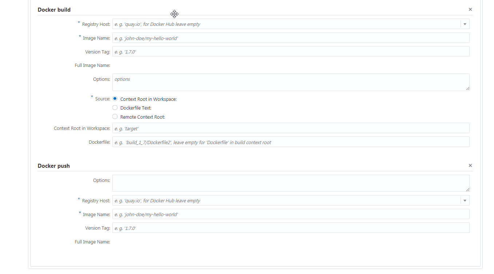

- Click **Save**.

  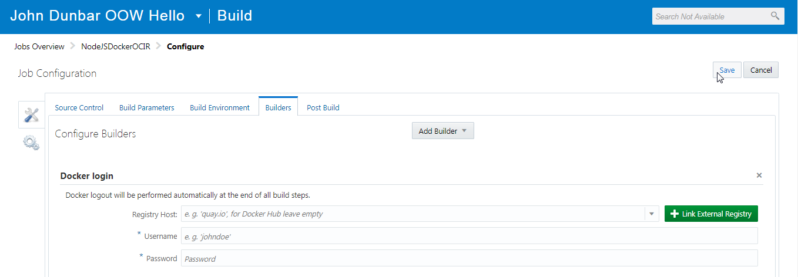

You’ve finished configuring the first build job, so now let’s move on to the NodeJSDockerHub build. 

- Click **Build** in the left nav bar. 

- Click **New Job**.

  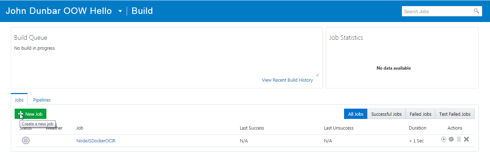

- In the New Job dialog: 
  - Type NodeJSDockerHub in the **Job Name** field 

  - Type Build and push Docker image to DockerHub in the **Description** field  

  - Select OOW_Template from the **Software Template** drop-down  

    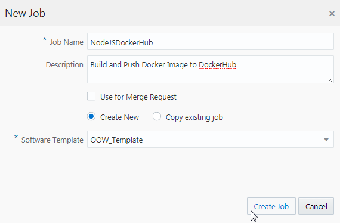                     

- Click **Create Job**.

- From the **Add Source Control** drop-down, select Git.

  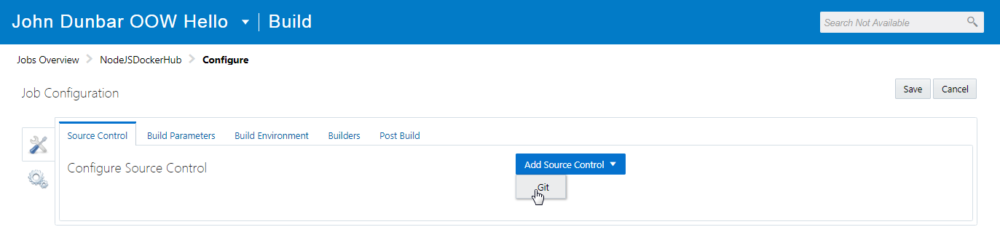

- Select NodeJSDocker.git in the **Repository** drop-down.

- Select master from the **Branch** drop-down. 

  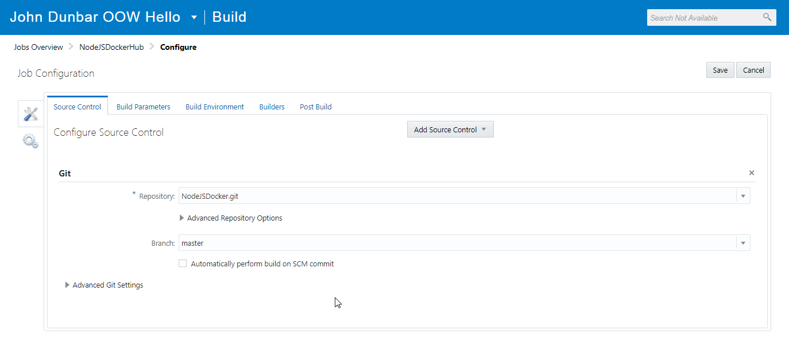

- Click the **Builders** tab. 

- From the **Add Builder** drop-down, select **Docker Builder->Docker login**. 
  - Type odcsrepo in the **Username** field  

  - Type odcsrepo in the **Password** field. 

    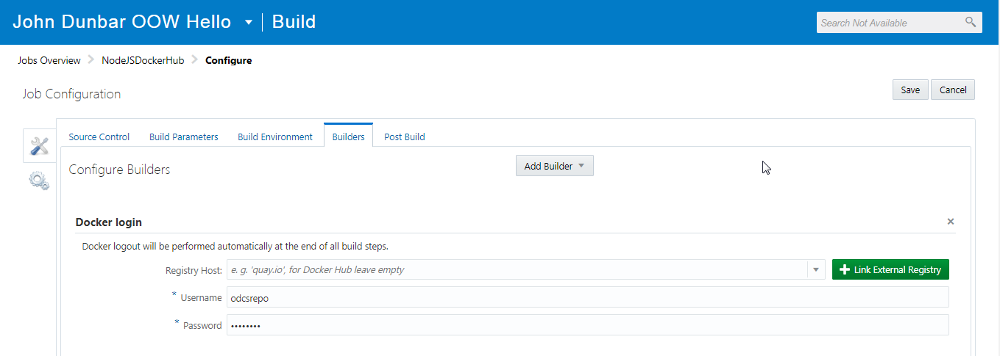

- From the **Add Builder** drop-down, select **Docker Builder->Docker build**. 
  - Type odcsrepo/nodejsmicro**jodu** in the **Image Name** field.  Replace **jodu** with the first two letters of your first and last name, respectively. 

  - In the **Source** radio buttons, click **Context root in Workspace**.

    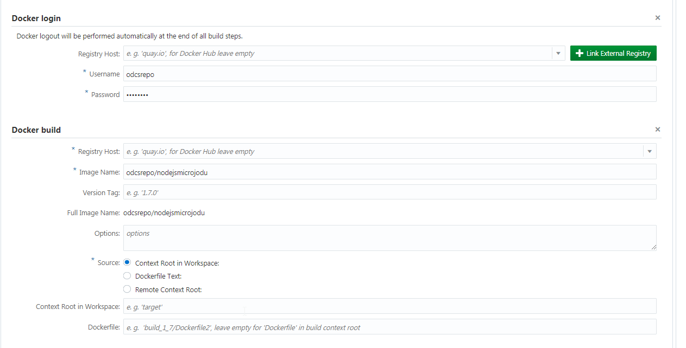

- From the **Add Builder** drop-down, select **Docker Builder->Docker Push**. 

  - Type odcsrepo/nodejsmicro**jodu** in the **Image Name** field.  Replace **jodu** with the first two letters of your first and last name, respectively. 

    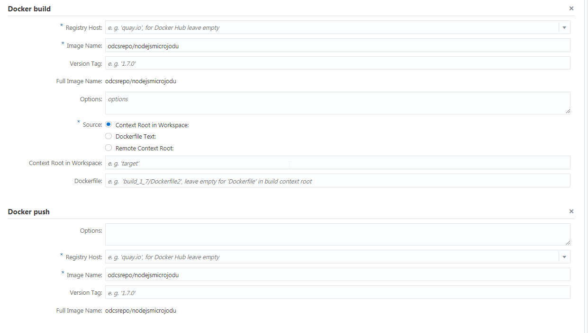

- Click **Save**.

#### Milestone 7: Create and execute the build pipeline

In this section, we’ll create a pipeline to run the two build jobs we just created.

- Click **Build** in the left nav, then click **Pipelines**:         

  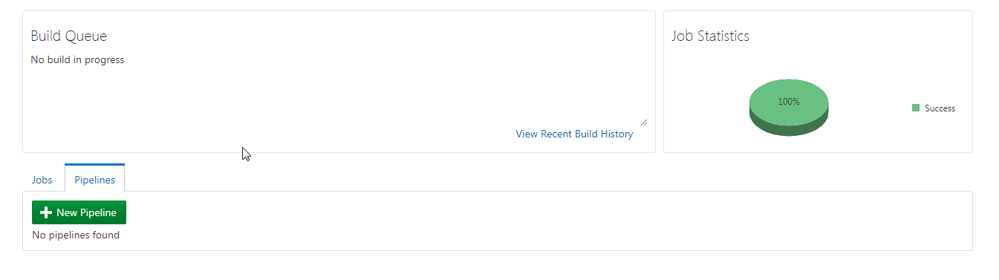

- Click **New Pipeline**.

- Let’s use **DockerPipeline** as the name. 

- Select both check boxes, as shown here: 

  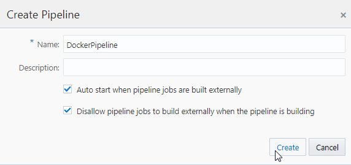

- Click **Create**.

- Drag NodeJSDockerOCIR to the gridded area, and drop it right after the **Start** bubble. 

- Drag NodeJSDockerHub and drop it right after NodeJSDockerOCIR. 

- User the cursor to draw areas between them, as shown here:   

  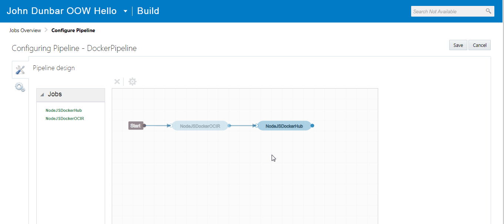

- Double-click the line connecting the two build jobs.

- In the editor, select Successful from the **Result Condition** drop-down:

  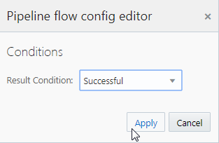

- Click **Apply**. 

- Click **Save**:

  

#### Milestone 8: Merge your feature branch with the master branch of the NodeJSDocker.git repository 

In this section, we explore how to review and merge code in DevCS. 

- Click **Merge Requests** in the left nav bar: 

  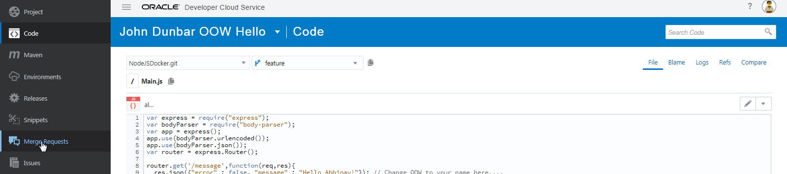

- Click **New Merge Request**:

  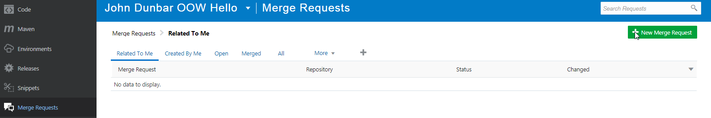

- In the New Merge Request dialog:
  - Select NodeJsDocker.git from the **Repository** drop-down

  - Select master as the **Target Branch** 

  - Select feature as the **Review Branch**

  - Click the commit that appears for the review branch 

  - Click **Next**.

    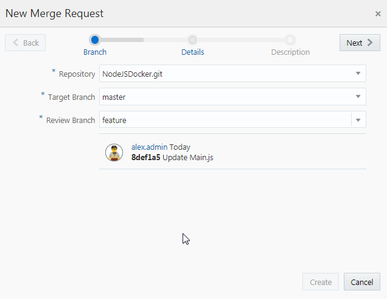

- On the Details page: 
  - Select yourself as the reviewer under **Reviewers**

  - In the **Linked Issues** field, type Task until you see the task you created earlier. 

  - Click the task description

  - Click **Next**.

    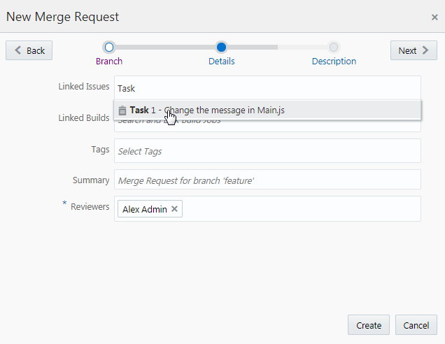

- Review the description and click **Create**:

  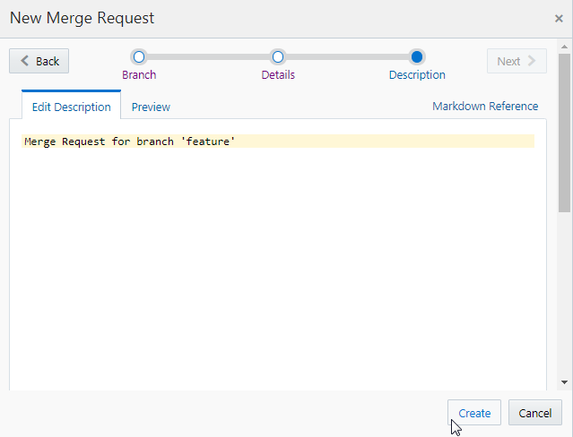

- Click the **Changed Files** tab and review the changes:

  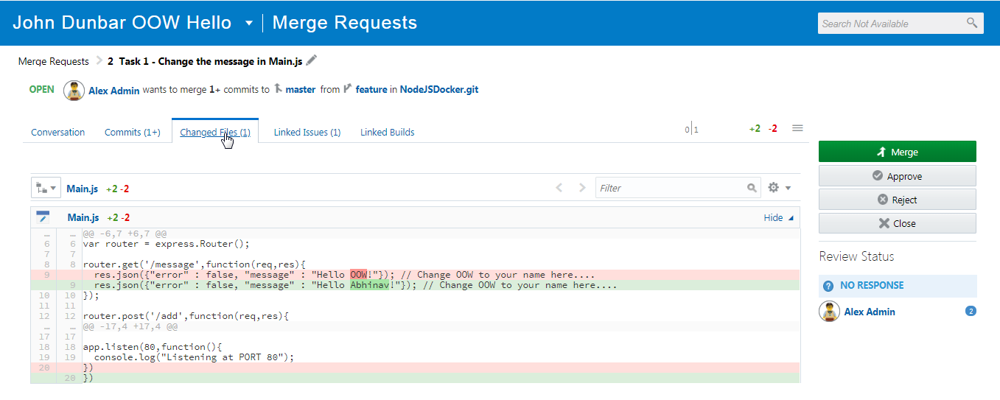

- If the changes look correct, click **Approve**:

  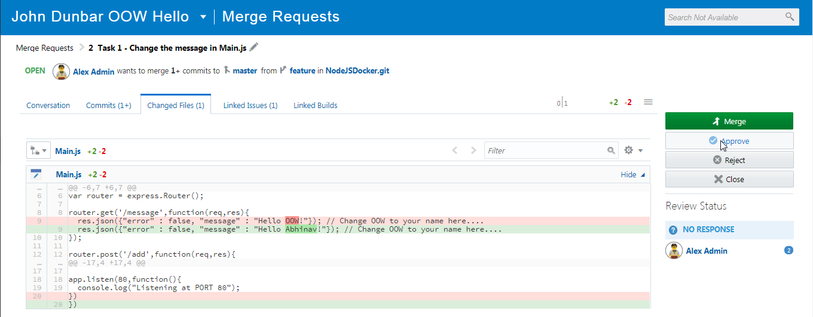

- Enter OK as a comment, then click **OK**

  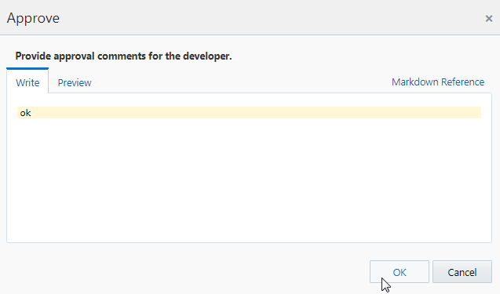

- Click **Merge** to merge the changes into the NodeJSDocker.git repository’s master branch:

  

- Keep the defaults, then click **Create a Merge Commit**.

  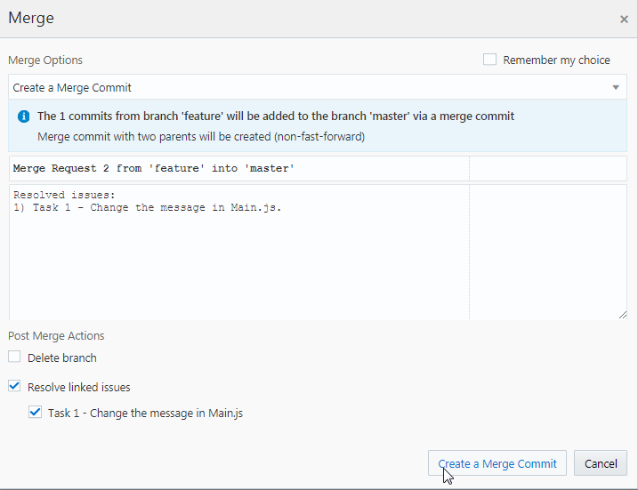

You should now see the Review Status as Approve, with a green tick. 

This merge will trigger the execution of the **NodeJSDockerOCIR** build job, which in turn will trigger the execution of the **DockerPipeline.**  

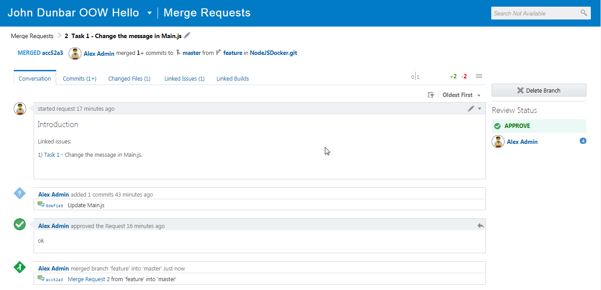

- Click **Build** in the left nav bar. 

- Click **Jobs**:

  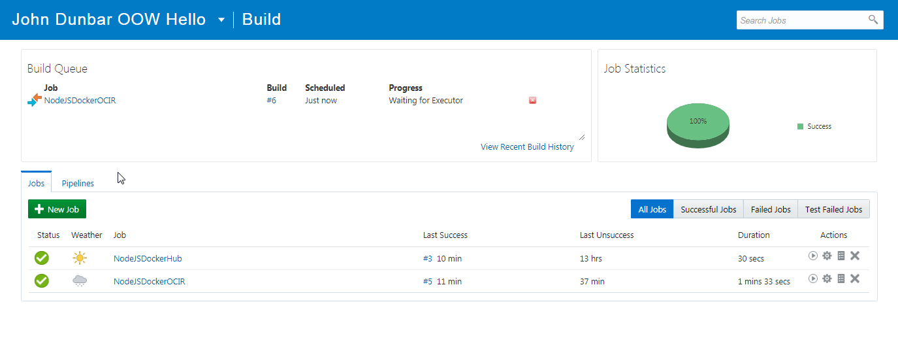

You should see your two build jobs, waiting to be built. 

- Click the **NodeJSDockerOCIR** build job.

- Click **Build Log**, as shown here: 

  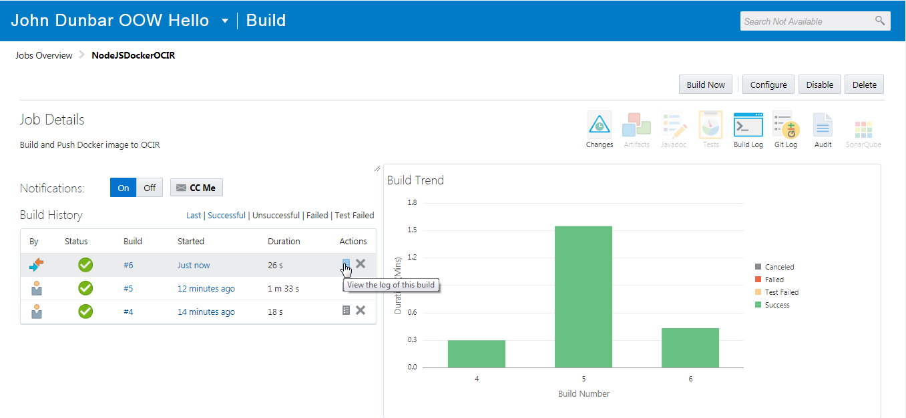

- Take a look at the log for the NodeJSDockerOCIR build job.

  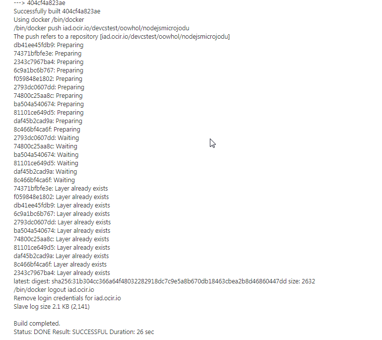

- Click the NodeJSDockerHub build job and take a look at its build log too: 

  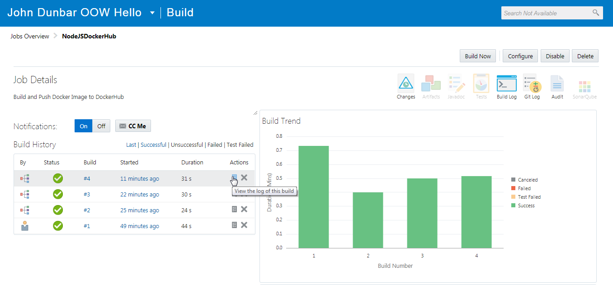

- Inspect the build job:

  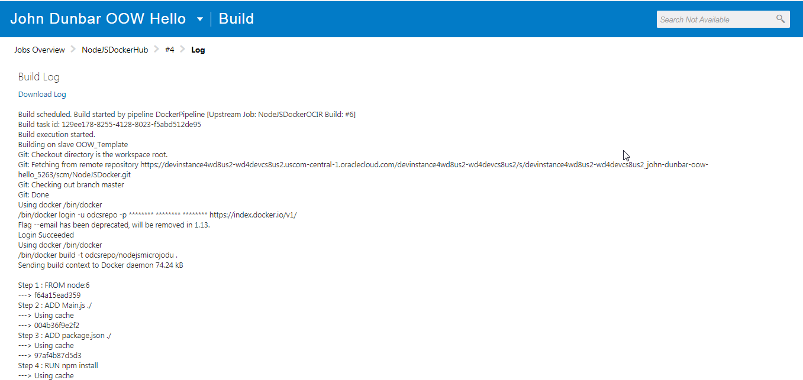

- Open Google Chrome and go to:  https://hub.docker.com

- Sign in using your credentials

- You should see your Docker image in the repository! 

  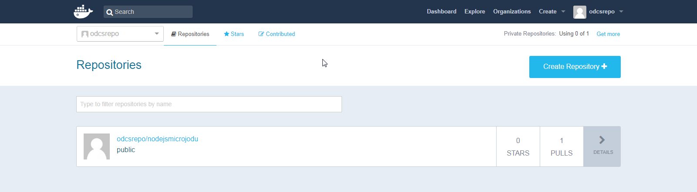

#### Summary

Now that you’ve finished this lab, you should know how to build a pipeline to build and push a Docker image to Oracle Cloud Infrastructure Registry and DockerHub registry using Developer Cloud.   Specifically, you learned how to: 

- Work with Oracle Developer Cloud Service and its most important features

- Create a project and pull the code from an existing GitHub repository to a DevCS-hosted Git repository
- Create a task within DevCS and an Agile board to track it
- Complete the task by branching the code, editing it using the online editor, and merging the code
- Build the Docker image with Continuous Integration in DevCS
- Push the Docker image to the Oracle Cloud Infrastructure Registry and DockerHub.

To learn more and get a free trial of Oracle Developer Cloud Service, visit:

- <https://cloud.oracle.com/developer_service>

To develop a sample application from scratch, check out the Oracle Documentation Portal:

- <http://www.oracle.com/webfolder/technetwork/tutorials/obe/cloud/apaas/Basic_App_Embedded_Tomcat/basic_app-tomcat-embedded.html>

---
[Go to Overview Page](../AppDevInfra.md)
