[Go to Overview Page](Dev2OKE.md)

## AppDev Development - Building applications with DevOps ##
### Setup your Developer Cloud Service Instance ###

### Introduction ###

This page will guide you through the setup of a new Developer Cloud instance :
- Enabling DevCS on your Dashboard
- Creating an instance
- Configuring the storage and Build parameters for your instance

This guide is meant for new Developer Cloud Service instances (post June 2018) cloud environments

### Enable DevCS on your dashboard ###

- Login to your cloud account and navigate to the dashboard

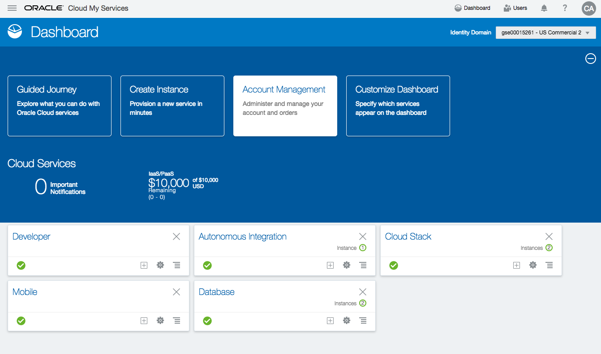

- Make sure the "Developer Cloud" service is "visible" on the dashboard as in the above screenshot.  If this is not the case, use the "Customize Dashboard" button to enable it.

### Create an instance ###

- Go into the Developer Cloud Service Overview by clicking on the Service title

- Open the Service Console.  You should have no existing instances.  If you have, you can skip the following steps and just validate you have a build engine witht the correct libraries included.

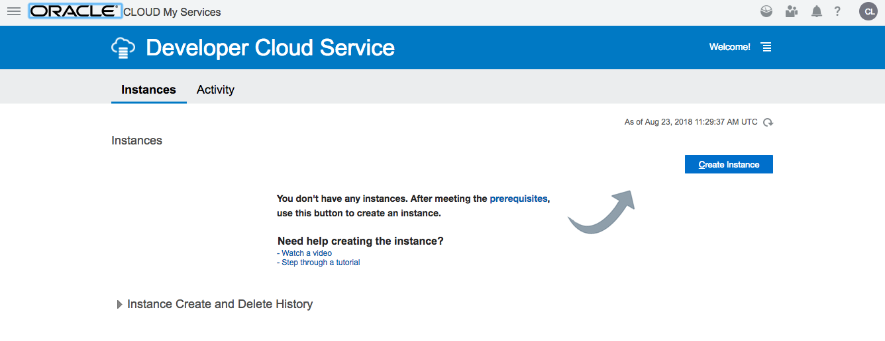

- Use the "Create Instance" button to create a new Developer Cloud instance

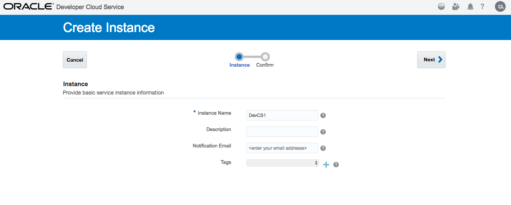

- Hit the "Next" button and then "Create"

- Now the instance is being created.  This will take a few minutes, you can hit the small arrow to requery the status.

### Configuring your DevCS Instance ###

Once the instance is available, you need to configure a few things to be able to create projects and run builds.  Please perform following steps to complete this configuration.

- Open a second window where you navigate to the Cloud Services Dashboard
- Open the Compute Classic Service Overview, and note down following elements :
   - Service Instance ID
   - Rest Endpoint

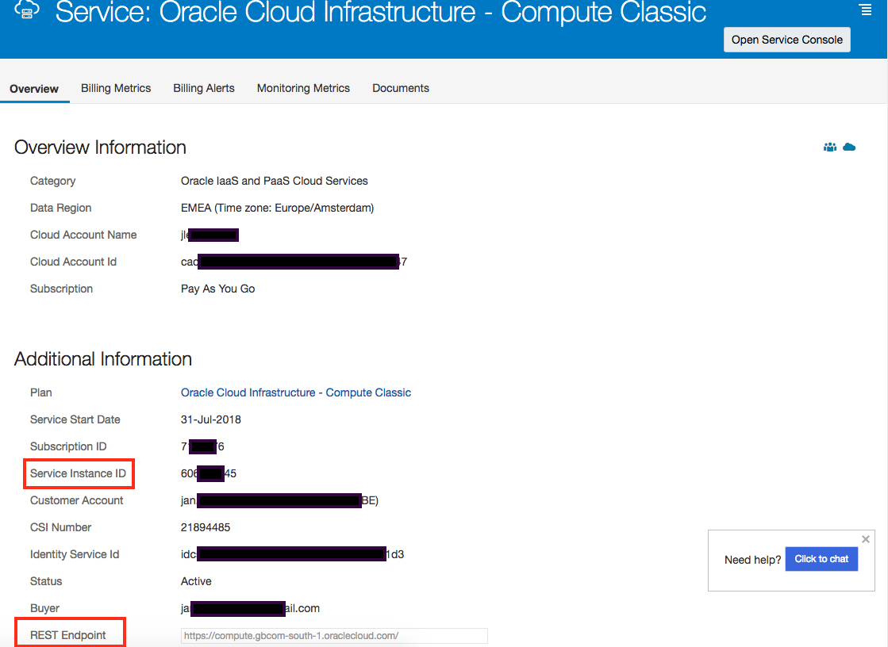

- Navigate back to the Dashboard, and now select the "Storage Classic" Service Overview.  Note down following element:
   - Auth V1 Endpoint

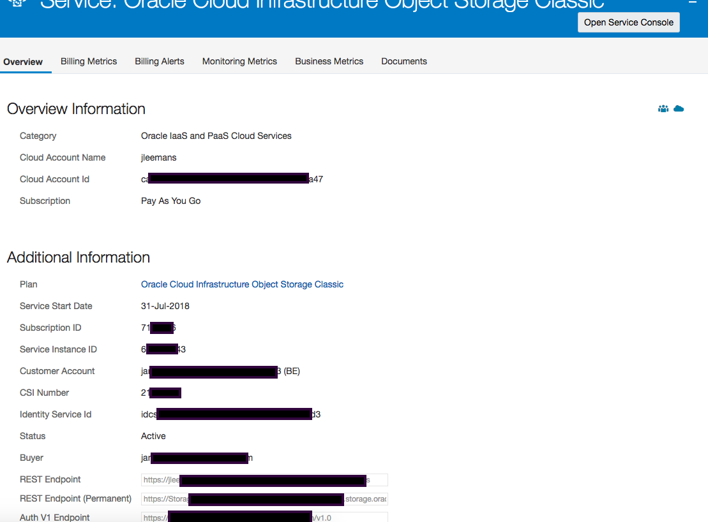

- Return to your initial window with the Developer Cloud Services, and click on the hamburger icon on the right of the newly created service.  Select "Access Service Instance".

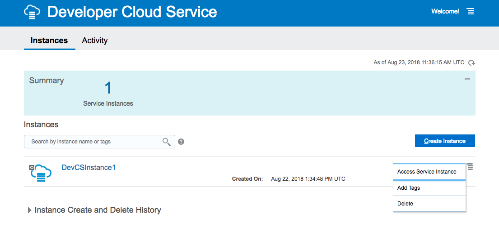

- Now go to the "Organization" by clicking on the icon top right with your username initials

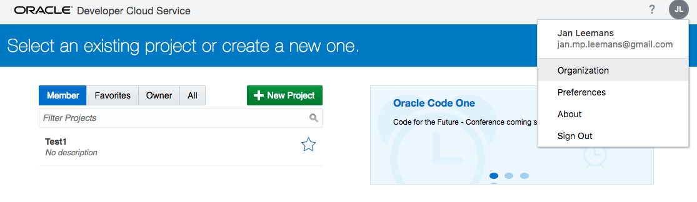

- Navigate to the "Storage" configuration, and enter the storage parameters.  Test the connection to validate.
   - Service-ID : ue the syntax "Storage-xxxxx" where xxxxx is your cloud instance name

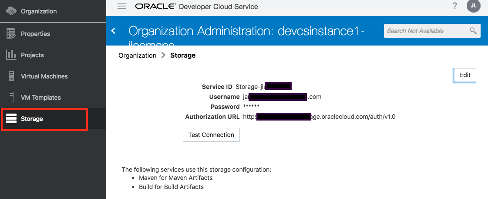

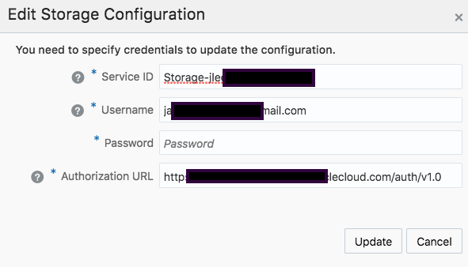

- Now navigate to the "Virtual Machine configuration, and hit the **Configure Compute Account** button:

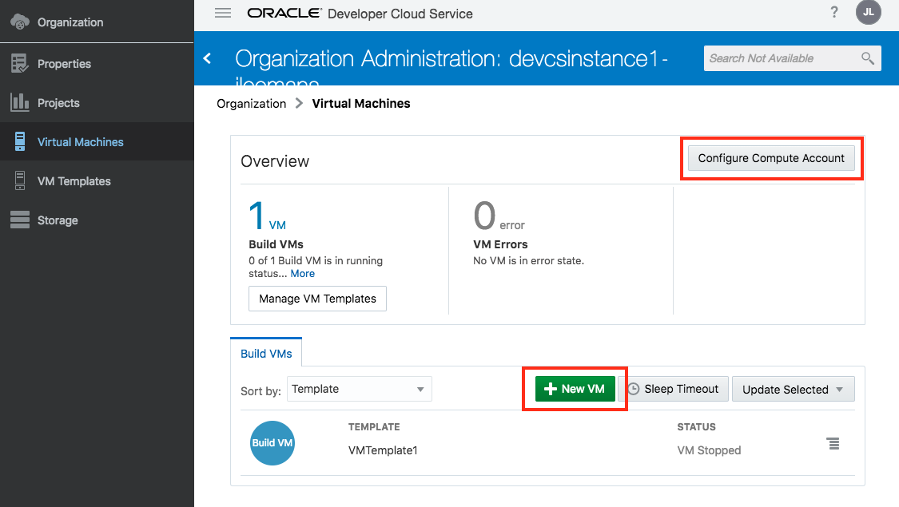

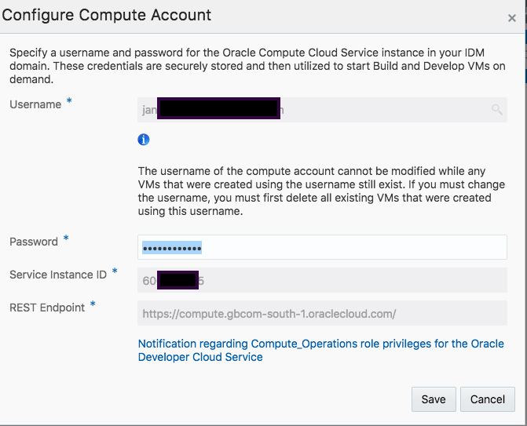

### Creating a Virtual Machine

- Navigate to the VM Template menu and create a new template.

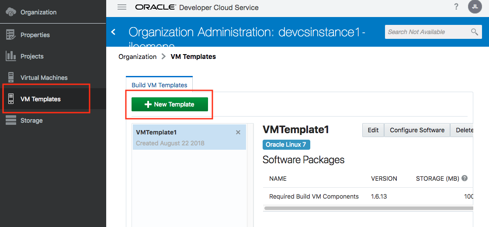

- In the dialog box, specify a name, for example **DockerOCIOKE**  and use the default **Oracle Linux 7** image.  Then hit the **Create** button.

  

- Now select the template you just created (DockerOCIOKE), and add the required software packages by clicking on the **Configure Software** button.

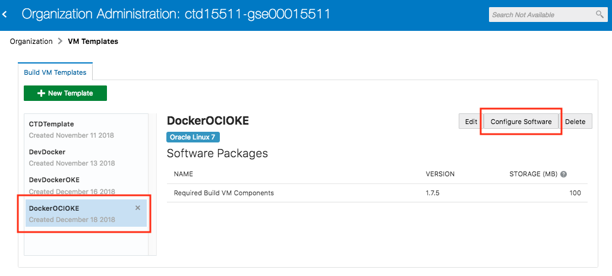

- Select the following packages:
  - Docker 1
  - Kubectl
  - OCIcli ==> this will prompt you to also install Python3

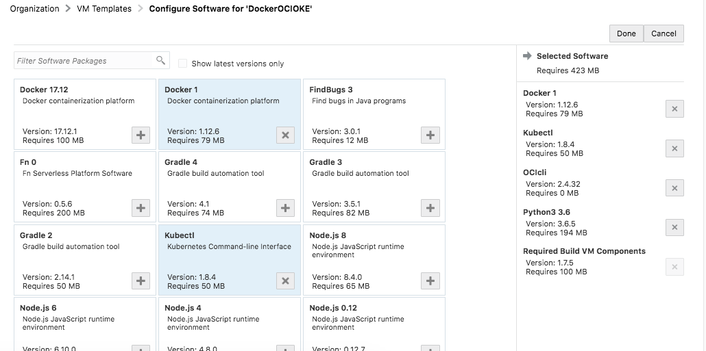

- Finally, navigate to the **Virtual Machines** menu on the left, and hit the **New VM** button.

  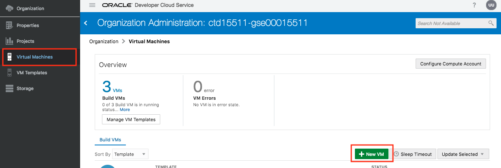

  - Choose **Quantity = 1**
  - Select the template you just created: **DockerOCIOKE**

You finished all the steps to finalize the Developer Cloud setup.  Please use the "Back" button of your browser to return to the main tutorial.

 

---

[Go to Overview Page](Dev2OKE.md)

