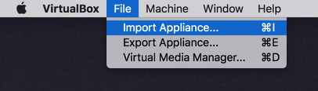
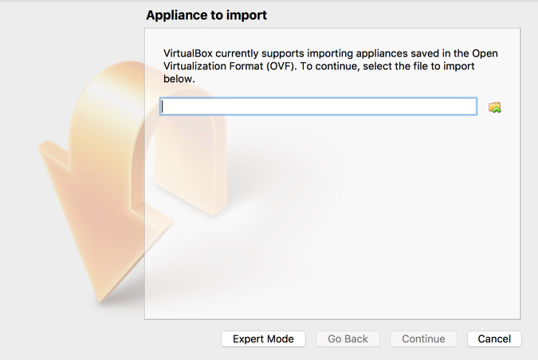
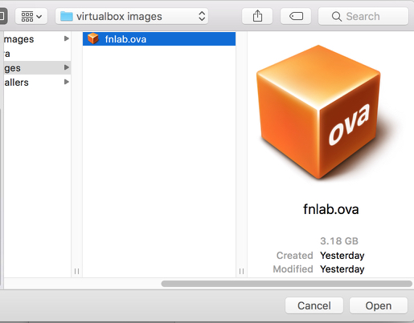
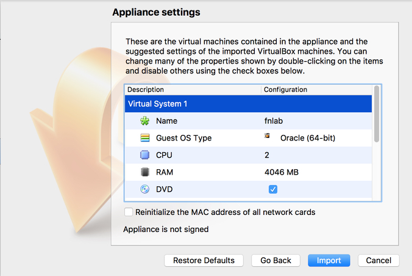
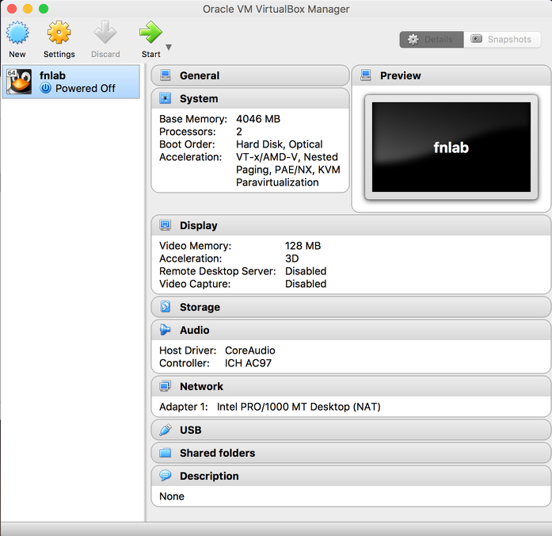
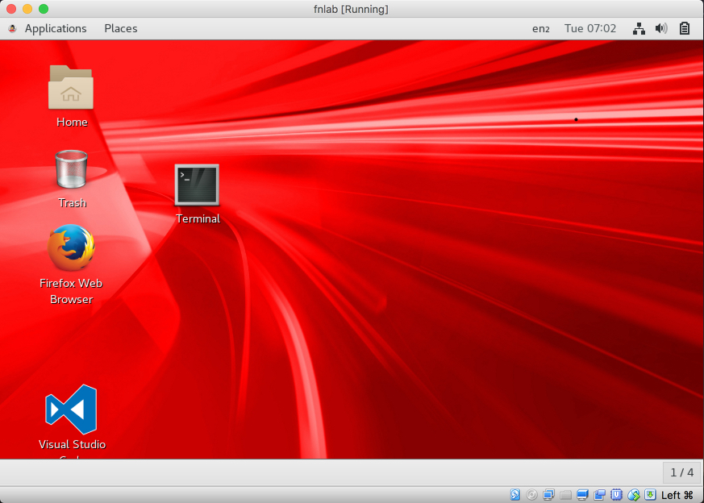

# VM Startup instructions

### 1. Install VirtualBox if needed

Your lab instructor may have a USB stick with installers or you can download from
http://www.oracle.com/technetwork/server-storage/virtualbox/overview/index.html

### 2. Import the lab VM appliance

Run VirtualBox and select File>Import Appliance...

Navigate to the folder with the fnlab.ova appliance and select.

Before importing you can review and adjust the settings but the defaults should be fine on a host machine with at least 8GB of RAM.

I can take a few minutes to import the applicance to create a virtual machine.

Once imported you'll see the `fnlab` virtual machine in the VirtualBox Manager.

### 3. Start the lab virtual machine

Select `fnlab` and click the `Start` button to launch the virtual machine
and open a Linux desktop.

Double click on `Terminal` to open a terminal.  Do *not* update when prompted, this is not necessary.

When running "$ sudo -s" the password is "demo"
