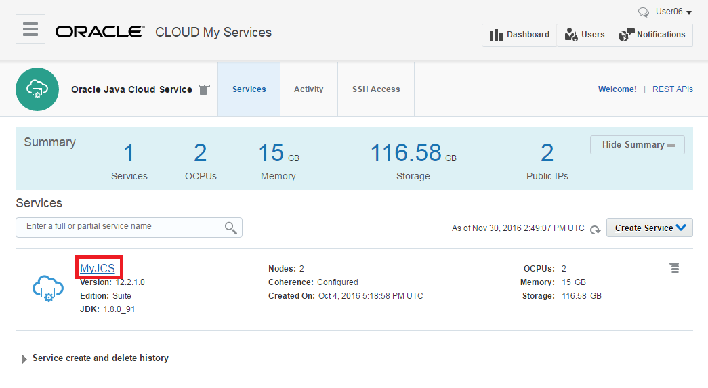
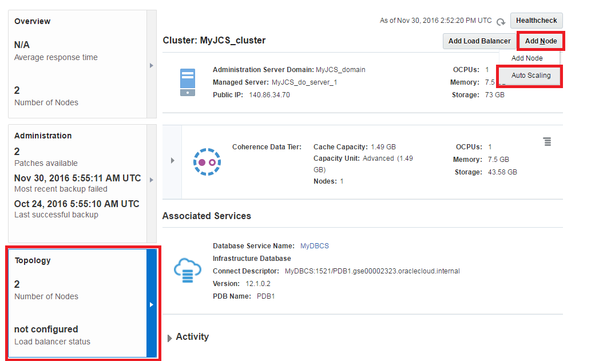
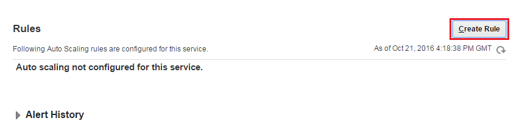
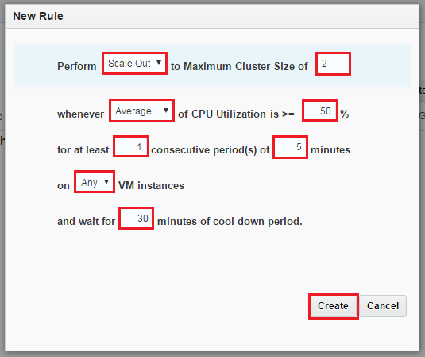
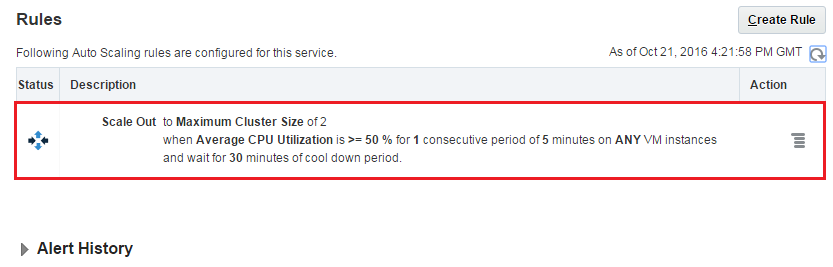

---
# ORACLE Cloud Test Drive Events #
-----
## Oracle Java Cloud Service Policy Based Auto Scaling ##

### Introduction ###
Scaling lets you add or remove resources for an Oracle Java Cloud Service instance on demand in response to changes in load on the service instance. You can scale an Oracle Java Cloud Service instance by scaling a cluster, a node, or the Coherence data tier in the service instance.
Oracle Java Cloud Service has Auto Scaling feature which allows you to define rule for a given service. When the rule's criteria meets the defined threshold Auto Scaling starts to scale in/out the service.

### About this tutorial ###
This tutorial demonstrates how to:

+ Create Auto Scaling rule

### Prerequisites ###

+ Oracle Public Cloud Services account including:
	+ Database Cloud Service
	+ Java Cloud Service
If you are taking part in the Cloud Test Drive Event, you already should have a running DB and Java Cloud Service in your environment

### Steps ###

#### Create Auto Scaling Rule ####

Create rule for Java Cloud Service which triggers auto scaling based on the defined criteria. Go back to the service console for the Java Cloud Service instances. Press the hyperlink of the instance name.

Click **Topology** on the left menu. Click **Add Node** and select **Auto Scaling** item.

On the Rules page click **Create Rule**. 

Define the rule parameters.
	
+ Perform: **Scale Out**
+ Maximum Cluster Size: **2** (1 more higher then the existing cluster size)
+ CPU Utilization: **Average** - **50%**
+ Number for measurement period: **1**
+ Period length: **5** minutes (this is the minimum)
+ VM instances: **Any**
+ Cool down period: 30 (this is the minimum)

Click **Create**. **Please note!** If another attendee already created the same Rule, you will get an error and will not be able to create the rule. That is OK since we are not gonna put the rule in to use in this lab anyway.

Wait till the rule will be complete.

                                               
#### Putting load on the JCS instance and observing the acttual autoscaling ####

The original version of this exercise comprised the creation of a load-generating application on the JCS instance, and thus observing the auto-scaling live.  This is outside of the scope of the Cloud Test Drive event, please feel free to test this on your own in the [original version](https://github.com/oracle/cloud-native-devops-workshop/blob/master/jcs-scale-ui/README.md) of this exercise.

