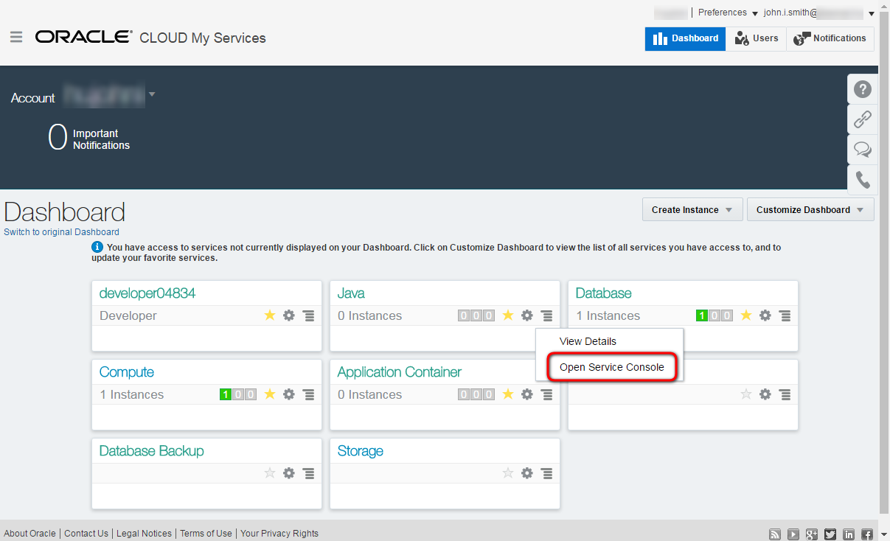
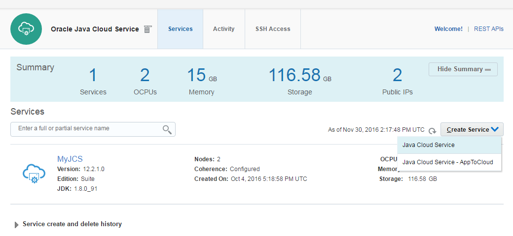
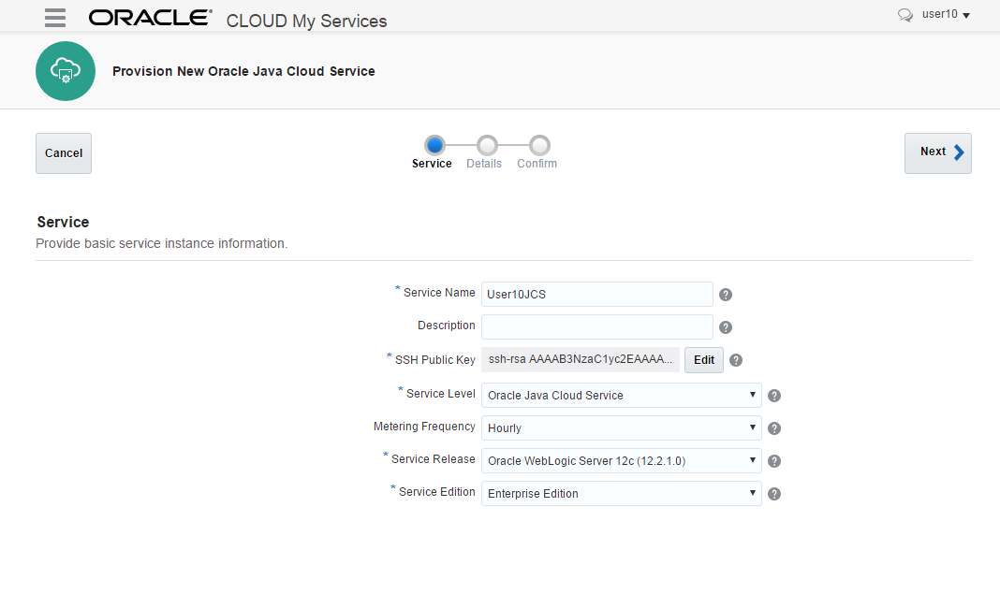
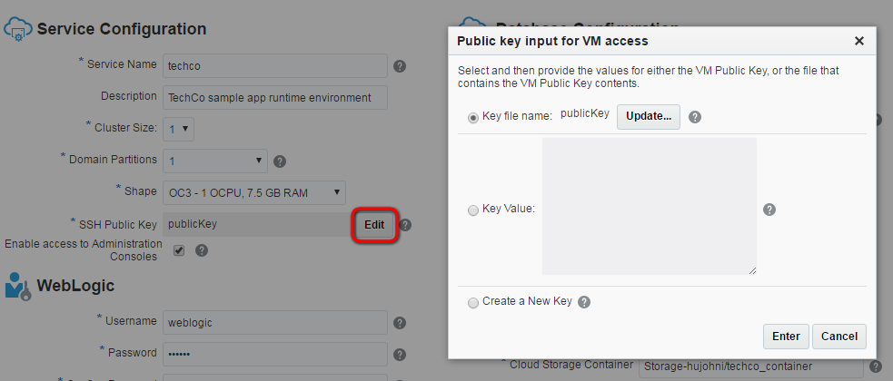
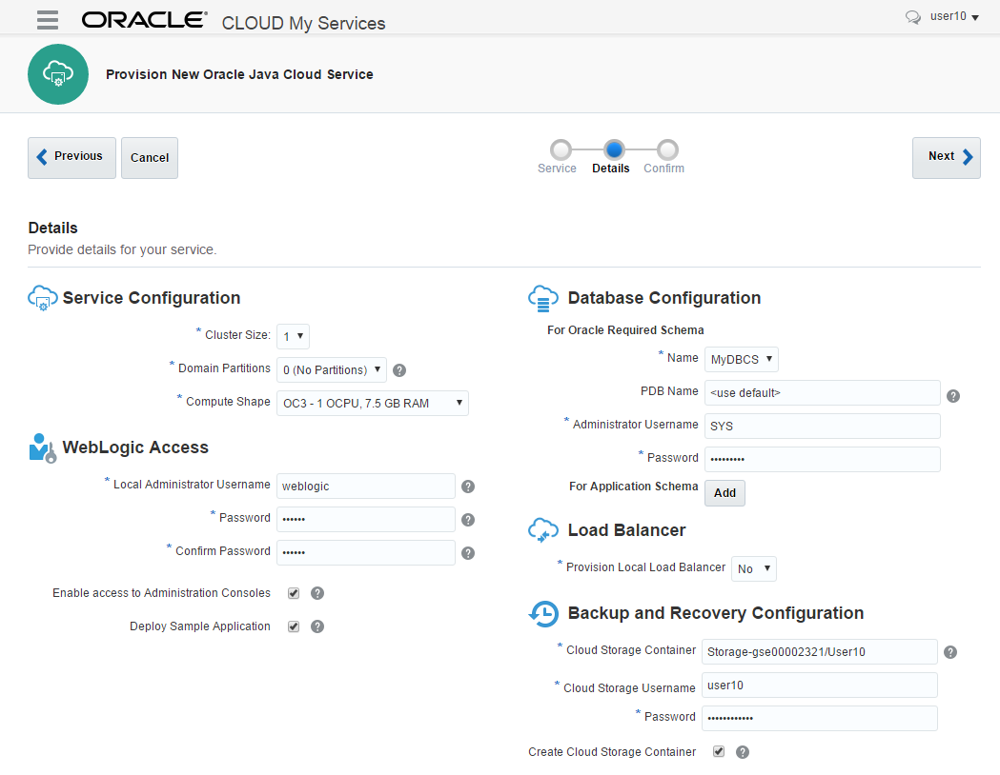
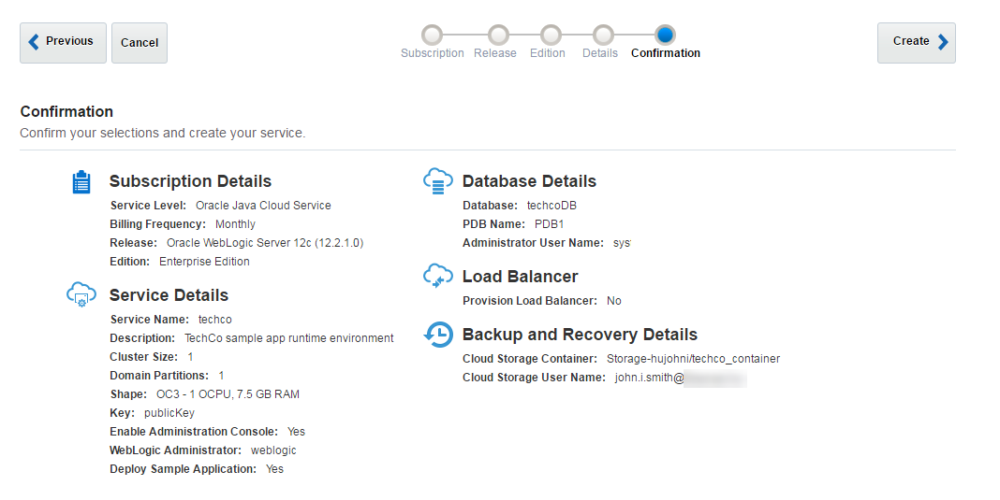

[Go back to Overview Page](../AppDevInfra.md)

## Application Development Infrastructure lab ##
### Create Java Cloud Service instance using the user interface ###

### Introduction ###

By using Oracle Java Cloud Service, you can quickly create and configure an Oracle WebLogic Server domain and set up your Java EE application environment without worrying about setting up any infrastructure or platform details yourself. All Oracle Java Cloud Service instances that you create are also preconfigured to use your database deployment in Oracle Database Cloud Service, and an object storage container that you create in your Oracle Storage Cloud Service.

### Steps ###

Go to the Console (see Access information that was delivered to you in the workshop, or login to your [trial environment](https://cloud.oracle.com/sign-in) ). On the dashboard click the hamburger icon on the Java tile. Select **Open Service Console**.

+ To create new instance click **Create Service** button and select **Java Cloud Service** in the drop down list.

Now choose the basic parameters for your Weblogic instance :
+ Service name : the name of the new instance, please include your username, eg. User10JcsInstance1
+ For the Service Level, select the  fully managed Oracle Java Cloud Service : "Oracle Java Cloud Service"
+ Hourly billing format 
+ Weblogic Release : choose the latest version
+ Weblogic Edition : Enterprise Edition

For more details about subscription types see the [documentation](https://docs.oracle.com/cloud/latest/jcs_gs/JSCUG/GUID-31F00F2C-221F-4069-8E8A-EE48BFEC53A2.htm#JSCUG-GUID-98DD6CE1-480F-4AA9-8131-A1D3D274440F)

Hit the "Next" button to go to the Services Details screen
+ Select the "Advanced" mode on the top of the screen
+ Now edit the SSH Public key you will use to access this instance : it allows to connect to the VM through ssh connection using the private key. Select **Create a New Key** option and download the newly generated keypair for later usage.

Now enter the following parameters on the screen:
	
+ **Cluster size**: to save resources leave the default 1. Which means one managed server.
+ **Domain Partitions**: Create mutitenant instance. Select 1 to enable partitioning.
+ **Shape**: number of OCPU and size of the RAM. Choose the smallest (default) one.

+ **Username**: username of WebLogic administrator. For demo purposes you can use: weblogic
+ **Password**: WebLogic administrator's password. Don't forget to note the password you selected. 
+ **Enable Administration Console**: because this instance will be available on public internet the default is that the WebLogic Admin console is not enabled. Do not forget to check in to get access to the Admin console.
+ **Deploy Sample Application**: deploy the sample application. It can be useful to test accessibility (correct LB configuration, etc.) of the Java Cloud Service Instance.

+ **Database Configuration / Name**: Database Cloud Service name to store WebLogic repository data. Basically the list populated with database services within the same identity domain.
+ **Database Configuration / PDB Name**: pluggable database service identifier of the Database Cloud Service instance -provided above- which will be used to store repository schema. If you have choosen default (PDB1) during Database Cloud Service creation then leave the default here too.
+ **Database Configuration / Administrator User Name**: DBA admin to create repository schema for Java Cloud Service instance. Enter: sys.
+ **Database Configuration / Password**: DBA admin password is shown in the same printed handout paper as the username and password.
+ **Database Configuration / For Application Schema**: It is an option to add different database service instance accessibility. For example different database used by the application and different for Java Cloud Service instance repository. You can configure later another Database Cloud Service, but here it is easier to define.
+ Backup Destination : Keep the default "None".  In case you would like to setup a backup service, the format is the following: Storage-IDENTITYDOMAIN/CONTAINERNAME, for example: Storage-gse00002323/User06.  The credentials for the storage are the same username/password you used to sign in to Oracle Cloud Services.
+ **Provision Load Balancer**: to save resources we will not create Load Balancer instance. Leave default: No

For more details about parameters see the [documentation](https://docs.oracle.com/cloud/latest/jcs_gs/JSCUG/GUID-31F00F2C-221F-4069-8E8A-EE48BFEC53A2.htm#JSCUG-GUID-88BD737C-8DA9-419A-8DBF-489BDFF9C512). Click **Next**.

The final page is the summary page showing the chosen configuration before you submit the instance creation request. 
#### ATTENTION !! ####
We will not actually create a new instance, as this process can take up to 30'
So now click **Cancel** to abort the creation of this configuration.  You can use the existing JCS instance in this environment for taking a look at a running instance

---
[Go back to Overview Page](../AppDevInfra.md)

