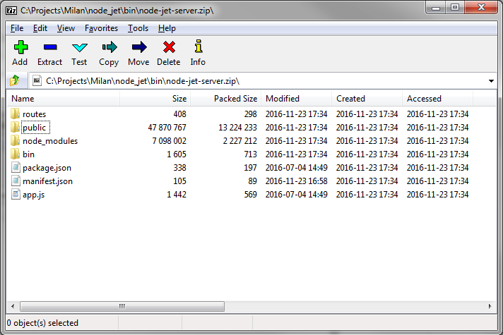
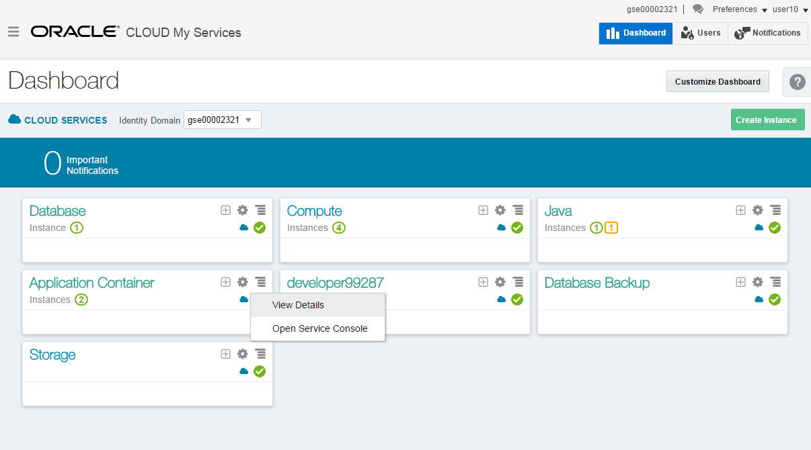
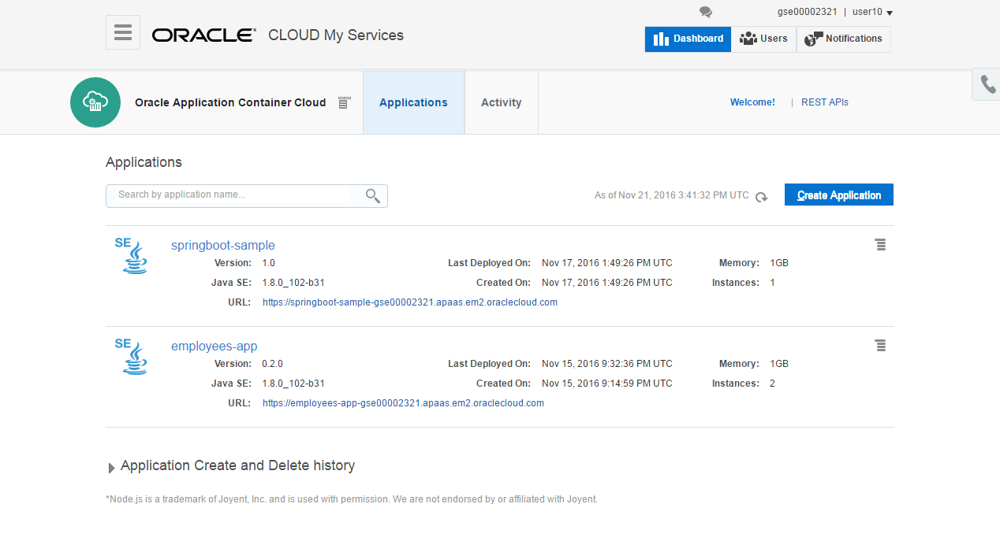
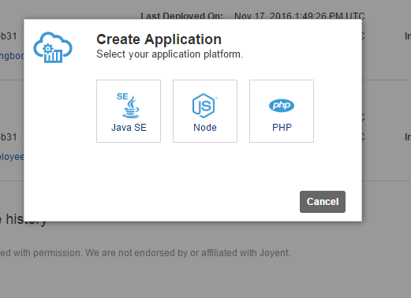
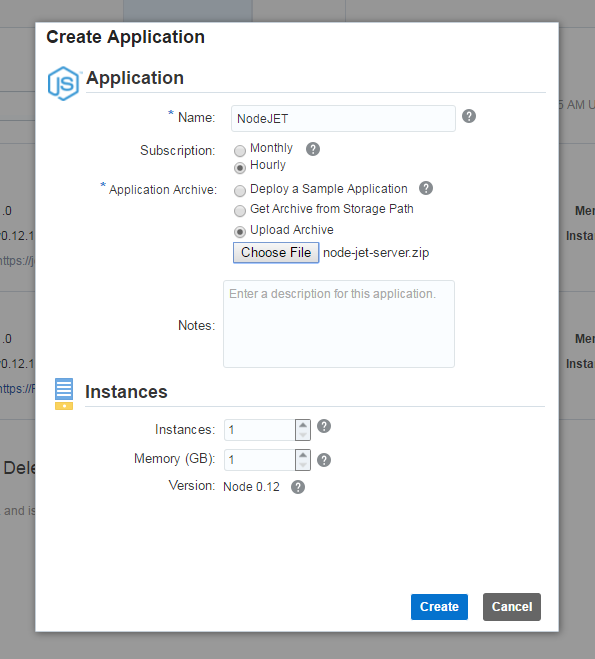
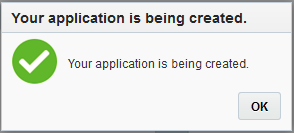
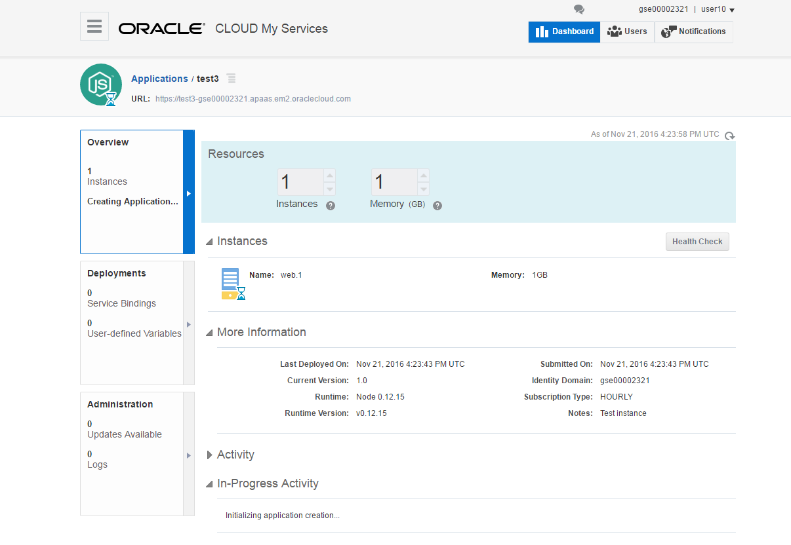
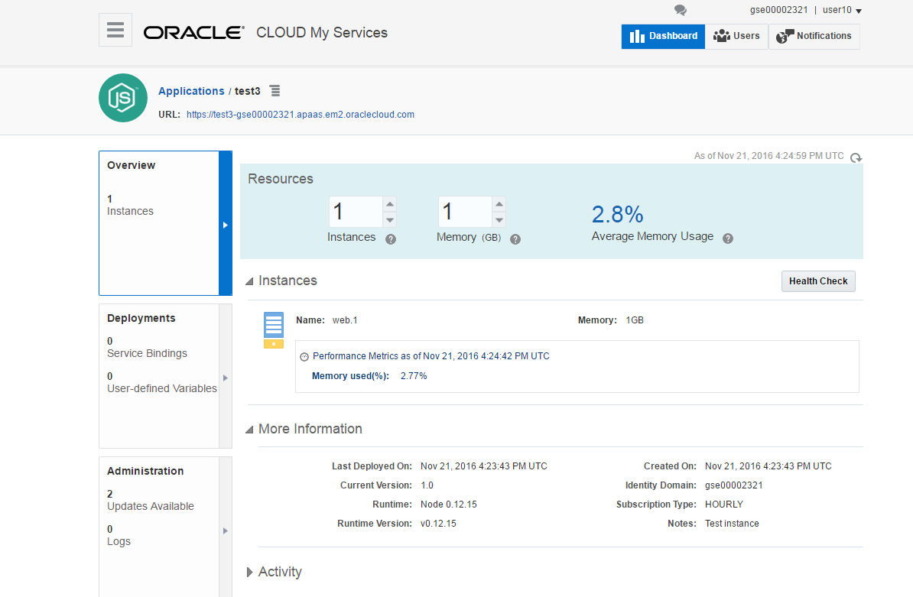
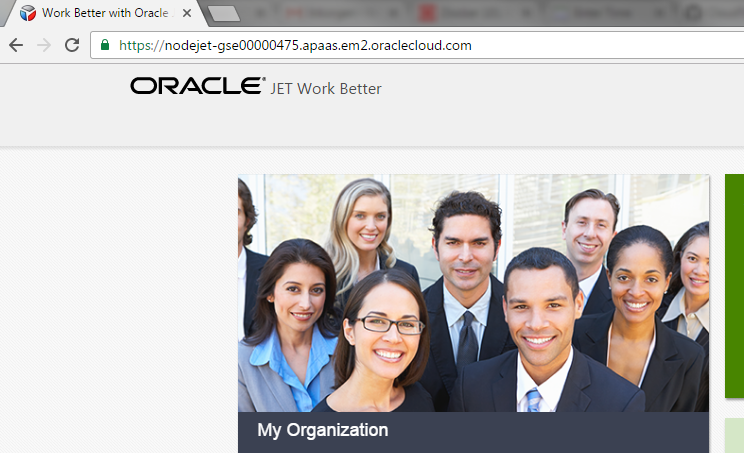

---
# ORACLE Cloud Test Drive Event#
----
## Deploy a Node.js application with Oracle JET UI onto the Application Container Cloud using the GUI##

Start by downloading the [zip file](bin/node-jet-server.zip) containing the Node.js and Oracle JET artifacts of the application. 

**Attention ! ** To correctly download the application, click on the above link, then use the "Download" button on the top right of the screen.  The resulting zip file should be approx. 16Mb 

The application is built using a Node.js application framework called Express.js. Express.js is a popular Node.js framework that helps us to organize our web application into an MVC architecture.

Open the file to understand the content of this package : 
+ manifest.json : This file is specific to Application Container Cloud, and specifies how to start your application and the Node.js runtime version to use. Optionally, you can include notes and a release indication. 
+ package.json : This file serves as documentation for what packages (and versions) our project depends on.
+ bin : Express.js specific folder that contains the start script.
+ node_modules : This folder contains, as the word suggests, node modules that might be needed to run our application, such as Express.js
+ public : Express.js specific folder. In this folder we have inserted an Oracle JET sample application called Work Better. This folder is mostly made up of HTML, CSS and JavaScript files. 
+ routes : Express.js specific folder that contains some default routes for the server resources. For example, adding /users to the base URL returns a sample response.
+ app.js : the main script which defines the routes.

If you are interested in understanding this application, a [detailed tutorial to construct this application step by step](extras/ACCS_NodeJS_DevCS.docx) is available.

Now launch your Oracle Cloud Dashboard:
+ Go to cloud.oracle.com and use your cloud credentials
+ Click on the "Hamburger" symbol besides the Application Container and select "Open Service Console"

On the Application Container Cloud overview page, you can see applications that are already created, and start the creation of new instances.  
+ Hit the "Create Application" button

+ Now select the "Node" Application

This brings you to the Create Application screen, where you can :
+ Enter a name for your application (for example mynode_userxx)
+ Select an Hourly subscription
+ Select to upload an archive.  Now you can select the "node-jet-server.zip" file you downloaded earlier from your local filesystem
+ keep the defaults for nb. of instances and Memory to save resources for the other participants
+ Hit the "Create" button. This step might take a couple of minutes

Your application is being created !
+ Click "OK" to continue

You now see the status "Creating Application"

You might have to hit the "Refresh" buttons a few times, once your application has been deployed, the URL on the top of the screen will become enabled.

Click on the link to see the application running.  What you see is the content of the /public folder - an Oracle JET responsive application.

Now close this tab of your browser to go back to the Application screen, and:
+ explore the "Deployments" tab on the left, which allows you to add service bindings and environment variables to the application
+ navigate to the "Administration" tab to analyze the logs and manage updates of the framework version.

