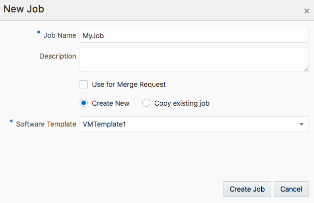
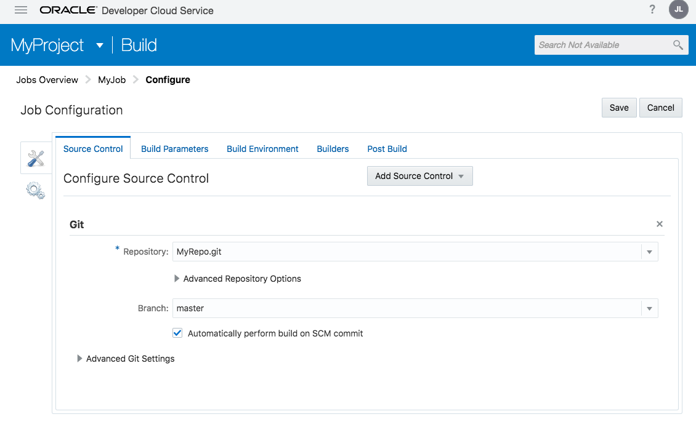
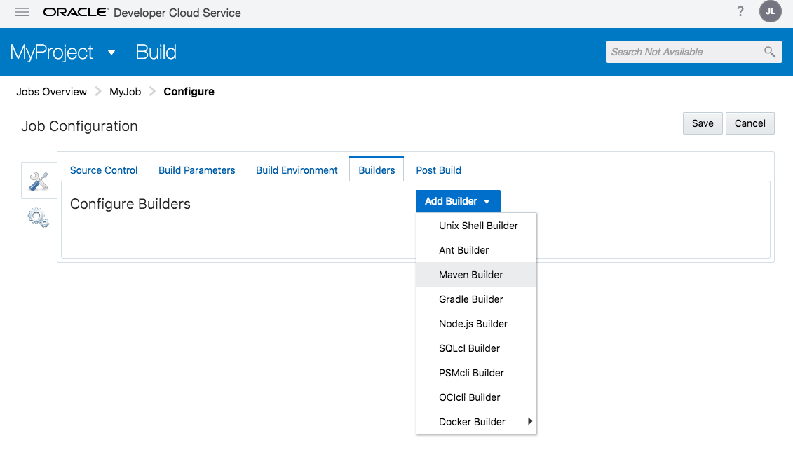
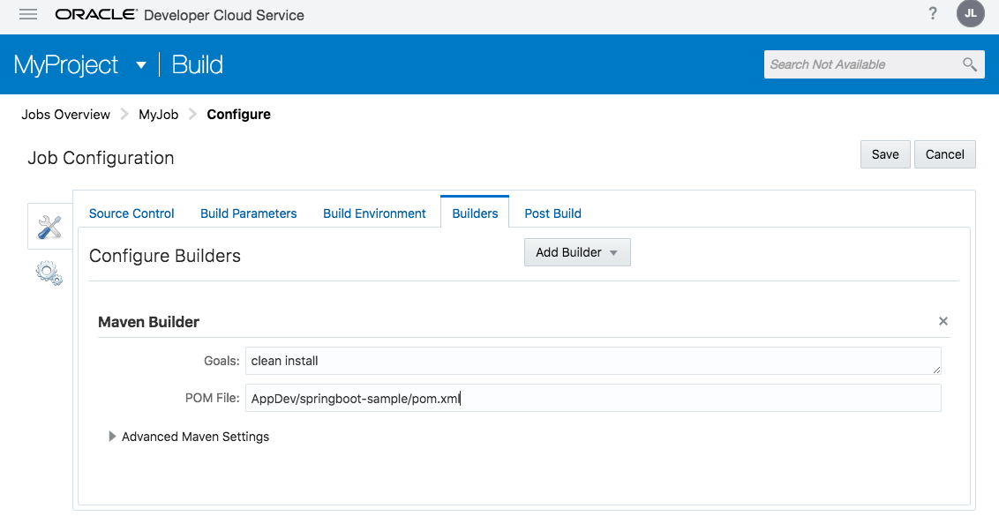
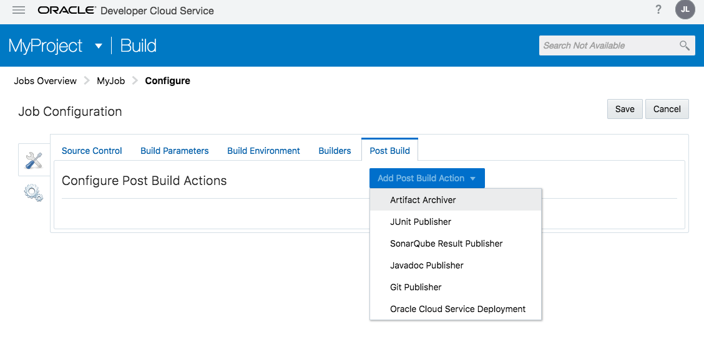
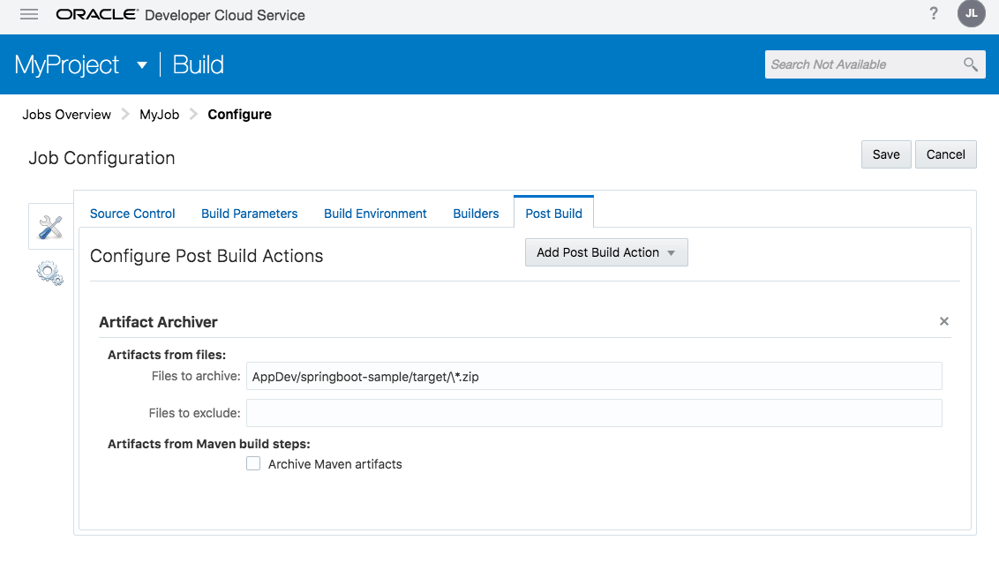
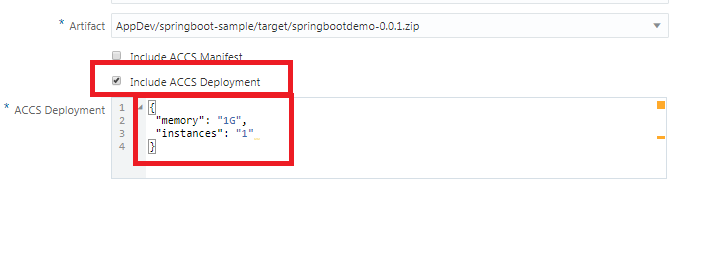

[Go to Overview Page](../Develop.md)


## AppDev Development - Building applications with DevOps ##
### Deploy SpringBoot demo application to Application Container Cloud ###

### Introduction ###

This tutorial demonstrates how to:

- configure a build job for the sample application
- configure a deployment profile to Application Container Cloud Service
- check the deployment on the ACCS console


### Open Oracle Developer Cloud Service Project ###

Select your Developer Cloud Service Project, and select the repository called "springboot-user-xx which was created in the previous step


**Attention : 2 important remarks !!!***
- If you are using a shared Developer environment with multiple participants on the same instance, please make sure to post-fix all objects you create in this exercise with "userxx", where xx is your user number !**
- The GUI of some of the Developer Cloud screens has changed since of the release of the latest version.  On the remainder of this page, you will see the screenshots of the NEW version.  If these look different from the screens you are getting on your environment, please navigate to [this page for the legacy screenshots](oldbuild.md).

### Configure build job for Spring Boot sample application ###

Once the Repository creation is done let's create the build job to compile and package the sample Spring Boot application to the desired format for Application Container Cloud Services.

Select **Build** item on the left side menu and click the **New Job** button.


- Enter a name for the new job, and prefix it with your username (i.e User04BuildJob). 
- Select the template you created earlier and "Create Job".



- On the "Source Control" tab, hit the "Add Source Control" button, select **GIT** 
   - Select the repository you just imported in the "Repository" field.  
   - Select the "Automatically perform Build on SCM Commit" flag
   


- Switch to the "Builders" tab and select a "Maven" Builder



- Enter **clean install** as Goals 
- Enter **AppDev/springboot-sample/pom.xml** to POM File field
   


- change to Post Build tab and create a "Artifact Archiver" step



- Enter **AppDev/springboot-sample/target/\*.zip** into **Files To Archive** field.



Click on **Save** to update the new job configurations. To check the build job click on **Build Now** on the job's detail page. Once the job is done check the archived artifacts. It should be the following: `springbootdemo-0.0.1.zip`


Please note the build job contains an extra build step which packs the default artifact `springbootdemo-0.0.1.war` and `manifest.json` (ACCS descriptor from the *AppDev/springboot-sample/src/acc.resources* folder) into a zip archive. This archive is the desired format to deploy a Java application to ACCS.

### Configure Application Container Cloud service deployment ###

Now we will create a deployment configuration which enable direct deployment to Application Container Cloud services after a successful build job. In order to deploy automatically to this service, you first need to collect your identity domain from the ACCS Overview screen.  

- Switch to the window where you have your Cloud Domain Dashboard, and click on the word "Application Container".  This will lead you to the Application Container Service Overview
- Note the Data region of your instance: this is probably EMEA Commercial 1 or 2 (code EM1 or EM2), or US Commercial 2 (code US2)
- Depending on the type of instance you are using, you will either use the "Identity Service ID", which has the form "idcs-xxxxxxx", or in case you do not see this parameter on your Overview screen, you will use the "Identity Domain ID", which has a form of "gse00xxxxx".

Switch back to the browser window where you have Developer Cloud running, change to the **Deploy** page, and create **New Configuration** 


Set the following properties.


- **Configuration Name**: the name to identify deployment configuration. Attention, this name cannot be longer than 30  characters and can only contain letters and numbers : for example "MyDeployUser01"
- **Application Name**: instance name in ACCS. You can use the same name as the Configuration name.
- **Deployment Target**: click **New** and select Application Container Cloud... and define connection properties:
   - **Data center** : EM1, EM2, cf the parameters you noted down earlier
   - **Identity Domain**: either a long code formatted like "idcs-xxxx", or the name of your domain
   - **credentials**: username & password of your cloud account
   


- **Type**: select **Automatic** which means auto deploy after a successful execution of the build job. Select your previously created job and its artifact to deploy.


Finally specify the Deployment Manifest to launch 1 instance with 1 GB of memory : 
- Click the "Include ACCS Deployment" flag
- Paste the below manifest:

```
    {
    "memory": "1G",
    "instances": "1" 
    }
```



Click **Save**. 

### Build and deploy the sample application ###

To initiate a deployment to Application Container Cloud Service now there are two options. You can Start deployment process using the newly created Deployment configuration. Click gear icon and select **Start**.


Other option is to fire a new Build Job execution which will deploy artifact after a successfull build. Go back to **Build** page and click the wrench icon belongs to Spring Boot sample application build job.

 

Both way deploys Spring Boot sample application on Application Container Cloud Service. You can check the deployment result on the **Deploy** page. Once the deploy is ready (this may take a while) click the **Deploy to ACCS** link.


This opens the Application Container Cloud Services console. You should see your Spring Boot sample application in the list. Click the application's URL to test.


The Spring Boot sample application main page should look like this.


There are many other option to trigger this deploy process. For example build can be triggered by source changes or can be scheduled to specific time of the day.

### + Optional step: Make changes in the application ###

Prerequisites: Git client, Text editor

Clone your newly created Git repository hosted on Developer Cloud Service to your local machine using basic or your favourite Git tool. Make small changes for example in the JSP file. Push changes to DevCS remote repository, execute Build again and check the changes on the redeployed application.

---
[Go to Overview Page](../Develop.md)
