[Go to Overview Page](../Develop.md)

## AppDev Development - Building applications with DevOps ##
### Deploy SpringBoot demo application to Application Container Cloud ###

### Introduction ###

This tutorial demonstrates how to:

- configure a build job for the sample application
- configure a deployment profile to Application Container Cloud Service
- check the deployment on the ACCS console

### Open Oracle Developer Cloud Service Project ###

Select the Oracle Developer Cloud Service Project called "CloudTestDrive" and select the repository called "springboot-user-xx which was created in the previous step

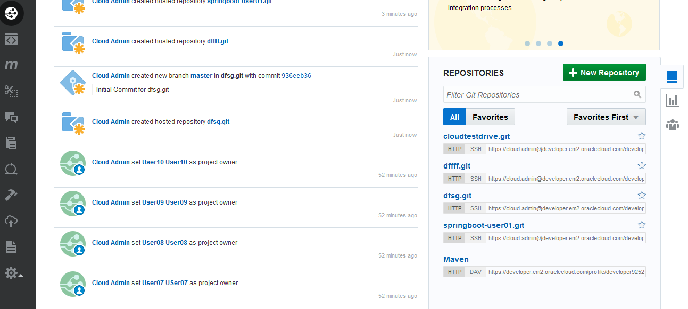

**Attention : in the Cloud Test Drive event, multiple users will be using the same Developer Project, but using a different repository.  Make sure to post-fix all objects you create in this exercise with "userxx", where xx is your user number !**

### Configure build job for Spring Boot sample application ###

Once the Repository creation is done let's create the build job to compile and package the sample Spring Boot application to the desired format for Application Container Cloud Services.

Select **Build** item on the left side menu and click the **New Job** button.

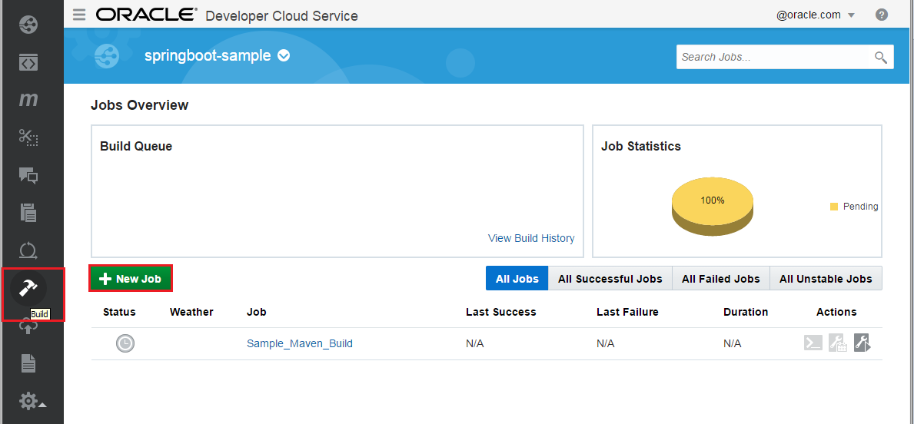

Enter a name for the new job, again, please prefix it so that you can identify it (i.e buildAppUser07). Select the *Create a free-style job* option and save.
On the Main configuration page of the newly created job make sure **JDK 8** is the selected JDK.

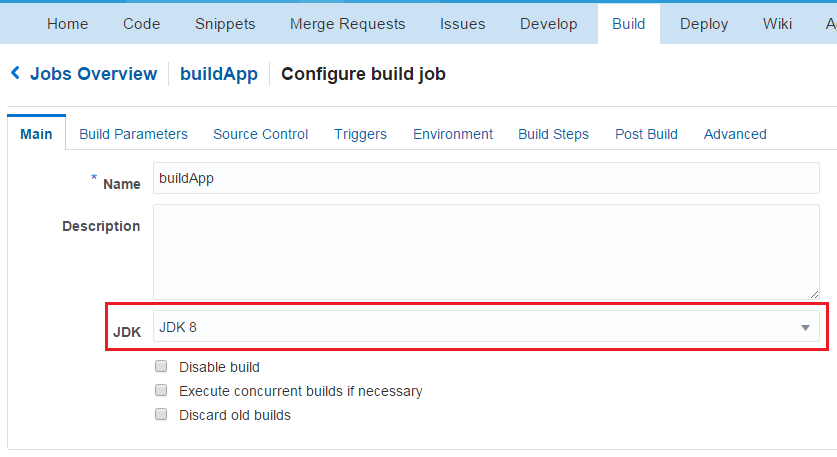

Change to the **Source Control** tab and select **Git**. In the git's properties section select the Git repository you created from the dropdown list. Leave the advanced settings default.

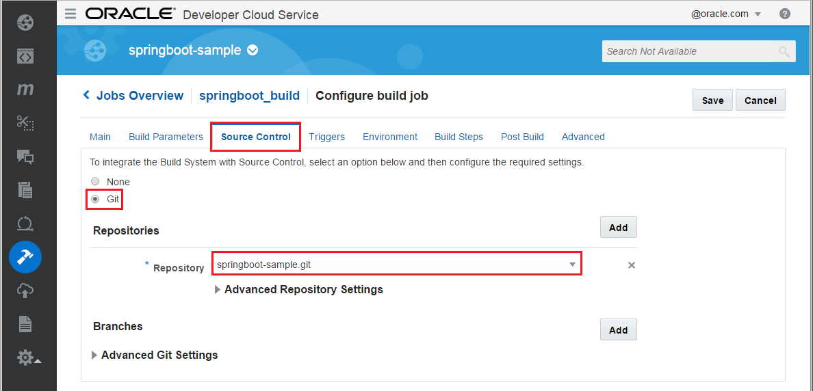

Click **Triggers** tab to configure *SCM polling*. Select **Based on SCM polling schedule**. This ensures if any files in the source code repository has changed then the build will be fired.

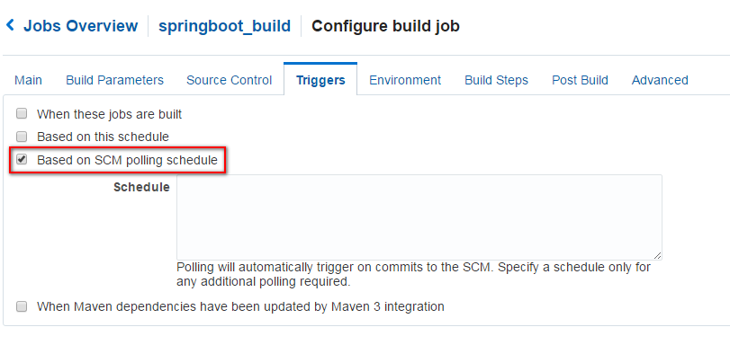

Change to **Build Steps** tab and add **Maven 3** build step. Enter **clean install** as Goals and **AppDev/springboot-sample/pom.xml** to POM File field. (In case if Build Steps tab just shows **Loading...** for a long time, save the Build configuration then re-open and continue.)

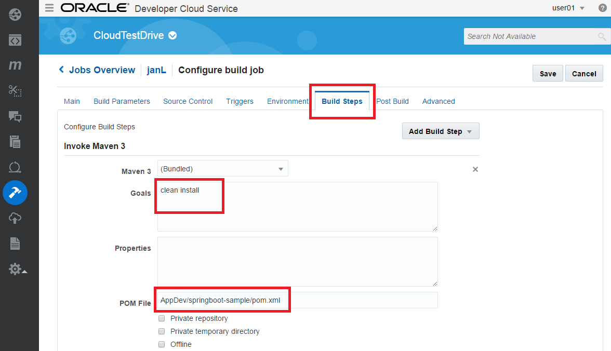

Finally change to Post Build tab and check in the **Archive the artifacts** option. Enter **AppDev/springboot-sample/target/\*.zip** into **Files To Archive** field.

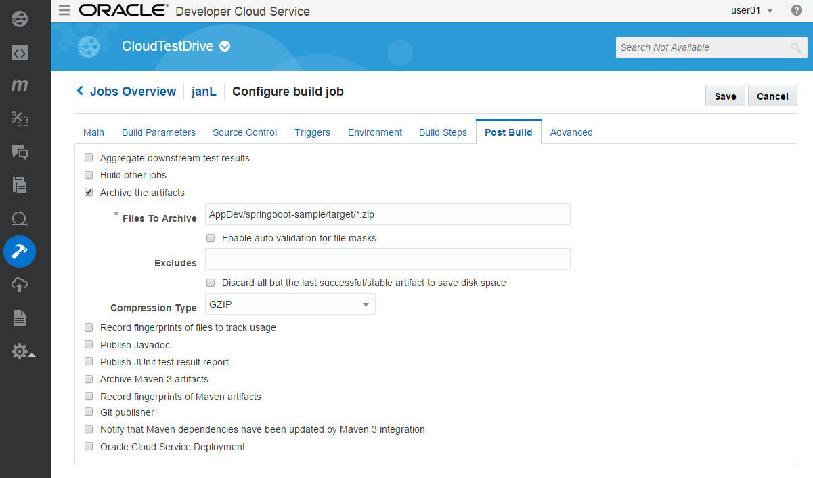

Click on **Save** to update the new job configurations. To check the build job click on **Build Now** on the job's detail page. Once the job is done check the archived artifacts. It should be the following: `springbootdemo-0.0.1.zip`

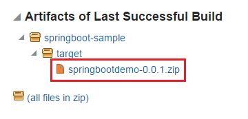

Please note the build job contains an extra build step which packs the default artifact `springbootdemo-0.0.1.war` and `manifest.json` (ACCS descriptor from the *AppDev/springboot-sample/src/acc.resources* folder) into a zip archive. This archive is the desired format to deploy a Java application to ACCS.

### Configure Application Container Cloud service deployment ###

Now create deployment configuration which enable direct deployment to Application Container Cloud services after a successful build job.
Change to **Deploy** page in DevCS and create **New Configuration** 

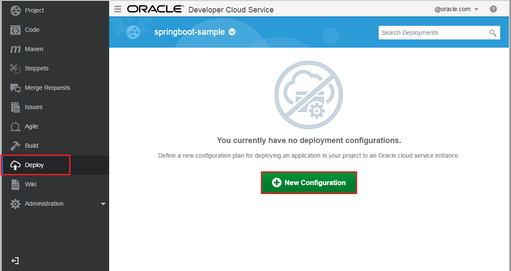

Set the following properties.
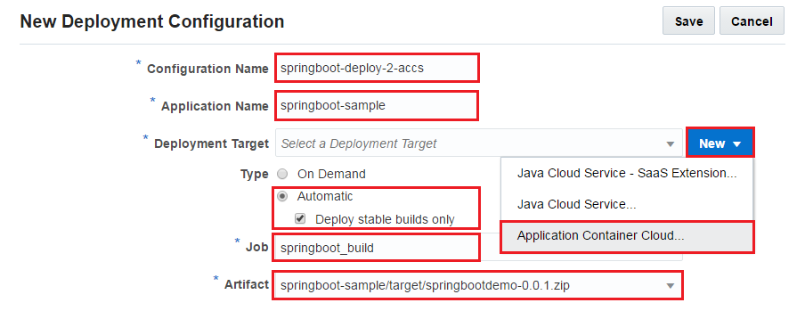

- **Configuration Name**: any name to identify deployment configuration. Again, please prefix this with your user (i.e springboot-deploy-2-accs-user06).
- **Application Name**: instance name in ACCS. This will determine the application's URL. Again, please prefix this with your user (i.e springboot-sample-user06).
- **Deployment Target**: click **New** and select Application Container Cloud... and define connection properties such as **Data center**, **Identity Domain** and **credentials**. 
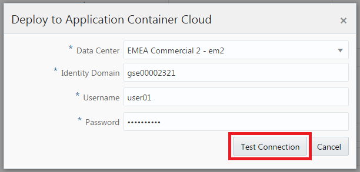
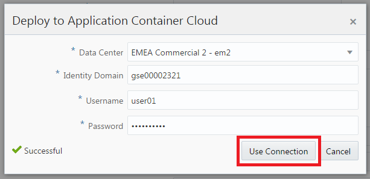
- **Type**: select **Automatic** which means auto deploy after a successful execution of the build job. Select your previously created job and its artifact to deploy.

Click **Save**. 

### Build and deploy the sample application ###

To initiate a deployment to Application Container Cloud Service now there are two options. You can Start deployment process using the newly created Deployment configuration. Click gear icon and select **Start**.

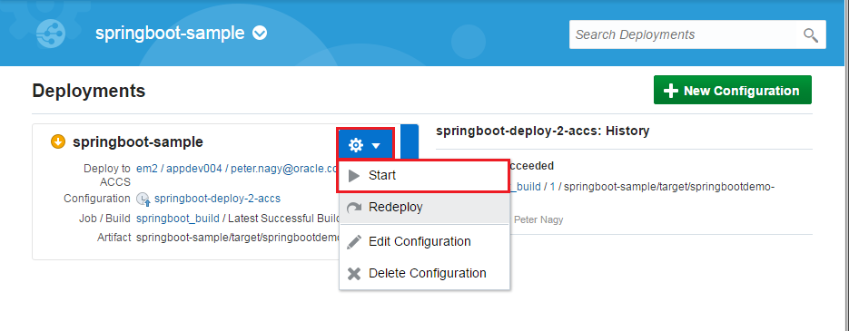

Other option is to fire a new Build Job execution which will deploy artifact after a successfull build. Go back to **Build** page and click the wrench icon belongs to Spring Boot sample application build job.

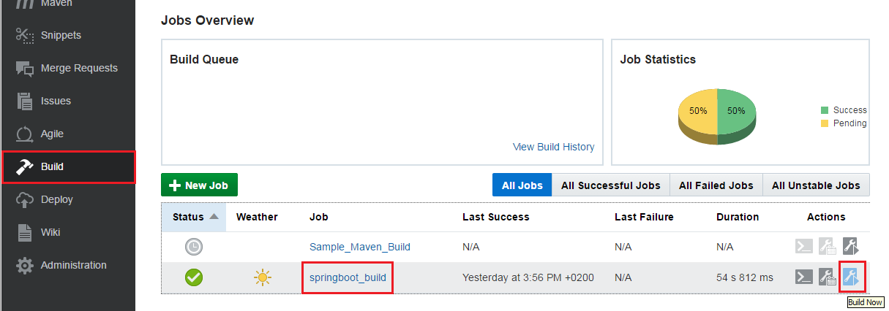 

Both way deploys Spring Boot sample application on Application Container Cloud Service. You can check the deployment result on the **Deploy** page. Once the deploy is ready (this may take a while) click the **Deploy to ACCS** link.

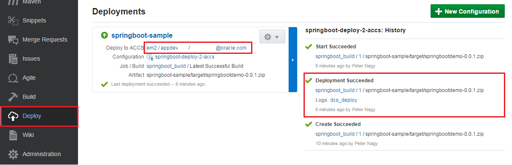

This opens the Application Container Cloud Services console. You should see your Spring Boot sample application in the list. Click the application's URL to test.

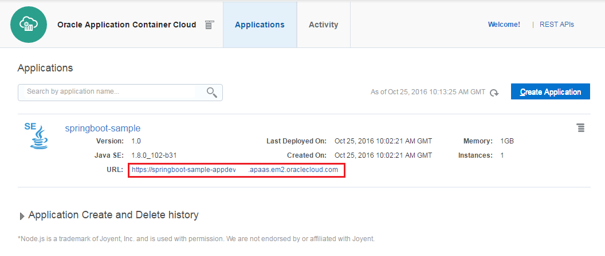

The Spring Boot sample application main page should look like this.

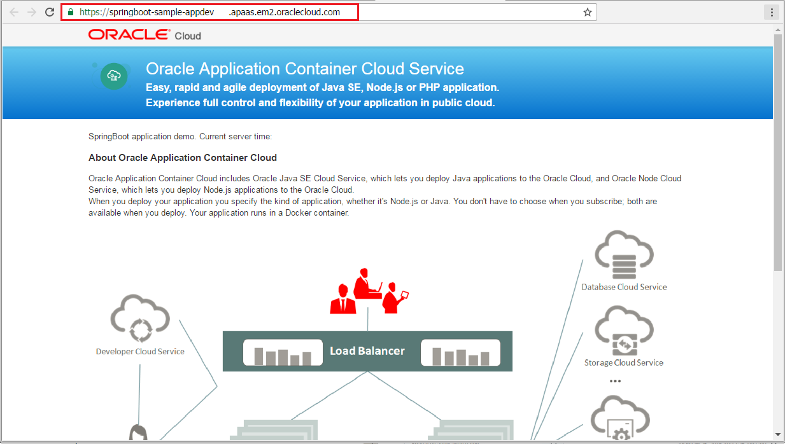

There are many other option to trigger this deploy process. For example build can be triggered by source changes or can be scheduled to specific time of the day.

### + Optional step: Make changes in the application ###

Prerequisites: Git client, Text editor

Clone your newly created Git repository hosted on Developer Cloud Service to your local machine using basic or your favourite Git tool. Make small changes for example in the JSP file. Push changes to DevCS remote repository, execute Build again and check the changes on the redeployed application.

---
[Go to Overview Page](../Develop.md)
