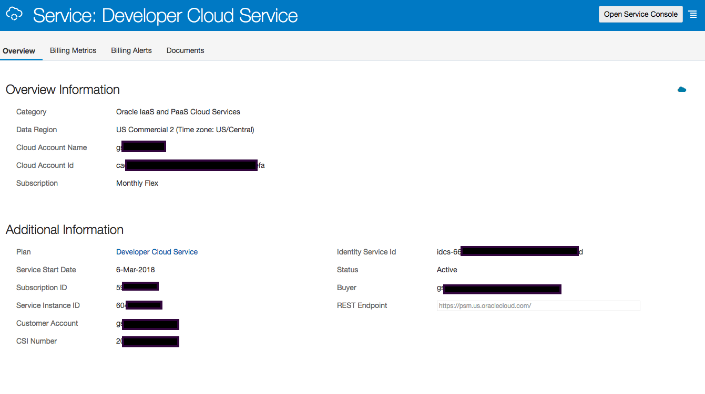

[Go to Overview Page](../Develop.md)

## AppDev Development - Building applications with DevOps ##
### Setup your Developer Cloud Service Instance ###

### Introduction ###

This page will guide you through the setup of a new DevCE instance : 
- Enabling DevCS on your Dashboard
- Creating an instance
- Configuring the storage and Build parameters for your instance
- Creating a Developer Project

This guide is meant for new Developer Cloud Service instances (post June 2018) cloud environments

### Enable DevCS on your dashboard ###

- Login to your cloud account and navigate to the dashboard

- Make sure the "Developer Cloud" service is "visible" on the dashboard as in the above screenshot.  If this is not the case, use the "Customize Dashboard" button to enable it.

- Go into the Developer Cloud Service Overview by clicking on the Service title
-- note down the ?? and ??

- Open the Service Console.  You should have no existing instances.  If you have, you can skip the few following steps and go straight to the "Create a new Project" page.

- Use the "Create Instance" button to create a new Developer Cloud instance

- Hit the "Next" button and then "Create"

- Now the instance is being created.  This will take a few minutes, you can hit the small arrow to requery the status.

### Configuring your DevCS Instance ###

Once the instance is available, you need to configure a few things to be able to create projects and run builds.  Please perform following steps to complete this configuration.

- Open a second window where you navigate to the Cloud Services Dashboard
- Open the Compute Classic Service Overview, and note down following elements :
   - Service Instance ID
   - Rest Endpoint

   
- Navigate back to the Dashboard, and now select the "Storage Classic" Service Overview.  Note down following element:
   - Auth V1 Endpoint
   
- Return to your initial window with the Developer Cloud Services, and click on the hamburger icon on the right of the newly created service.  Select "Access Service Instance".

In the DevCS 
