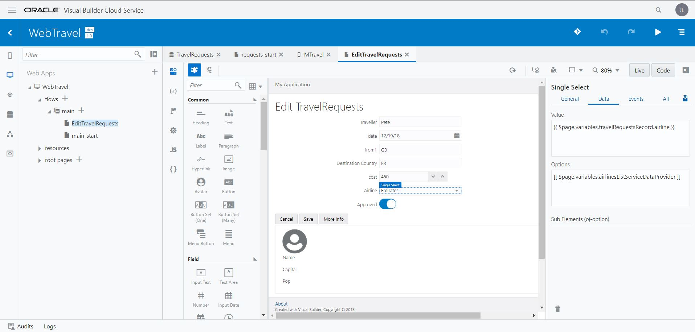

[Go to the Cloud Test Drive Overview](../../README.md)

# Visual Builder Cloud Service Virtual Workshop #

In this short lab you will build and deploy a simple HR web or mobile application, based on Department, Employee and Location data.

## Use visual development to easily build sophisticated Web or Mobile apps

### Introduction ###

Oracle Visual Builder Cloud Service is a visual development tool for creating web and mobile applications by simply dragging and dropping user interface (UI) components onto a page. It is aimed at professional developers who want to enhance their productivity by using a low-code tool to help build javascript apps.

Oracle uses VBCS alongside other technologies to develop our SaaS applications and other cloud products 

You can create custom business objects with the click of a button, and you can add data by importing CSV files or XLS spreadsheets to your application. You can access any data available via a REST API. You can define the processing logic needed for web and mobile pages. Since there are QuickStarts (Wizards) for most common actions you don't need any programming experience to develop an application. However, you can extend the functionality and change the appearance of your apps at any point using standard HTML, CSS and javascript. You can switch between visual and code mode as required.

## Prerequisites ##

- Click on links with the right mouse button to open them in a new tab.

- To run these labs you will need access to an Oracle Cloud Account.  Follow [this link to get a free Trial account](https://myservices.us.oraclecloud.com/mycloud/signup?sourceType=:ow:evp:cpo::RC_EMMK190118P00039:VLVB&intcmp=:ow:evp:cpo::RC_EMMK190118P00039:VLVB) from Oracle.

- You do not need any prior experience of VBCS.

- Please use Google Chrome when building VBCS apps. End users can run the apps with any browser.

### Instructions ###

- After obtaining your free trial, you will receive an email containing the link to the main Cloud Console.  

- Set up an instance of VBCS in your new Cloud environment by [following these detailed steps](Setup_vbcs.md)
 
## Running the Workshop

This basic lab will guide you through the development of a simple HR application, based on Department, Employee and Location data. Please go through the modules below in sequence. There is no need to rush. Anything you do not finish you can complete them later, along with the other materials and further tutorials noted below.

Each module should take between 5 and 15 minutes.

+ [Create a web application and first business object](https://apexapps.oracle.com/pls/apex/f?p=44785:52:102029913232746:::52:P52_CONTENT_ID,P52_MODULE_ID,P52_ACTIVITY_ID,P52_EVENT_ID:22716,2059,10586,5817) 
- (Complete Sections 1 and 2 only. Stop after data import, before Section 3)
+ [Define the other business objects](https://apexapps.oracle.com/pls/apex/f?p=44785:52:102029913232746:::52:P52_CONTENT_ID,P52_MODULE_ID,P52_ACTIVITY_ID,P52_EVENT_ID:22716,2059,10586,5817) (Start at  Section 3 - "Create a Department Business Object")
+ [Create pages to display and add departments](https://apexapps.oracle.com/pls/apex/f?p=44785:52:102029913232746:::52:P52_CONTENT_ID,P52_MODULE_ID,P52_ACTIVITY_ID,P52_EVENT_ID:22717,2059,10588,5817) Complete Sections 1 and 2 only. Stop after building pages for Departments, before Section 3)
+ [Create pages to display and add employees](https://apexapps.oracle.com/pls/apex/f?p=44785:52:102029913232746:::52:P52_CONTENT_ID,P52_MODULE_ID,P52_ACTIVITY_ID,P52_EVENT_ID:22717,2059,10588,5817) (Start at  Section 3 - "Add Page to Display Employees")
+ [Define navigation between pages and import data](https://apexapps.oracle.com/pls/apex/f?p=44785:52:102029913232746:::52:P52_CONTENT_ID,P52_MODULE_ID,P52_ACTIVITY_ID,P52_EVENT_ID:22718,2059,10589,5817)
+ [Add pages to edit and delete departments](https://apexapps.oracle.com/pls/apex/f?p=44785:52:102029913232746:::52:P52_CONTENT_ID,P52_MODULE_ID,P52_ACTIVITY_ID,P52_EVENT_ID:23083,2059,10587,5817)
+ [Add pages to edit and delete employees](https://apexapps.oracle.com/pls/apex/f?p=44785:52:102029913232746:::52:P52_CONTENT_ID,P52_MODULE_ID,P52_ACTIVITY_ID,P52_EVENT_ID:23083,2059,10587,5817)
+ [Stage and publish the application](https://apexapps.oracle.com/pls/apex/f?p=44785:52:102029913232746:::52:P52_CONTENT_ID,P52_MODULE_ID,P52_ACTIVITY_ID,P52_EVENT_ID:23084,2059,10662,5817)

---

### Want to do more ?

The modules above are a subset of the standard tutorials included in the [VBCS product Documentation](https://docs.oracle.com/en/cloud/paas/app-builder-cloud/books.html). To see the complete set, which includes building native mobile apps for Android or iOS, charting and working with process cloud, please [click here](https://docs.oracle.com/en/cloud/paas/app-builder-cloud/tutorials.html)

For an additionbal set of more specific tutorials, including master-detail pages, validations, dynamic UI, security and external data acces via Fusion apps and other REST APIs (i.e. Service Connections), please [click here](https://blogs.oracle.com/vbcs/oracle-visual-builder-cloud-service-learning-path)

See also the [VBCS BLOG](https://blogs.oracle.com/vbcs/) and the [Dev Tools BLOG](https://blogs.oracle.com/shay/vbcs-3).

---

## License ##
Copyright (c) 2014, 2018, 2019 Oracle and/or its affiliates
The Universal Permissive License (UPL), Version 1.0   
[Details](../../common/license.md)

---
## Further Info ##
[Oracle VBCS documentation](https://docs.oracle.com/en/cloud/paas/app-builder-cloud/books.html)

[Oracle VBCS Home Page](https://cloud.oracle.com/en_US/visual-builder)
