Use the **back button** of your browser to return to the previous page

# Visual Builder Cloud Service Lab #

## Setting up an instance of VBCS in your Cloud tenancy

To run the VBCS labs you will need access to an Oracle Cloud Account.  Follow [this link to get a free Trial account](https://myservices.us.oraclecloud.com/mycloud/signup?sourceType=:ow:evp:cpo::RC_EMMK190118P00039:VLVB&intcmp=:ow:evp:cpo::RC_EMMK190118P00039:VLVB) from Oracle.

### Instructions ###

- After obtaining your free trial, you will receive an email containing the link to the main Cloud Console.  

- Log into your new Cloud Instance with the provided username / password - note you might be prompted to change the password on the initial login

   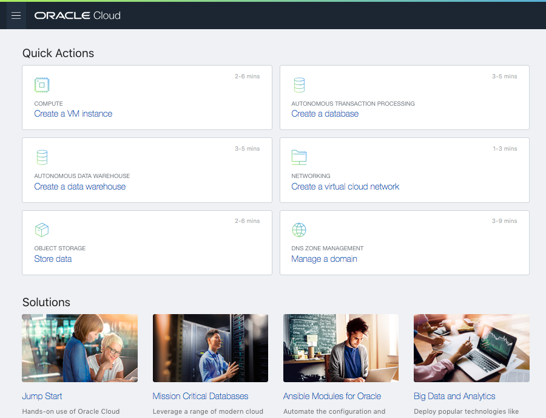

- Open the left-side menu, and scroll down to open the "Administration", "My Services Dashboard"

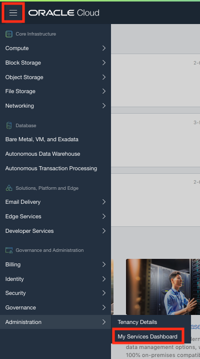

- You now arrive on the "Dashboard" page representing all the PaaS services.  You mlight already have the tile "Visual Builder" visible.  In that case, you can skip the dashboard customization.

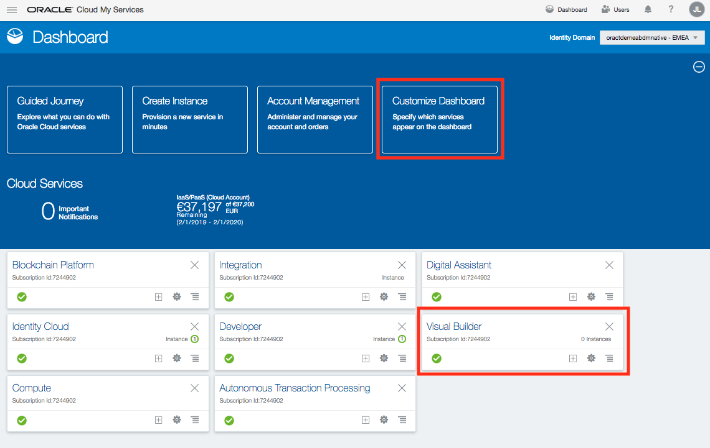

- In case this tile is not visible, click on the "Customize Dashboard" button and scroll down to the "Application Development" section of the list.
- Select the "Show" option for Visual Builder.

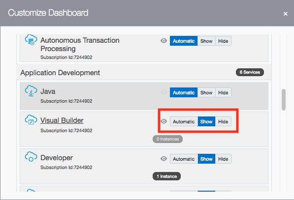

- Once you have the tile for Visual Builder on your dashboard, click the hamburger icon to see the menu, and select "Open Service Console" from the list.

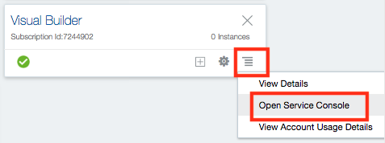

- In the Visual Builder Dashboard, you probably will have no instances available yet.  Use the "Create Instance" button to start the creation.

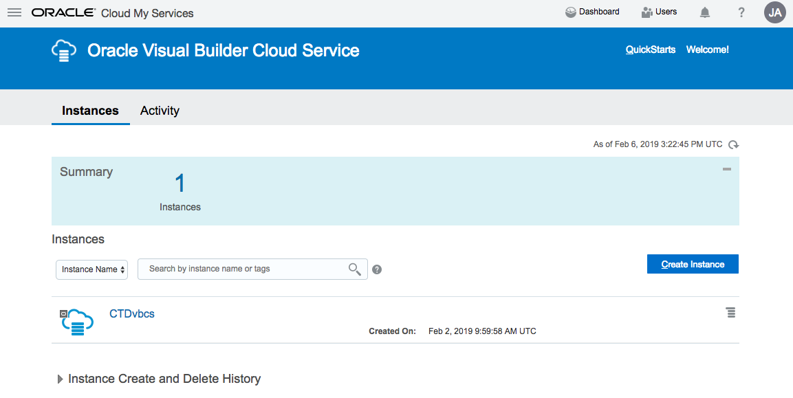

- Enter a name for your instance
- For the region, leave the default "No preference" selection.

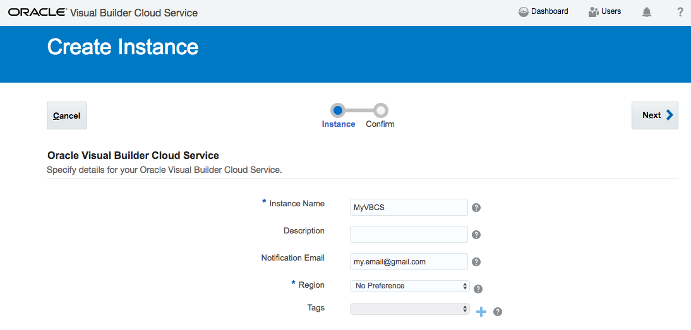

- Hit the "Next button to see the summary, then "Create" to start the creation.

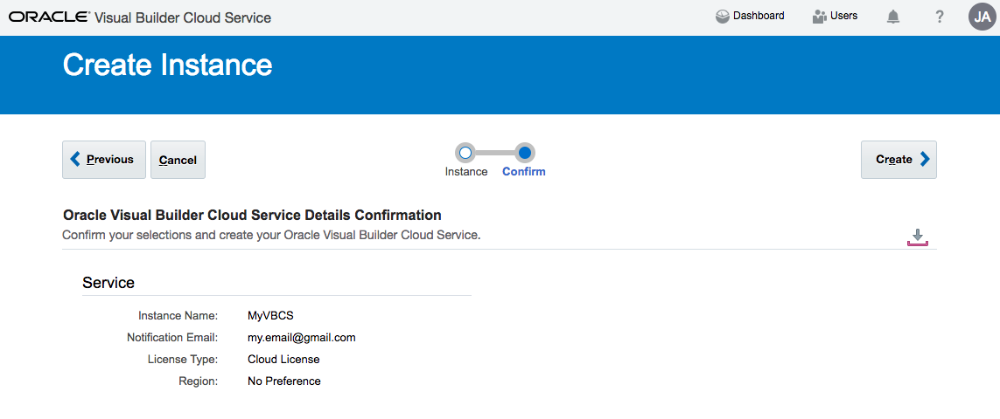

- You will return to the Visual Builder dashboard, with your new instance being created.  Use the "Refresh" button untill the instance is up and running as shown below

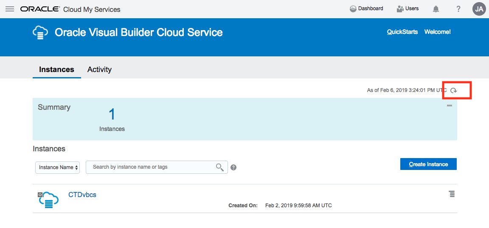

- Once the instance is running, the hamburger icon will become active, and you can navigate to the "Open Oracle Visual Builder Service Home Page"

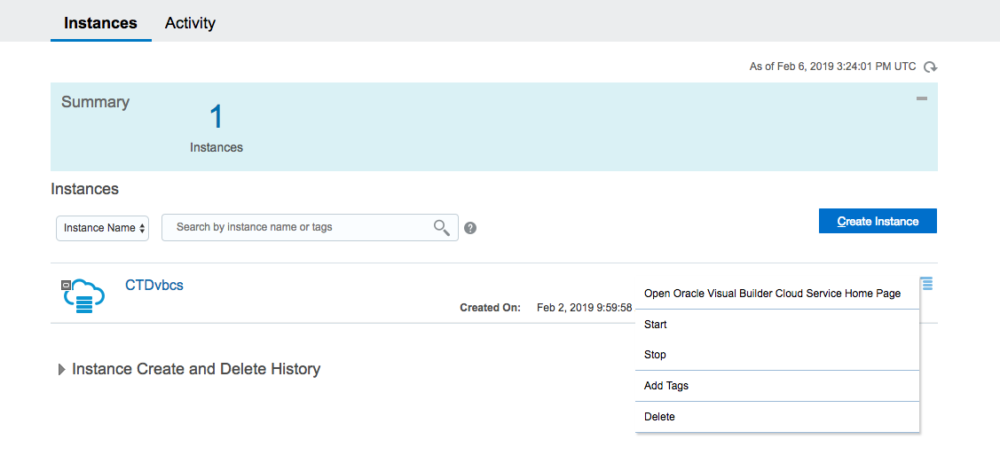

- You are ready to start the tutorial !

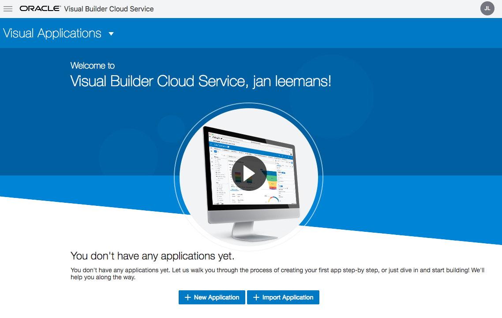

- Use the **back button** of your browser to return to the initial VBCS Lab page.

---
## License ##
Copyright (c) 2014, 2018 Oracle and/or its affiliates
The Universal Permissive License (UPL), Version 1.0   
[Details](../../common/license.md)

---
## Further Info ##

[Oracle VBCS documentation](https://docs.oracle.com/en/cloud/paas/app-builder-cloud/books.html)

---
Use the **back button** of your browser to return to the previous page.
