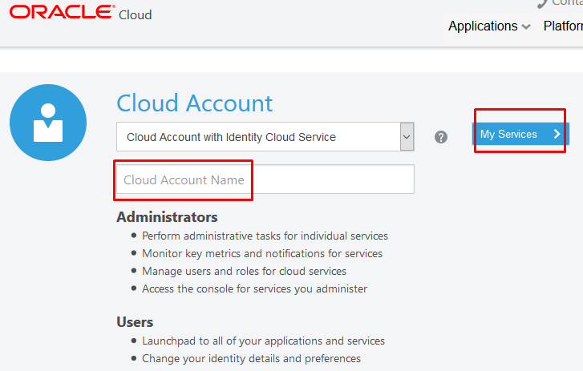
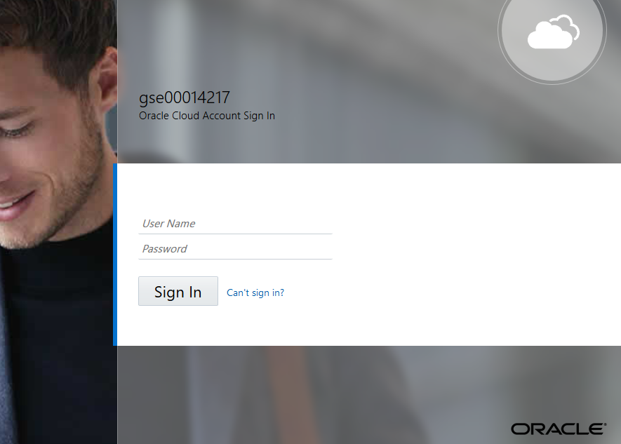
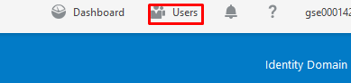
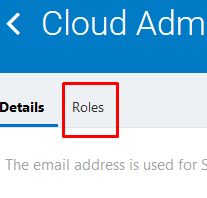

[Go back to the Autonomous Overview Page](../readme.md)

## Autonomous Cloud Lab ##
### Introduction ###

Based on machine learning, Oracle Autonomous Cloud represents a new
category of software automation. Oracle recently introduced Oracle
Autonomous Database Cloud---an incredibly important milestone. Oracle
Autonomous Cloud leverages the power of AI and machine learning to
deliver self-driving, self-securing, and self-repairing autonomous
capabilities. This dramatically transforms how companies innovate by
simplifying processes, reducing inefficiencies, and allowing companies
to free resources to focus on innovation. With Oracle Autonomous Cloud,
companies can lower costs, reduce risks, accelerate innovation, and get
predictive insights.

 

**Self-Driving**

- Auto provision, secure, monitor, back up, recover, and troubleshoot
- Instantly grow and shrink compute or storage without downtime

**Self-Securing**

- Adaptive intelligence-enabled cyber threat detection and remediation
- Automatic data encryption, security patches application

**Self-Repairing**

- Automated protection from downtime
- Up to 99.995 percent availability\*. \< 2.5 minutes downtime per month, including planned maintenance

## Lab prerequisites ##

### Access Check List ###

To secure the best start for the hands-on we need to check the access right.
This checklist will check access to below cloud service that is use for the hands-on labs.

- Autonomous Data Warehouse
- Autonomous Transaction Processing
- Analytics Cloud

 **Autonomous Data Warehouse -- Access Check**

 To be able to provisioning the Cloud Service you need to member of
 'OCI\_Administrator (Provide administrative access in Oracle Cloud
 Infrastructure.)'

 Required Role: **OCI\_Administrator (Provide administrative access in
 Oracle Cloud Infrastructure.)**

 **Autonomous Transaction Processing -- Access Check**

 To be able to provisioning the Cloud Service you need to member of
 'OCI\_Administrator (Provide administrative access in Oracle Cloud
 Infrastructure.)'

 Required Role: **OCI\_Administrator (Provide administrative access in
 Oracle Cloud Infrastructure.)**

 **Analytics Cloud -- Access Check**

 To be able to provisioning the Cloud Service you need to member of
 'AUTONOMOUS\_ANALYTICS\_ServiceAdministrator'

 **Required Role: AUTONOMOUS\_ANALYTICS\_ServiceAdministrator**

**How to check**

Sign into you Oracle Cloud

<https://cloud.oracle.com/en_US/sign-in>
1\.Type you Cloud Account Name and press My Services

2\.Type your use name and password then press Sign In

3\.Go to Users, top right corner

4\.In User Management, find you self

5\.Go to Role

Scroll down the list and check what role you have.If you do not have the need role. You need to talk to your Cloud Service Administator.

## SQL Developer ##

You will need SQL Developer installed on your computer to do the
exercises in this lab guide. The minimum SQL Developer version that is
required to connect to an Oracle Autonomous Data Warehouse Cloud
instance is SQL Developer 17.4.

To exercise all labs, you will need the latest SQL Developer version
18.1.

 Follow these steps to install SQL Developer depending on your machine

**Good Practise**

It is recommend to you a **separated Compartment** in Oracle Cloud
Infrastructure. Therefore, it will not have impact of any other running
workload.

How to create a Compartment -
<https://docs.cloud.oracle.com/iaas/Content/Identity/Tasks/managingcompartments.htm>

---
[Go back to the Autonomous Overview Page](../readme.md)
