[Go back to the Autonomous Overview Page](readme.md)

## Autonomous Cloud Lab ##
### Section 1. Provisioning an Autonomous Data Warehouse Service ###

In this section you will be provisioning an Autonomous Data Warehouse Cloud (ADWC) instance using the UI capabilities of the service.

**Note:** Using your cloud environment you should have access to:

-   The Cloud Account Name

-   The Username

-   The Password

1.  Go to
    [cloud.oracle.com](http://cloud.oracle.com)
    and click **Sign In** to login to your Oracle Cloud account.

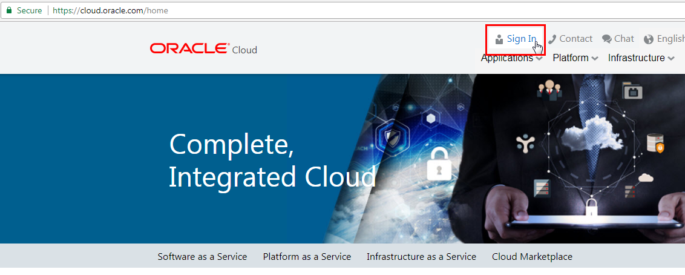

2.  Enter the **Cloud Account Name**. In this example, the Cloud Account Name is *gse00014216*. Click **My Services**.

3.  On the login page, fill in the Username and Password for your cloud account. Click **Sign In**.

4.  We will start from the Cloud Dashboard and go to Compute service console (the OCI Console). For this go to the Navigation Menu on the top left part of the Dashboard Home page.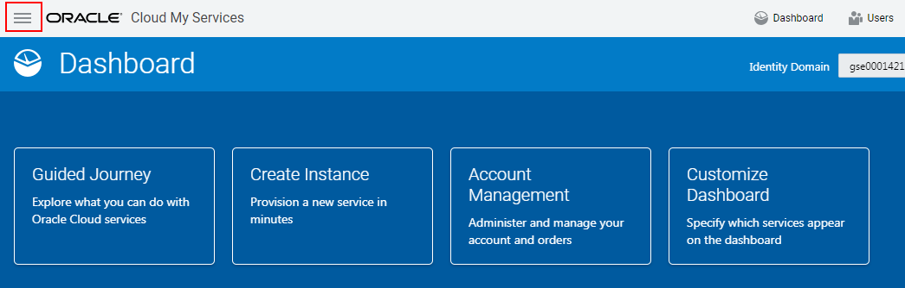

5.  In the Services list choose Compute.

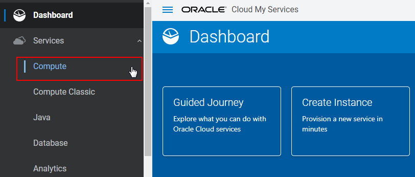

6.  The OCI Console launches and it will take you to the Home page page.  Autonomous Data Warehouse, as Autonomous Transaction Processing are both deployed on OCI datacentres and can be created from OCI interface.

    Click on the **Menu** on the top left of the Page.

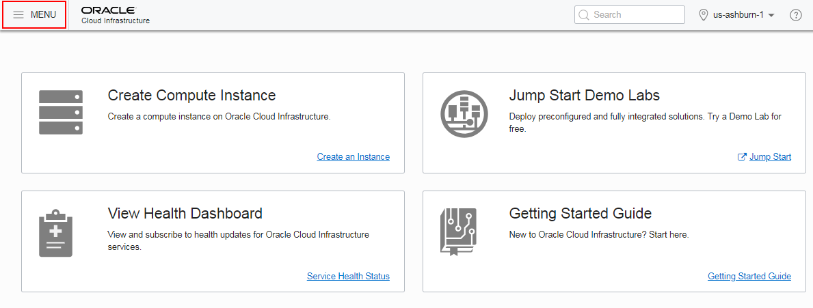

7.  A new Menu appears and select Autonomous Transaction Processing
    service under the Database Category\
    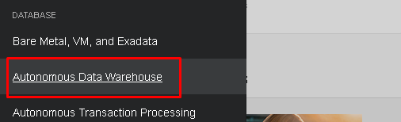

8.  On the right side of the page, you could choose a compartment if you
    have one already.

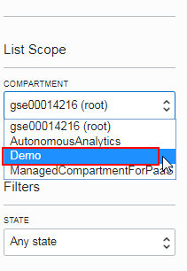

9.  Click Create Autonomous Data Warehouse button to create a new
    service instance.

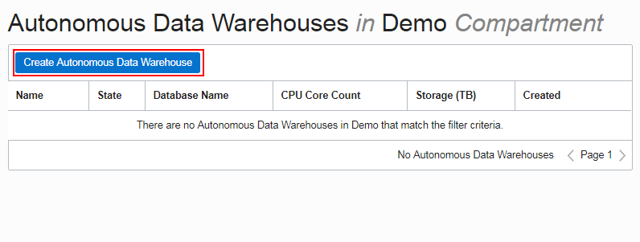

10. A new window appears. Enter the following information in the
    **Create New Instance** screen:

    **Display name:** Choose a unique display name. In our case we
    will use ADWCInstance001

    **Database Name:** Choose a unique database name. In our case is
ADWCdb001

    **CPU Count*: 1**

    **Storage Capacity (TB): 1**

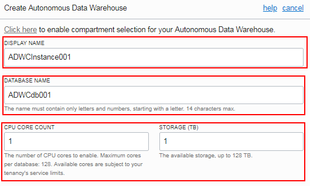

In the Administrator Credentials section enter the Administrator
Password and confirm the password:

    **Administrator Password:** 12 Character password like
**Welcome12345**

    Also tick the **SUBSCRIBE TO NEW DATABASE SOFTWARE LICENSES AND THE
DATABASE CLOUD SERVICE** radio button.

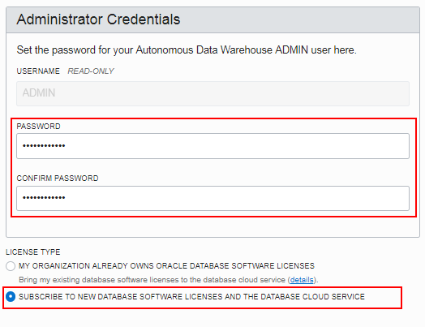

Click **Create Autonomous Data Warehouse** button.

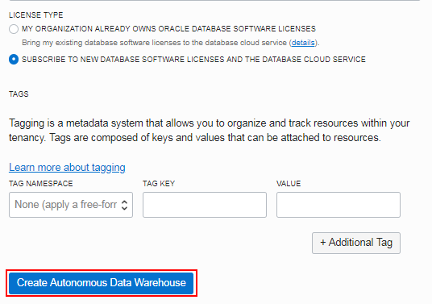

11. Notice that the instance is on provisioning state

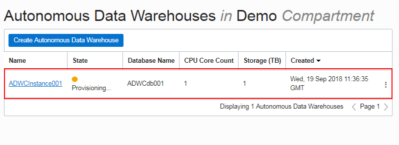

12. Click the **refresh** arrow button to see the status of your
    database. Once the service is provisioned click on its name to open
    the *Service Overview* page.

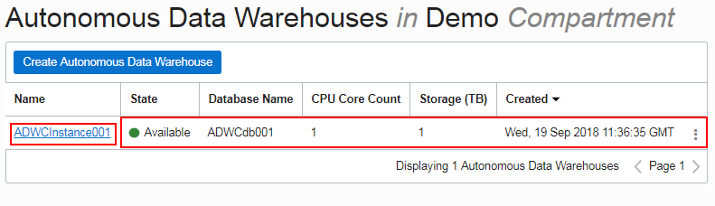

13. Check the **Service Overview** page for more details on your ADW
    instance.

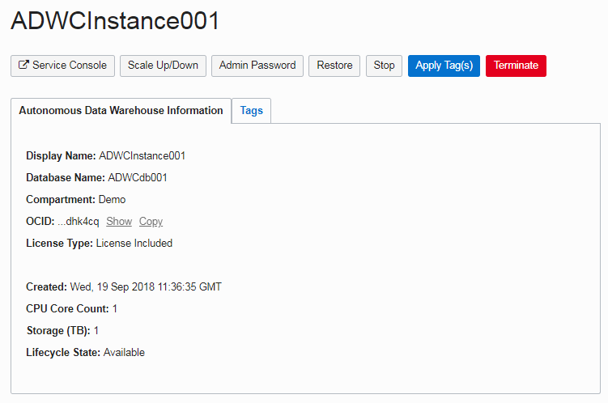

---
[Go back to the Autonomous Overview Page](readme.md)
