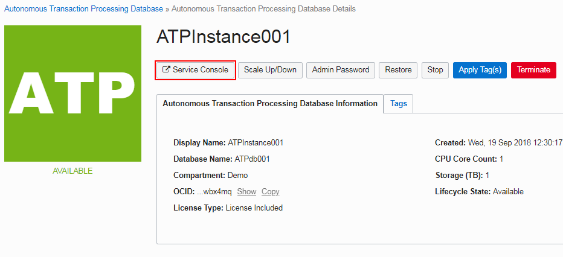
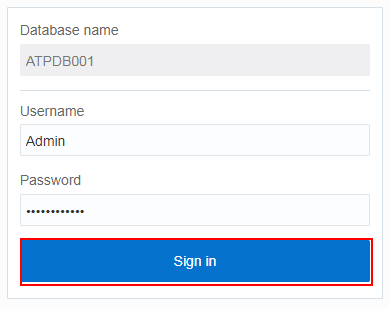
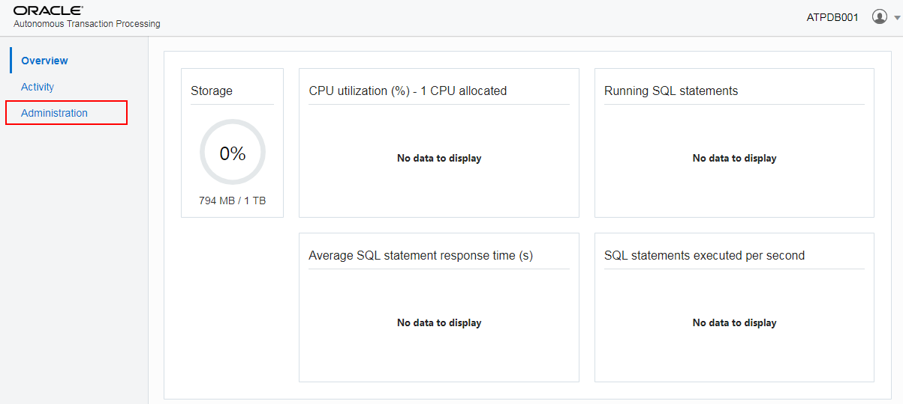
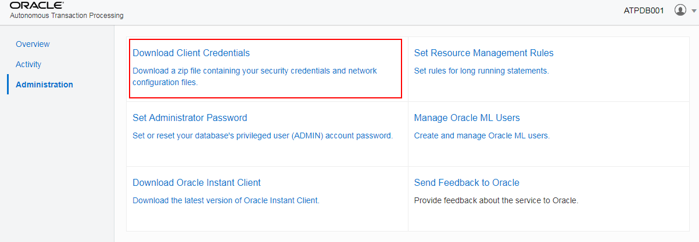
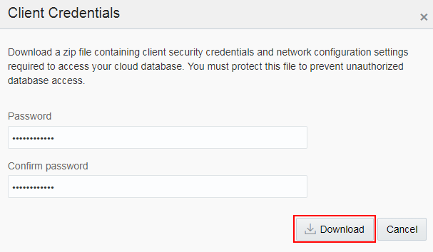
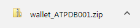
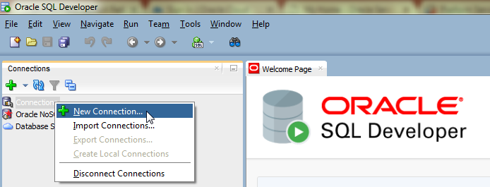
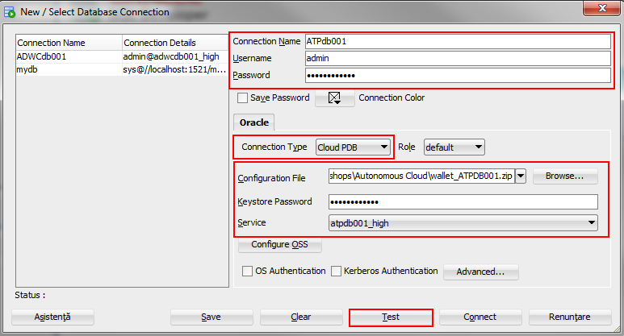
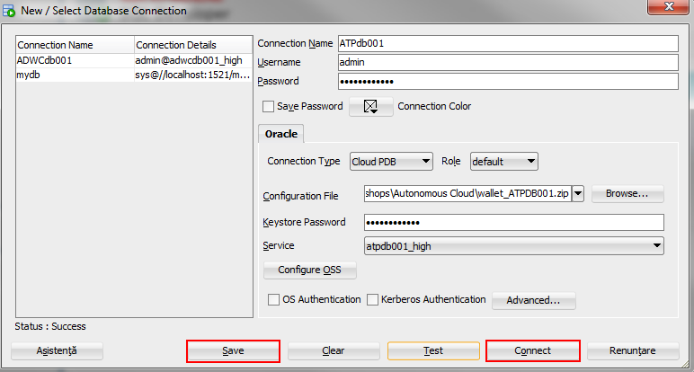

[Go back to the Autonomous Overview Page](readme.md)

## Autonomous Cloud Lab ##
### Section 4. Connecting to Autonomous Transaction Processing Database ###

In this section you will go through the steps of accessing the
credentials for connecting to your ADW instance with external clients,
like SQL Developer.

1.  The first step in accessing the credentials is to log in to the
    **Service Console** associated to your ATP instance. To do that, click
    on the **Service Console button** in the ATPInstance001 overview.

2.  Login to the *Service Console* with the following credentials:

    **Username*: admin**

    **Password: Welcome12345**

    **Note:** this is the password you specified during the provisioning
    of the service.

3.  On the home page, click the **Administration** menu on the left side
    of the page.

4.  Click **Download Client Credentials**.

5.  Enter a password before downloading the wallet zip file containing
    the credentials. This password will protect the sensitive data
    residing in the file. You can use **Welcome12345** as the password
    and then re-type it for confirmation.

    Click **Download** and save the file on your local computer.

A zip archive with the wallet was downloaded:

Next we will open SQL Developer and create a connection there.

6.  Open **SQL Developer** and click to create a new connection.

7.  Fill in the details to connect to the database as follows:

    **Connection Name: ATPdb001**

    **Username: admin**

    **Password: Welcome12345**

    **Connection Type: Cloud PDB**

    **Role: default**

    **Configuration File**:* Browse to the location of the zipped
    wallet and select it

    **Keystore Password: Welcome12345**

    **Note**: The Keystore Password is the one you selected for your
    wallet before downloading it. The Service you need to choose is the
    name you gave to your service when provisioning it.

    **Service: atpdb001_high** - it is the service of the
    ATPdb001 instance created which lead to consumer group high.

    Click **Test** to check the connection.

8.  If the test is successful **Save** the connection and click
    **Connect** to access the database.

The connection to the ATP database using SQL Developer is created. The
next step would be to load a table using SQL Developer from a local
file.

---

[Continue to Section 5](Section5.md)

---
[Go back to the Autonomous Overview Page](readme.md)
