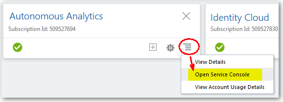
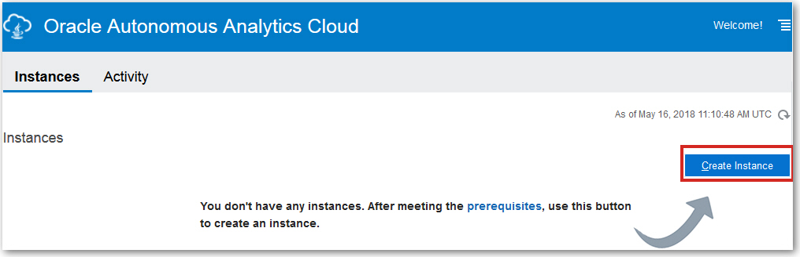
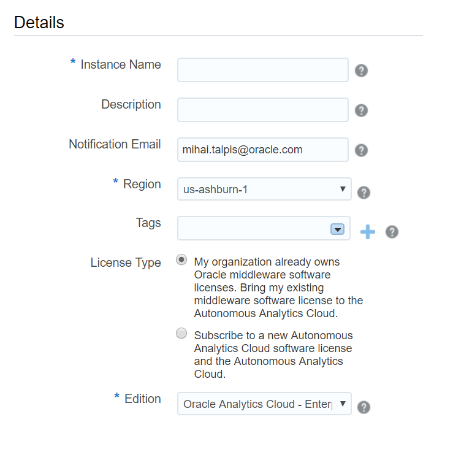
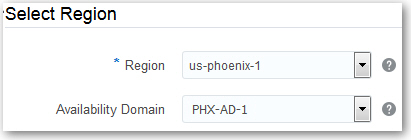
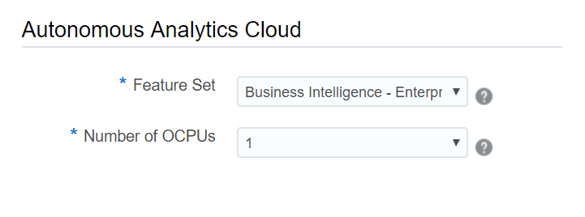
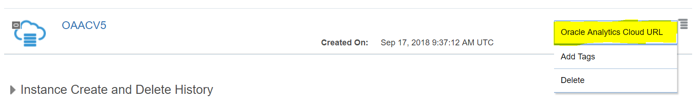
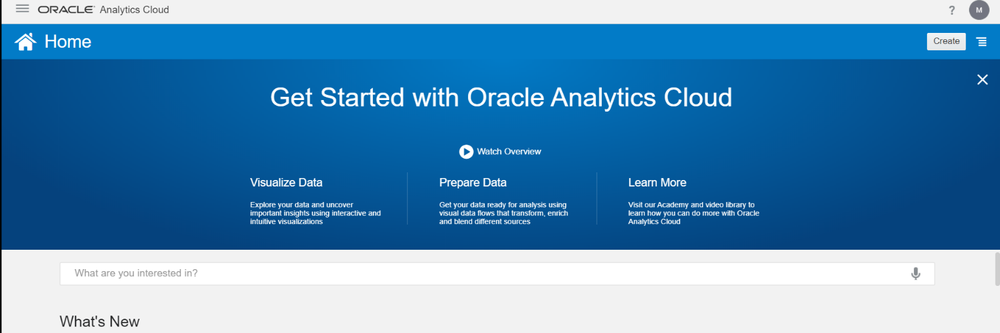

[Go back to the Autonomous Overview Page](readme.md)

## Autonomous Cloud Lab ##
### Section 5. Creating an Autonomous Analytics Cloud instance ###

You use Oracle Cloud Stack to set up services with Oracle Autonomous
Analytics Cloud.

1.  In My Services, open the dashboard.

2.  Navigate to **Autonomous Analytics**,
    click the **Action Menu**, and then select **Open Service Console**.

    

3.  Click **Create Instance**.

4.  In the **Details** area:

    -   **Name**: Enter a name for your service instance. The name must
        start with a letter and can contain only letters and numbers.

    -   **Description:** (Optional) Enter a description.

    -   **Notification Email**: Enter the email address of the person
        who should receive status updates about this service. This
        person is usually you, the Cloud Account Administrator who's
        setting up the service.

    -   **Region**

    -   **Tags:** (Optional) Add tags and assign tags to this service.

    -   **License Type:** Bring your own license or subscribe to a new
        Autonomous Analytics Cloud software license and the Autonomous
        Analytics Cloud.

        For example:

 

5.  In the **Select Region** area:

    -   **Region**: A region is a localized geographic area.

        For example:

6.  In the **Choose Service Options** area:

    -   **Edition:** Select the edition of Oracle Analytics Cloud that
        you want to use. The edition that you select determines the
        feature set that you can use.

        -   Enterprise Edition --- **EE-Enterprise**

        -   Standard Edition --- **SE-Standard**

        -   Data Lake Edition --- **DATALAKE-Datalake**

    -   **Feature Set:** Select the features that you want to deploy.
        The options available to you depend on the edition you're
        subscribed to. If you select **Business Intelligence**, you
        automatically have access to Data Visualization.

        -   Standard Edition --- **Data Visualization**

        -   Data Lake Edition --- **Data Visualization** or **Essbase**

        -   Enterprise Edition --- **Data
            Visualization** or **Essbase** or **Business
            Intelligence** (includes Data Visualization)

    -   **Number of OCPUs:** Select the number of Oracle Compute Units
        (OCPUs) for your environment.

**You can raise a service request to change the compute shape after creating the service, if the needs of your business change.**

 For example:

7.  Click **Next**.

8.  Verify that the details are correct, and click **Confirm**.

It takes about half an hour to create the service. Oracle sends an email
to the designated email address when your service is ready. Display the
Activity page to check the current status. 

9.  After the instance has been created you can go ahead and launch the
    platform by clicking on the menu drop-down button and selecting
    **Oracle Analytics Cloud URL**

10. You will be redirected to the
    following page, which is the Data Visualization welcome page:

    

11. In the left hand side you will find the Analytics Cloud menu with
    the following options:

    

    -   **Home:** easy access to manage your connections, view existing
        data sets, projects and data flows.

    -   **Projects:** you can manage folders and projects from this
        section.

    -   **Data:** displays all the datasets, connections, dataflows and
        sequences.

    -   **Machine Learning:** manage and inspect the models that you
        have created.

    -   **Console:** add/edit map layers, jobs, administer users and
        roles, manage snapshots, connections and configure mail
        settings.

    -   **Academy:** useful resources for getting started.

    ---

    [Continue to Section 6](Section6.md)

    ---
    [Go back to the Autonomous Overview Page](readme.md)
