[Go back to the Autonomous Overview Page](readme.md)

## Autonomous Cloud Lab ##
### Section 6. Using Oracle Autonomous Analytics ###

Creating a Project

1.  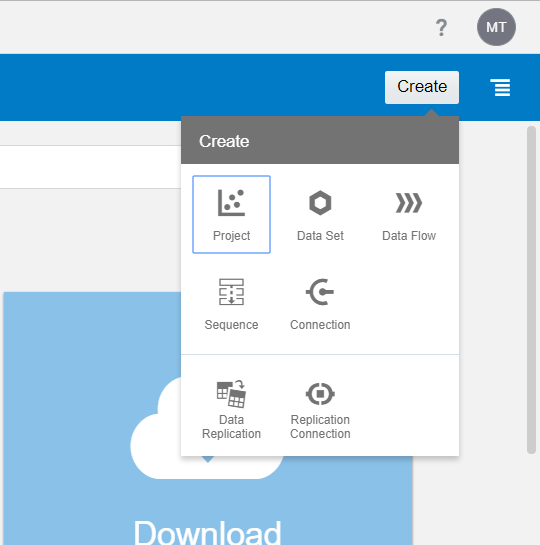
    You may now head back to the home page
    and click **Create** in the right hand side and select **Project**

2.  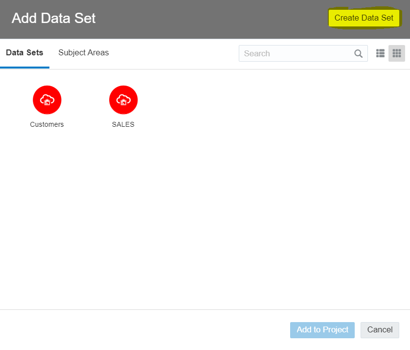
    You can select either from the
    existing data sets or create a new one, given that this is a fresh
    instalation, go ahead and click **Create Data Set**

3.  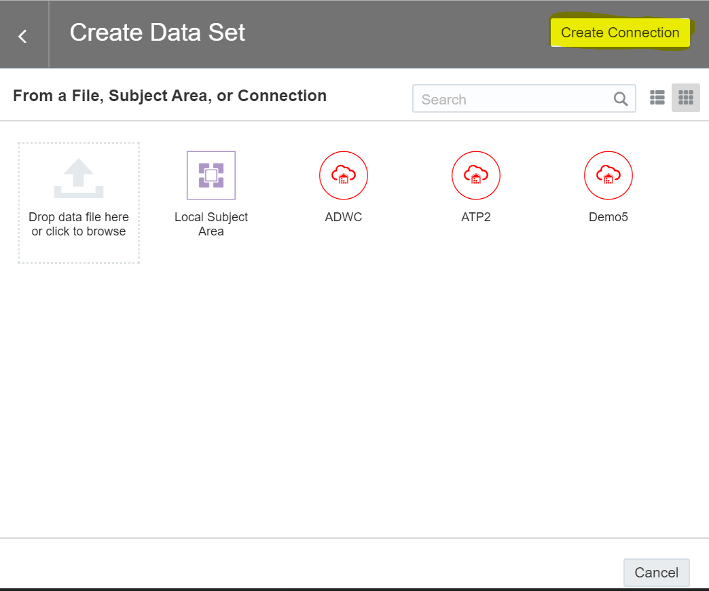
    In the **Create Data Set** dialog box there will be displayed all the
    current connections as well as the option to upload a file (.csv,
    .xlsx)

 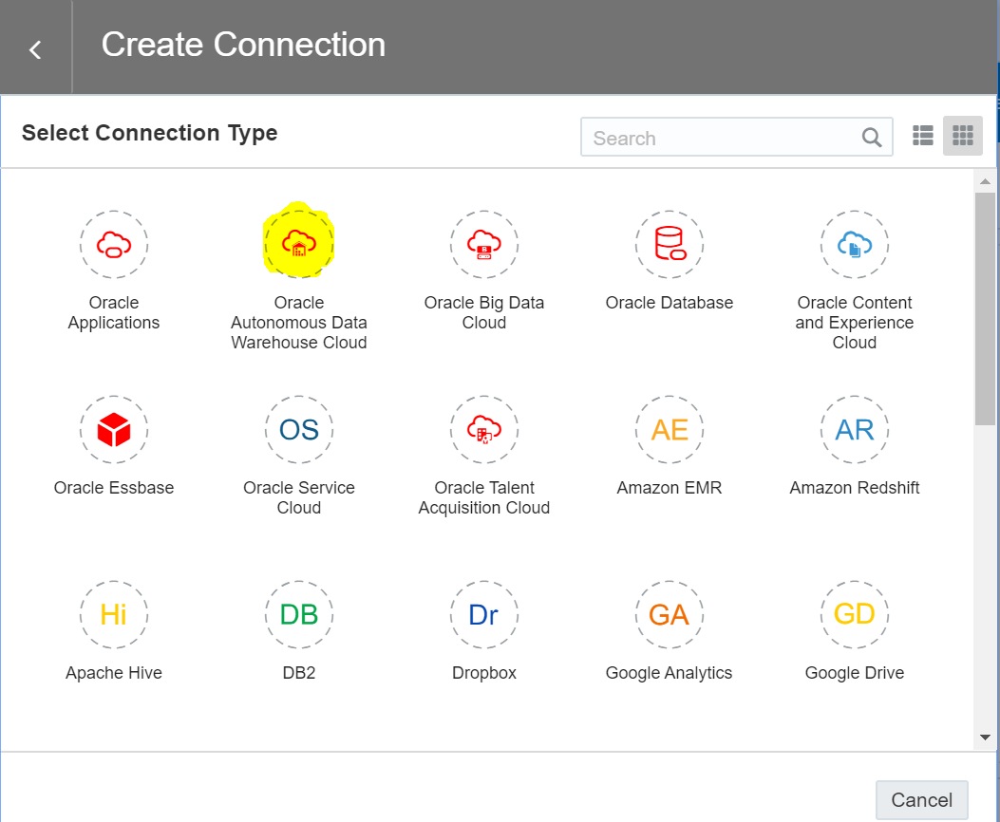

Proceed to **Create Connection** in order to connect to a database.

 These is the list of possible connections in Oracle Analytics Cloud,
 for this workshop we are going to connect to **Oracle A**utonomous
> **D**ata **W**arehouse **C**loud (short -- ADWC or ADW).

4.  Fields for creating a connection to **ADWC**:

    -   **Connection Name:** This name will be used to display the
        connection for easier access on the screens that we have
        previously seen

    -   **Description (Optional)**: for internal purposes

    -   **Host:** host name from the wallet you have downloaded -- open
        **tnsnames**

    -   **Port:** default for **ADWC** is 1522, also available in the
        **tnsnames** file

    -   **Client Credentials:** browse for the .sso file provided in the
        wallet

    -   **Username:** the username you have provided when creating the
        **ADWC** instance

    -   **Password:** the password you have set

    -   
        **Service Name:** same procedure as
        for the **host** -- open **tnsnames**

This should be the end result. Click **Save** and proceed to the next
step.

5.  After completing the previous step, all the schemas in the database
    will be shown, for the purpose of this exercise we are going to use
    **SH** which is a sample schema provided with the creation of a new
    database.

    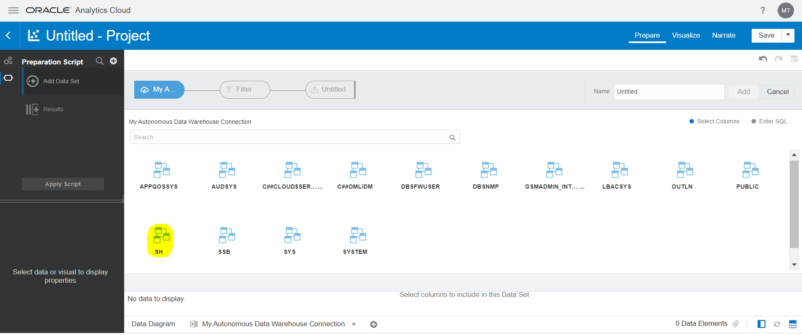
    Select **SH** to proceed.

6.  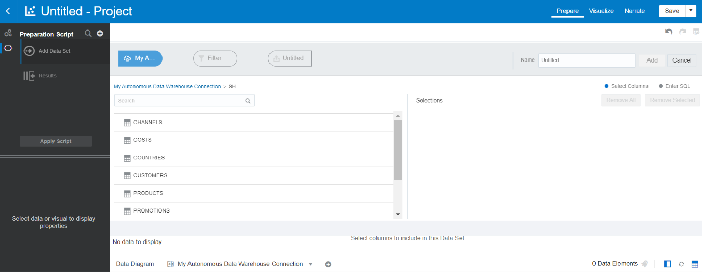
    After selecting the schema, the
    following **Tables** will be retrieved, we are going to use the
    **Customers** table

7.  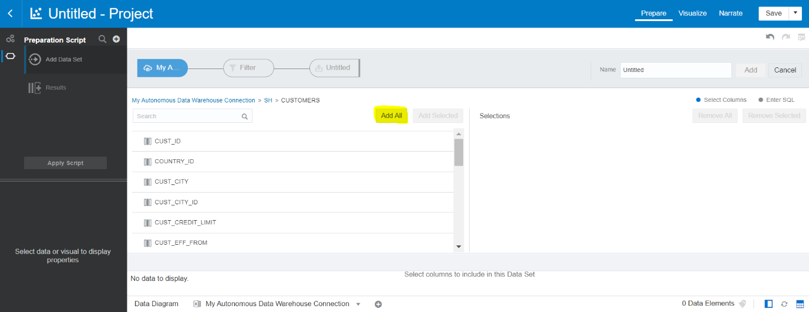{
    Now that you have selected the table,
    select all the columns by clicking **Add All**, afterwards you can
    name your dataset and finally click **Add** to finish the importing
    process.

8.  
    After you click **Add** the data will be available
    for preparation, by default columns that contain numeric values will
    be imported as measures (**\#**), to change that click on the symbol
    and select **Attribute**. Repeat this for all the columns that
    contain **ID** in their header.

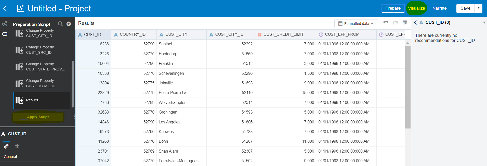
    Once this is done, click **Apply Script** to save changes and proceed to the **Visualize** tab.

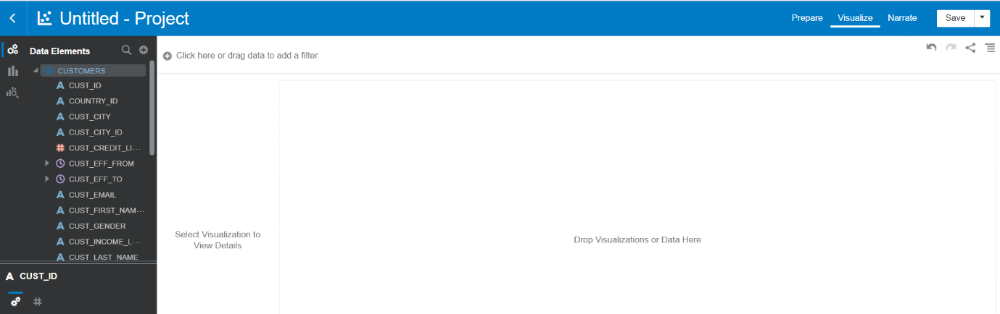

    You will be taken to a blank canvas and on the left hand side you will see the dataset that you have created.

9.  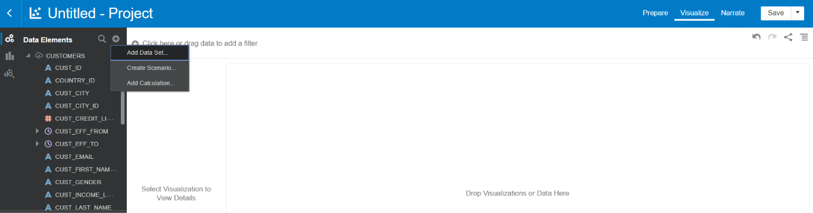

    For the purpose of this exercise, we need an
    additional table, which can be added by clicking on the **+** sign
    next to the magnifier.

    An **Add Data Set** dialog box will pop up, the same one as we have seen in step 2. only this time we already have the connection created

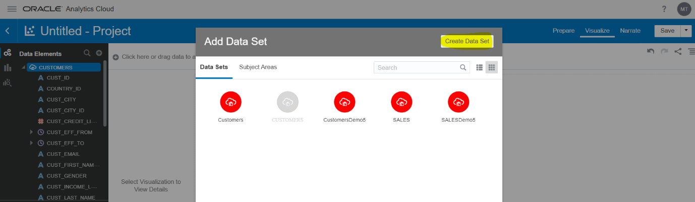

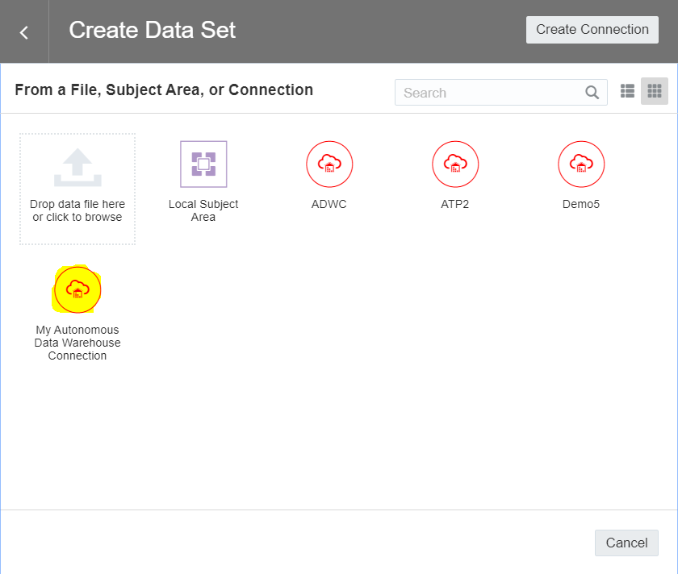

    Select the connection you have created:

   Given the fact that we have uploaded the
   tables from the same schema and there are two columns with identical
   names **CUST\_ID**, the service has created the join automatically and
   now we can correlate data from two different sets. If the join does
   not exist, create one by clicking **Add Match**, select the matching
   columns and click **OK**.

11. Now that you have joined the datasets, click on **Visualize** and
    focus on the left hand side.

    Expand the datasets, hold **CTRL** to select both **CUST\_CITY** from
 **CUSTOMERS** and **AMOUNT\_SOLD** from **SALES**, right click and
 select **Create Best Visualization**.

 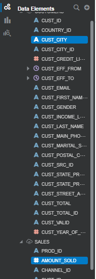

 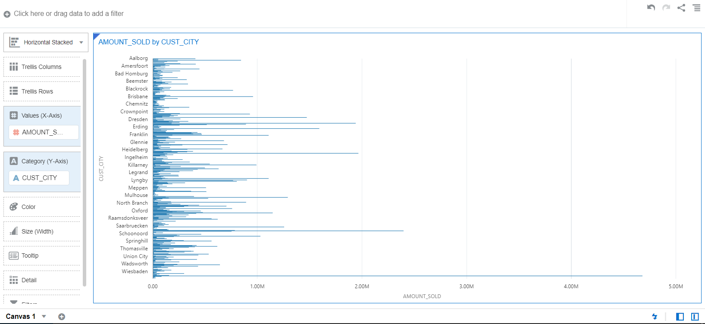
    The result should look like this,
   although, while the result is readable, due to the high number of
   values in **CUST\_CITY**, some of the labels are not displayed.

12. 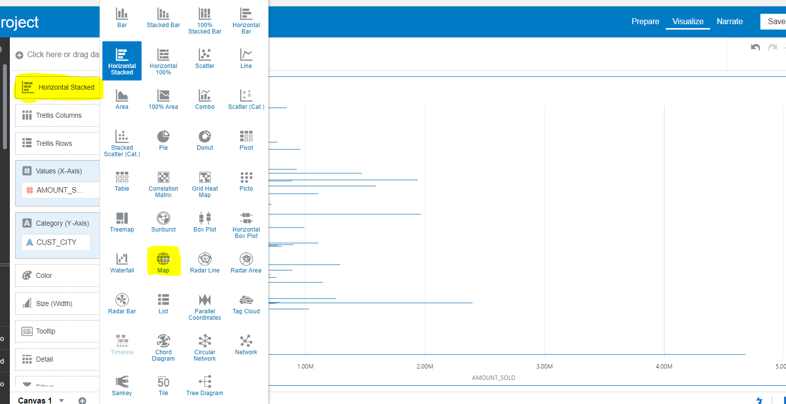
    Change the visualization type to
    **Map** by clicking on the actual type -- **Horizontal Stacked**.

 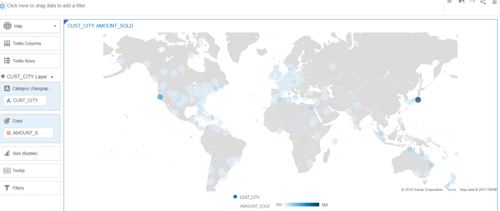

 Now the values are displayed in an interactive map that you can zoom
 in on, drag around and check different values.

 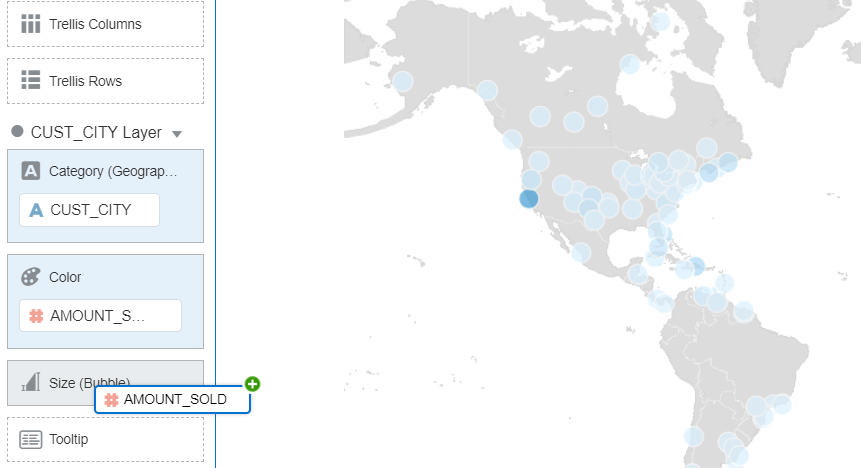
    The colour of the bubble is based on the value of
 **AMOUNT\_SOLD**, for a better result, click and drag **AMOUNT\_SOLD**
 to **Size**.

 The end result is displayed below.

 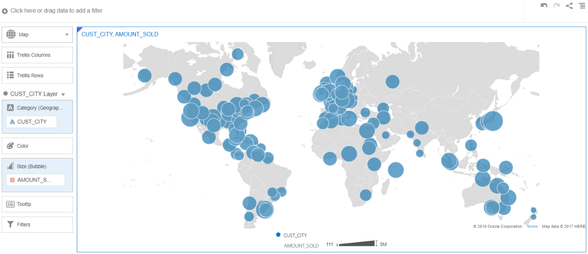

13. 
    Rename the Canvas by clicking the
    drop-down property menu in the bottom left corner and select
    **Rename**.

 Give it a name and proceed to the next step.

15. 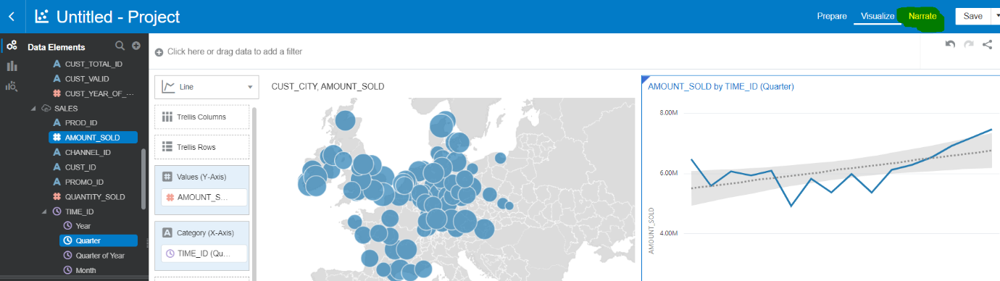
    Clicking on **Narrate** you can add
    Canvases to present them in your meetings.

 Drag your canvas on the blank page, add a text box in which you can
 explain the depicted information and click
 Present.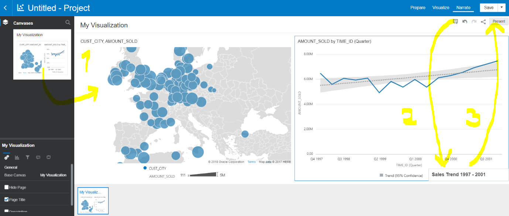

**Section 7. Conclusion**
-----

Oracle Cloud Platform's built-in autonomous capabilities transform the
way cloud services are delivered and consumed. Benefits for
organizations include:

**Lower Cost**

-   Reduce administration costs by up to 80 percent with complete
    automation of operations and tuning

-   Reduce runtime costs by up to 70 percent by paying only for
    resources needed at any given time

-   Deploy new apps in minutes versus months, save tens of thousands of
    dollars in resource costs

**Reduce Risk**

-   Mitigate breach impact by avoiding reputational damage, associated
    breach costs, and revenue losses

-   Reduce human error; under 2.5 minutes of downtime per month.

-   Run highest throughput, mission-critical workloads on proven Oracle
    and open source technologies

**Accelerate Innovation**

-   Develop new apps within hours with self-generating code, plus
    intelligent and secure CI/CD pipelines

-   Deploy new business processes within minutes versus days with
    voice-enabled, self-defining integrations

-   Provision a data warehouse in seconds and accelerate time to
    innovation

**Predictive Insights**

-   Proactively discover new insights with ML-based continuous data
    analysis

-   Analyze data using AI with predictive data visualization, narration,
    and intelligent data discovery

-   Get proactive insights with comprehensive, in-database analytics for
    SQL, ML, Graph, R, and Times series

---

[Go back to the Autonomous Overview Page](readme.md)
