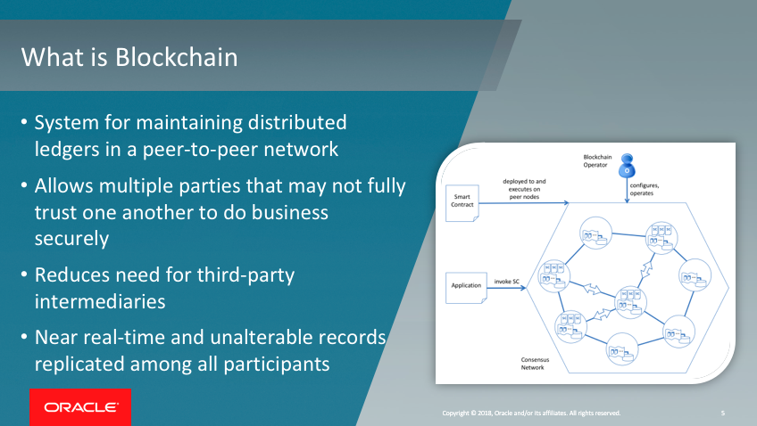
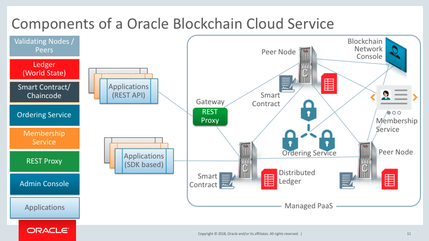
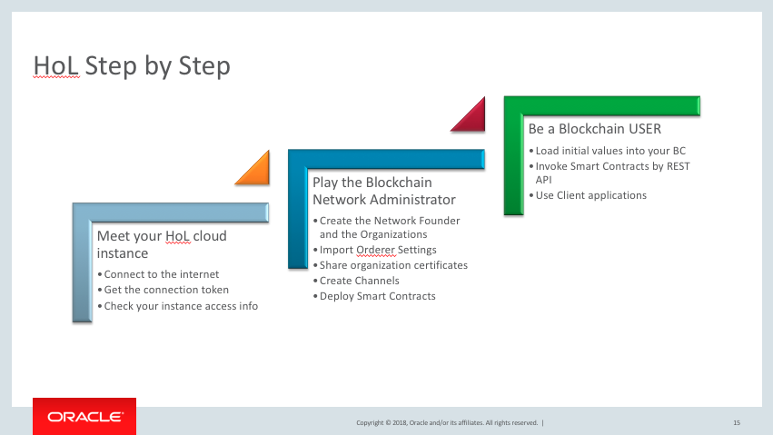

[Go to the Cloud Test Drive Overview](../README.md)

# Blockchain Cloud Service Lab #

## Introduction - what is Blockchain ? ##

## What will you do with Blockchain in this Lab ? ##

## Let's start ! ##

This lab is composed of a series of steps.  Your instructor will inform you which sequence will be run in your lab.

+ Download the tutorial by clicking on the links below, and then **use the "Download" button** .  
Attention ! To come back to this page, hit the "Back" button of your browser !

  - Lab 1 - [creating a network with 3 orgs](Lab1_BCS_Network_HOL.docx)
  - Lab 2 - working with this network (sample application AND REST API)
  - Lab 3a & 3b - working with Sample App & REST API
  - Lab 4 - extending network (COMING)
  - Lab 5 - working with chaincode (COMING)

+ Log in to the environment with the URL and the credentials that have been provided

---

## License ##
Copyright (c) 2014, 2018 Oracle and/or its affiliates
The Universal Permissive License (UPL), Version 1.0   
[Details](../common/license.md)

---
[Go to the Cloud Test Drive Overview](../README.md)
