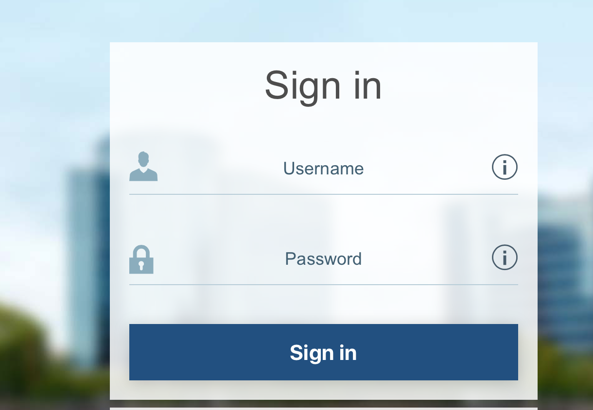
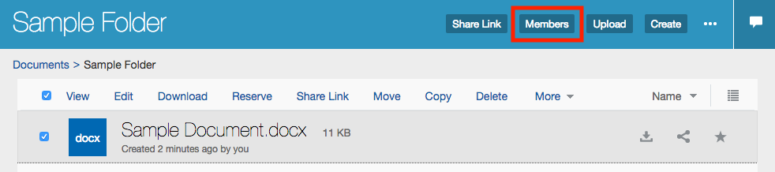
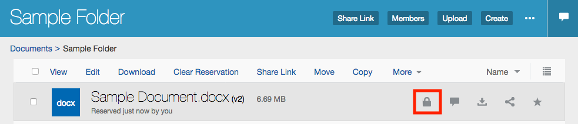

[Go to the Cloud Test Drive Overview](../README.md)

# CONTENT AND EXPERIENCE LAB #

## Introduction ##

This lab will showcase Content Cloud. Oracle Content & Experience Cloud Service (CEC) lets you easily store your business content in the cloud, securely access it from anywhere, and share it with your colleagues and partners in real time. With a fast, intuitive web interface and easy-to-use desktop and mobile applications, employees can view and collaborate on files even when offline, keeping your organization running efficiently and your employees staying productive from any location.

## Chapter 1: Upload and Share a file in Oracle CEC 

In this chapter of the workshop we are going to show how to use Oracle CEC via a web browser and how to upload a file into a folder and share it afterwards.

FOLLOW THE LINK IN YOUR ACCESS DOCUMENT 

At the Login Prompt enter the user name and password that has been supplied to you.

Welcome to the main page of CEC. You’ll notice on the left-hand menu that you can select between Content and Experience. For the moment we will have a look at the Content part of CEC.
Now we are going to create a new folder and upload a file into that folder

Click on Create on the right upper corner 

NOTE: Depending on the CEC instance you might already see existing folders and content.

A new window will pop up. In this window you
-	Name the new folder
-	Write a description
-	Click on Create

When the new folder is created, you can access it by clicking on it

When you are in the folder you will see it is empty.

We can now start added documents to it.

Click on Upload – a new window will pop up

Select a file in the new window and click on Open or double click the file to start the upload.

You will see the message keeping you updated as the upload progesses.

Click on the Details button to open a more detailed view about the upload process. When you are done, close this window
Note: When the uploading process is complete, a message will notice you if the upload was successful or not.

One of the great advantage of Oracle Content Cloud is it’s ability to share folders with your colleagues or customers.

Now we are going to share the created folder.

Click on Documents to go back to the main directory.

Right-Click on your folder and click on Members

OR

Select the folder by clicking on it’s checkbox.

Then select MEMBERS from the top menu.

If you don’t see the SHARE option along the top – click on the MORE to show all of the actions.

Click on Add Members in the new window.

Note: There are two other ways of sharing a file or a folder which we will discuss later during this workshop

Select a member from an available member list or type in their email address.

Click on the drop-down arrow and choose one of the four possible roles that a member can have

Viewer: These members can view files and folders online

Downloader: These members can view and download files and folders

Contributor: These members can view, download, and modify files and folders

Manager: These members can modify files and manage people who can access this folder

When done, click on Add

The summarization window shows all member of this shared folder including their role (access rights).

More members can be added here.

Click on Done 

CEC also supports drag and drop file uploads.

Open your file browser and drag/drop a file into your folder.

### Chapter 2: Conversations, Editing and other collaboration features
In this chapter of the workshop we are going to show some of the collaboration features of CEC

Go into your created folder and click on the sample document to open it.

Click on the Conversation icon in the right upper corner. It looks like a white speach bubble !

Write some text for the conversation and click on Post.

Add an anotation to your document : 

Click on the Pin Button

Click where you want to add an anotation in your document

A yellow box will appear in the conversation section.

Add a Comment

Your annotation is now effective.

Everytime you click on your Pin, you will be automatically  redirected to the corresponding comment. 

This will allow you to track changes, and point out specific parts of a document when collaborating with other team members.

Click on the Conversation icon again to hide the conversation.

Go back to your folder and right click on the sample document.

Or Select the documents Check Box.

Click on Reserve to lock your file. Use the Padlock Icon. The file is now locked

Download your file to make changes

In Word, write some new text into your document and then save the file.

Note Optional Step  :

If you don’t have the Windows application installed 

Go back to your folder in the web browser. 

Right click on your file, 
Select Upload New Version
Upload your file

You will see that there is a new version saved

Right click on your document and click on Clear Reservation to unlock your file

Click the More button and then click on Version History

A new window will appear where you will see when and from whom the document was changed.

In this window you can download the latest or a previous version, delete them or make a previous version to the latest.

It is also possible to click on the file name to open any version within the browser.

Click on Done to close this window.

Back in your folder, click on the Share button. A new window will appear.

In a previous step, we have added a new member for collaboration to this document

There are two other ways of sharing.

1. You can send a link to a member who is part of the CEC instance.

2. You can create a public link to send to anyone by selecting Public 

You can modify the properties of the Public Link by selecting Edit Link Options.
When you enter an email addres in the To field, you’ll notice that the CopyLink button will change into a SendLink button 

Click on CopyLink.

The Share Link dialog will disappear and the link will be copied to your clipboard. 

Go back to your folder and click on the conversation icon.

Write a message to the file conversation and click on Post.

Using Document Cloud service, you can manage custom properties so that users can quickly categorize files and folders with additional descriptions.

It is known as Metadata.

Click on the 3 dots next to the “Download” Button

Select Custom Properties 

A new tab will appear.

We need to set up custom properties for this document.

Click on Manage 

The CEC Administrator has the possibility to create as many custom properties as needed.

Your environment has been already configured with two custom set of properties.

We will use the one of the provided metadata sets.

Flipp the switch next to DOCUMENT APPROVAL and press SAVE.

Note :

You can customise a custom properties in Doc Settings. You need Admin rights for this.

You will be able to decide the number of fields, the type and other information.

We are showing an example in our screen shot.

Now fill your fields on customer metadata.
Click Save.

## Chapter 3: The Desktop Application
Conversations, Editing and other collaboration features

In this chapter of the workshop we are going to show the desktop application and its integration with the cloud.

The desktop app keeps files and folders on your computer desktop synchronized with your files and folders in the cloud.

It's easy to do. Just install the client software. You set up an account and the software will set up a folder for you on your desktop, with the name you give the folder. You can choose the folders you want to sync, and they’re put into that desktop folder to be synced whenever the app starts. You can also directly add files and folders into your desktop folder and they’ll be added to Oracle Content & Experience Cloud Service. They’re available to use in your browser or a mobile device. All your information stays up-to-date while the sync client is running.

You can also set notifications, letting you know when the conversations you’re active in are changed. You can customize what notifications you’ll receive so you can follow only those conversations that are important to you. You can also share your files and folders, just like you do when you use a web browser.

One way of downloading the desktop application is to click on your account name and then click on Download Apps

Select the version you want to download and install it.

Note: The CEC application is integrated with your Windows file browser. You can choose the folders you want to sync, and they’re put into that desktop folder to be synced whenever the app starts. You can also directly add files and folders into your desktop folder and they’ll be added to Oracle Content & Experience Cloud Service.

Note: All your information stays up-to-date while the sync client is running

Note: You can also set notifications, letting you know when the conversations you’re active in are changed. You can customize what notifications you’ll receive so you can follow only those conversations that are important to you. You can also share your files and folders, just like you do when you use a web browser.

## Congratulations
## You completed this workshop! 

### License ##
Copyright (c) 2014, 2017 Oracle and/or its affiliates
The Universal Permissive License (UPL), Version 1.0   
[Details](../common/license.md)

---
[Go to the Cloud Test Drive Overview](../README.md)
