[Go to the Cloud Test Drive Overview](../README.md)

# Digital Experience Labs #

## CONTENT AND EXPERIENCE LAB ##

### Introduction ###

This lab will showcase Experience Cloud. Oracle Content & Experience Cloud Service puts the power of creating highly engaging sites into the hands of non-technical line-of-business managers. A beautiful website built on collaborative content including images, PDFs, and presentations can be created in minutes. Applications and processes and can be integrated as well. Assembling a web site is a matter of point-and-click.

This lab will demonstrate how Oracle Content & Experience Cloud Service (CEC) provides a complete web site creation solution. In this demo, we will showcase the key features of the Experience Cloud Service product on how to rapidly develop and publish a microsite in the cloud.

#### End-to-End Application Flow 

This demo showcases the end to end flow of creating and testing a web site including the following:

•	Create a theme from an existing website
•	Create a site
•	Edit a site
•	Integrate external components
•	Test and publish your site
•	Collaborate and share documents dynamically with all team members

### Login
FOLLOW THE LINK IN YOUR ACCESS DOCUMENT 

At the Login Prompt enter the user name and password that has been supplied to you.

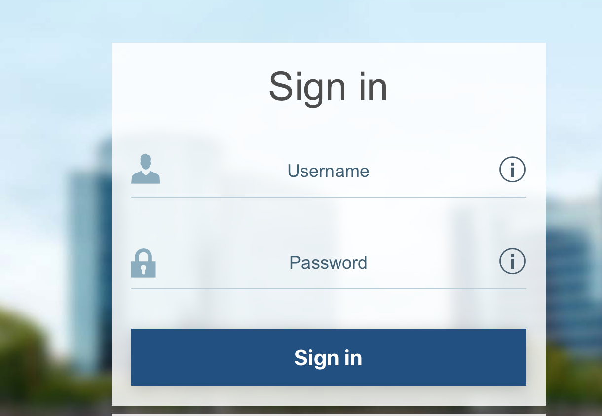

In this chapter of the workshop we are going to show how to use Oracle CEC via a web browser and how to upload a file into a folder and share it afterwards

## Create a site from a template
This main CEC homepage is split into two pages

The Content page: 
You have access to all your documents and conversations from this screen
You can perform all the required action directly from the browser (share, move, create, delete, comment, organize, etc...)

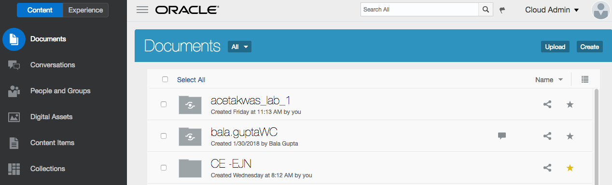

The Experience Page:
This is where you will be able to create/edit/update/publish your websites, themes, templates and applications

Click on the “Experience” tab

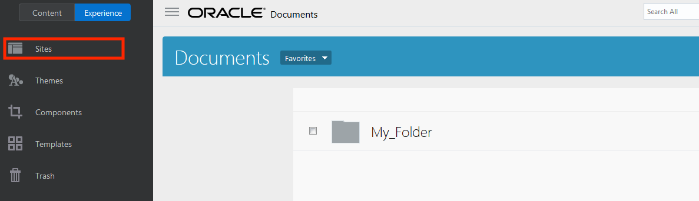

Depending on your instance, you will be able to see existing websites.

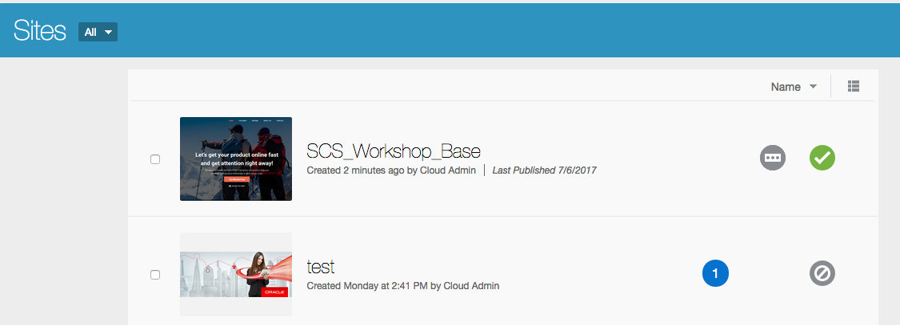

We will first have a look at one of this website.
We will then copy this website, and customize it in order to suit our Travel Request needs.

This will show you how easy it is to reuse an existing website, share and modify it and following your business requierements.

Open the properties for the SCS_Workshop_Base website and see what it looks like.
Select the website and click on Properties.

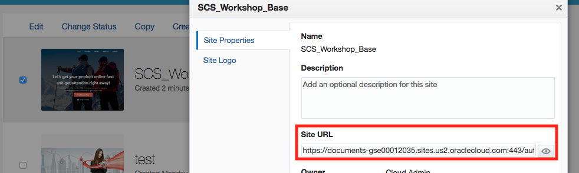

Come back to the Site Page

1. Right click on the SCS_Workshop_Base site
2. Select “Create Template”

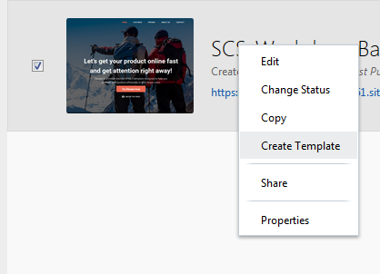

Provide a name to your template and a description (optional)

Click Create Template

You receive a notification once your template has been created

NOTE: Append the template name with your name to be able to identify it afterwards.

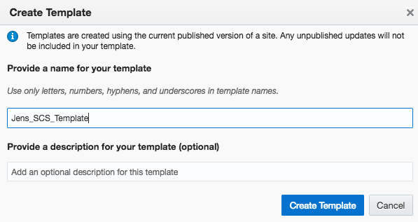

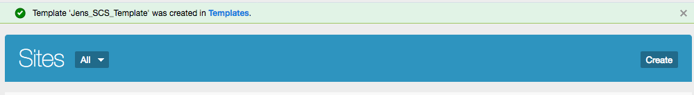

A template contains a theme. A theme defines the look and feel of the page. The template may have already some content inside. 
A template is required for the creation of a site.

You adjust the theme that resides within the template to adjust the look and feel of the website.
Templates are a very convenient way to create and maintain sites.
They are easy to export, share and modify between team members.

A template contains a theme. A theme defines the look and feel of the page. The template may have already some content inside. 
A template is required for the creation of a site.

You adjust the theme that resides within the template to adjust the look and feel of the website.
Templates are a very convenient way to create and maintain sites.
They are easy to export, share and modify between team members.

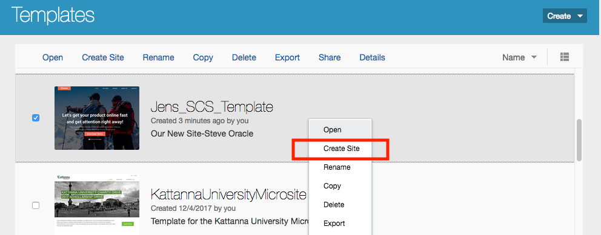

Provide a name for your Site

Click Create.

Again, you will get a confirmation message.

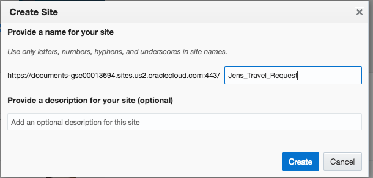

You can now go back to the “Sites” page

Your site is now in the list of sites 

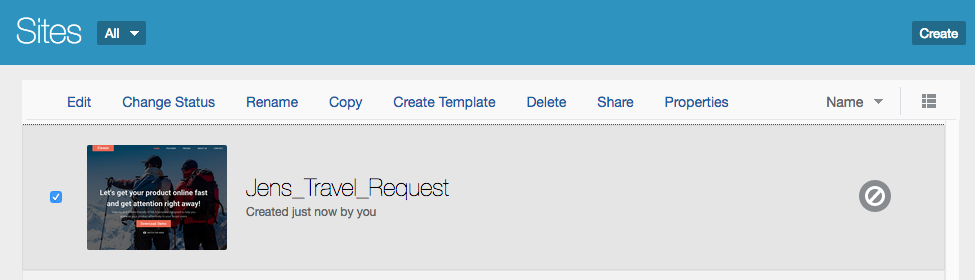

## Edit your site
Select your site and click the edit link.

A popup named New Update shows up. 
•	Give a name to your update 
•	Click the Create button
 
Note: A new browser tab will open
If this browser tab does not open, you will receive a notification in your browser that it’s blocking popups

Choose to allow popups in this case.

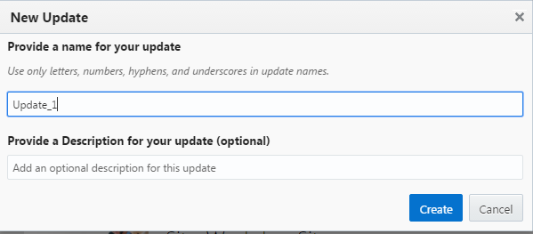

Your browser window should look like the following now

Look for the toggle between
View and Edit mode of the page 

•	Click on the toggle to go into Edit mode

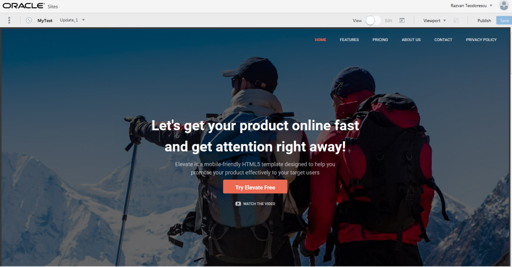

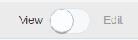

A black bar with icons will show up on the left side of the screen.

•	Click the first icon to see the site tree

We only want to create a simple microsite with a single page, so we’re going to delete all other pages.

•	Click on an item and then click the garbage bin icon

•	In the popup menu click Ok

Do this for all pages except Home

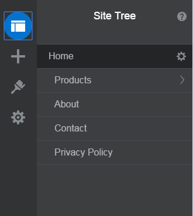

From the home page
•	Click the cogwheel icon and you will see a configuration page for this page

Rename the page title from to “Manage Travel Request”.

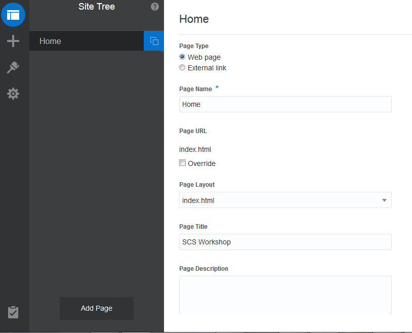

We will now modify the Home page

Click on the Close button

We will start by modifying the title

•	Click on the text and modify it.

Example: 
“Let's get your product online fast and get attention right away! “

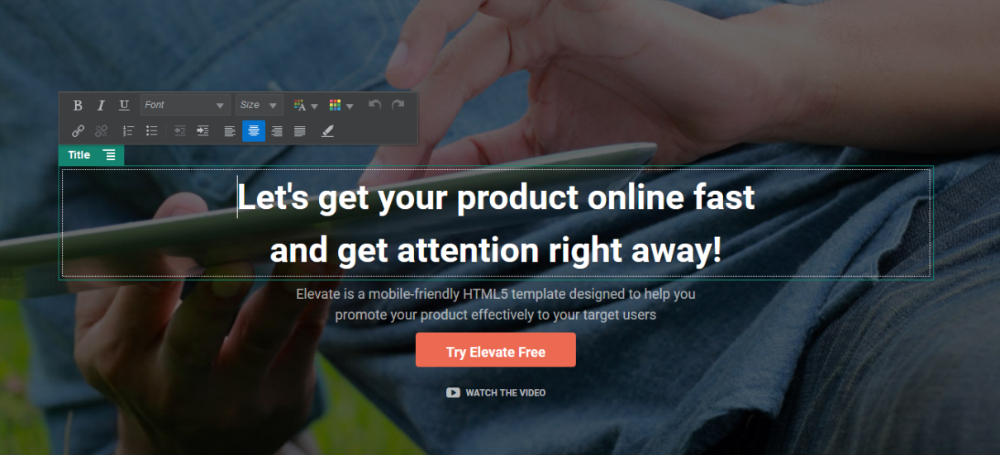

•	Modify the Paragraph following the same simple method

Example: “Easily manage your Travel Requests thanks to a mobile-friendly HTML5 Website.”

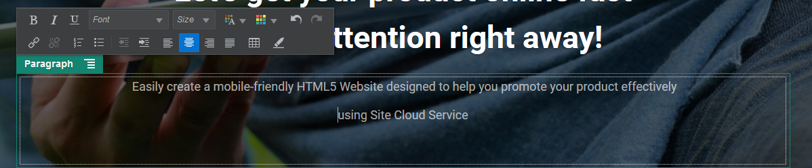

Click on the orange button.

Modify a button :
•	Click on the green bar’s extremity, 
•	Open the setting menu

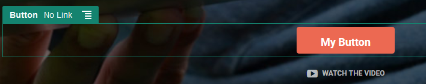

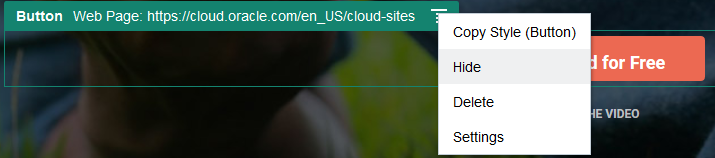

•	Change the label in the “General“ tab

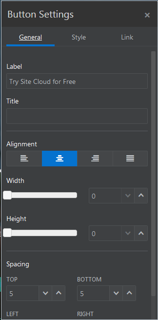

•	Go to the “Link” tab

•	Select “Web Page”

•	Enter an URL: https://cloud.oracle.com/en_US/cloud-sites

You can now close the tab.

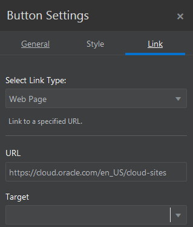

We will link a video to the page

•	Click on “Watch the Video”

A slot will open with an existing video. We will replace this 

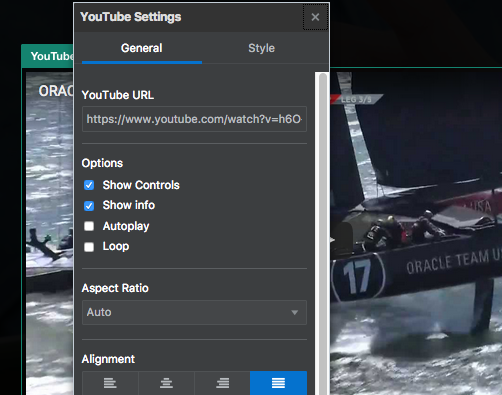

Click on settings

Paste this Youtube URL:
https://www.youtube.com/watch?v=4weOMXMK-dQ

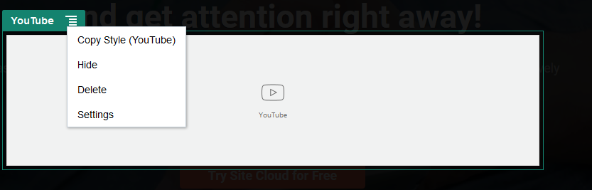

We will now start dragging components onto our page

We will be using three different components

•	One Oracle Social Network conversation where different users can share information 
•	One Content Cloud folder where you can manage your documentation
•	One for seeing an inbox of Process Cloud tasks 

We will delete the static images from the base website and replace them with dynamic components

On the left side of the screen, click the second icon, the plus sign

Click once again on Components

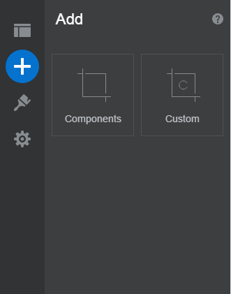

Here in the list look for the “Social” section

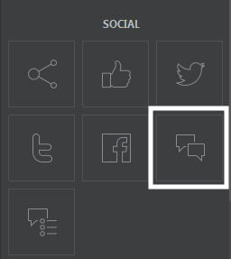

In the slot next to the title “ Save you time and effort”

Delete the image component

Drag and drop a “Conversation” component into the now empty slot

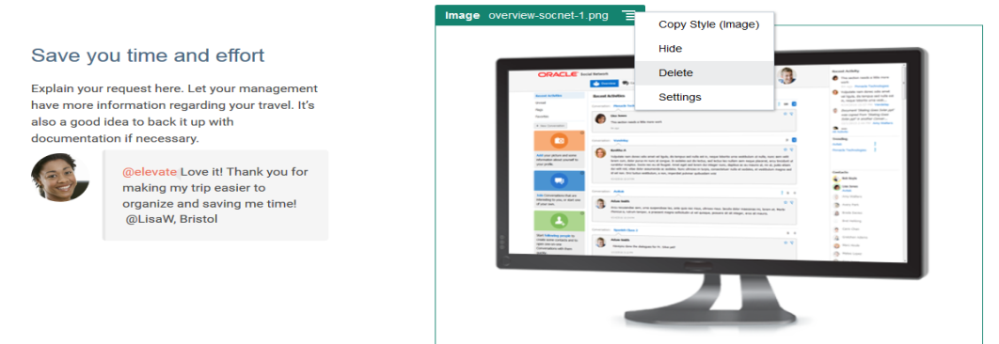
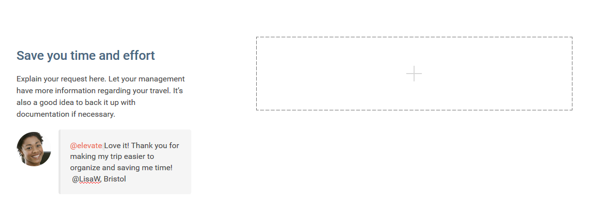

Open the “Conversation Settings”

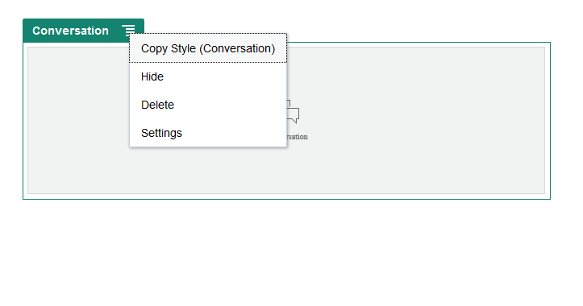

Select “ Custom Settings”

Choose Conversation by clicking on Select

Highlight a conversation and click on Back

You can now  close the tab

This is the final result of your integration

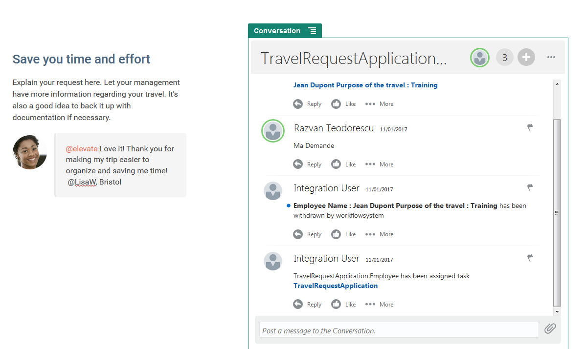

Go down next to “ Works across all devices”

Delete the image on the left in order to get this screen

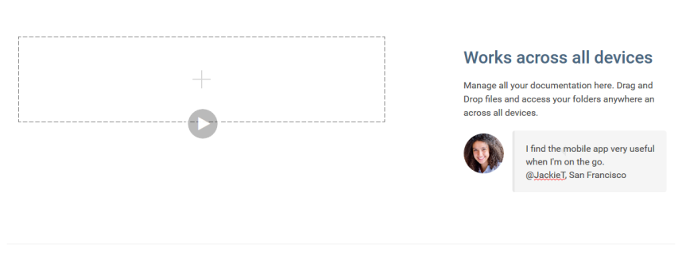

From the Components bar

Look for the “Documents” section 
Drag and drop a “Document Manager” component

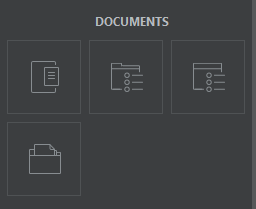

Open the “ Documents Manager” Settings

Open the “Custom Settings”

Select the folder created in the Content lab

Click on OK and close the tab

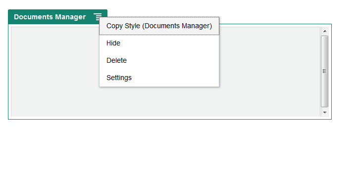

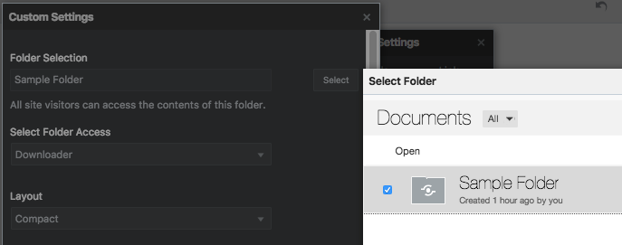

You can now use all the Content Cloud Service features here

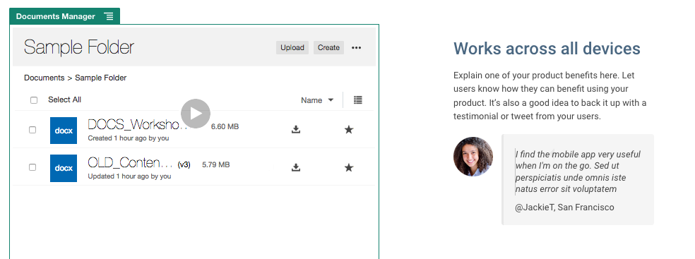

The last component we want to insert is the PCS component

This one is an external component

Go down to this part of the Site

Delete the image on the left, using the same method as before

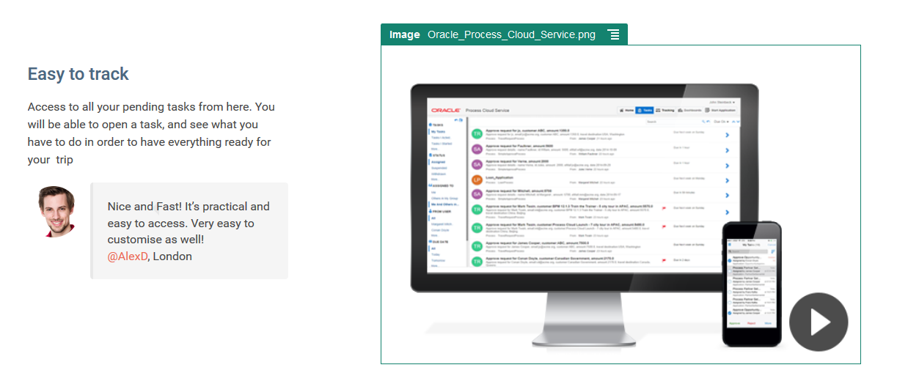

Go back to the “Add Components” tab

Select Components

Scroll down to the PROCESSES section, and Select the “Task List” Component

Drag and drop it into your empty slot next to “Easy to track”

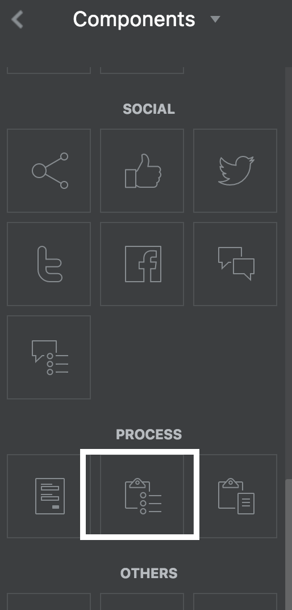

Click on the component header and Choose Settings

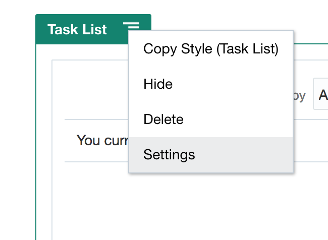

A popup with settings shows up In this menu click on Custom Settings

Another popup will appear

NOTE: You could enter and change settings here, but for the workshop your PCS instance is alreaday configured.

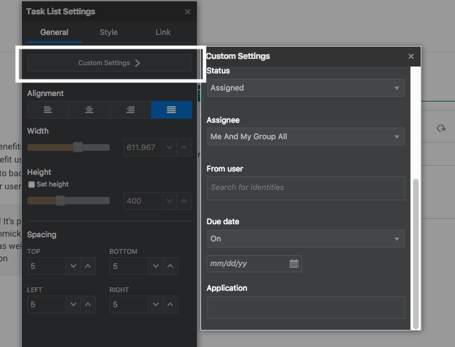

The result should be similar to this screenshot.

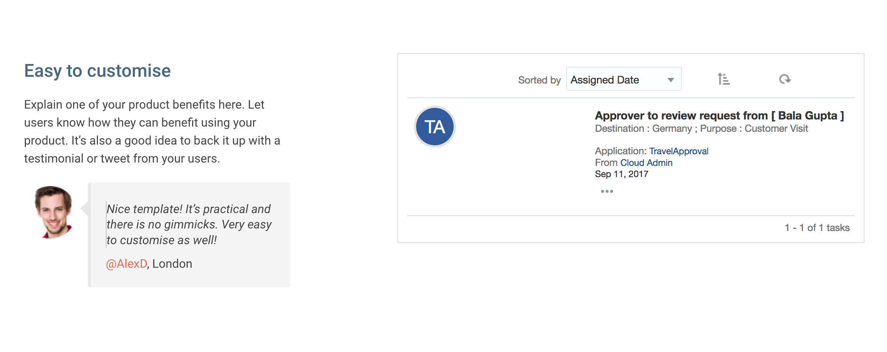

Save your website

Go to the preview mode in order to see you website as it will look once online

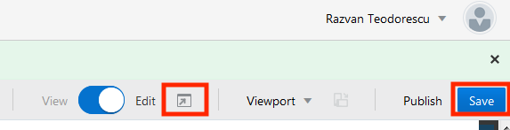

We are happy with our website

We can now publish our update

The current update will be saved and all the changes we made will be visible on the site as soon as you decide to put it online

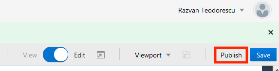

## Congratulations
## You completed this workshop! 

### License ##
Copyright (c) 2014, 2017 Oracle and/or its affiliates
The Universal Permissive License (UPL), Version 1.0   
[Details](../common/license.md)

---
[Go to the Cloud Test Drive Overview](../README.md)
