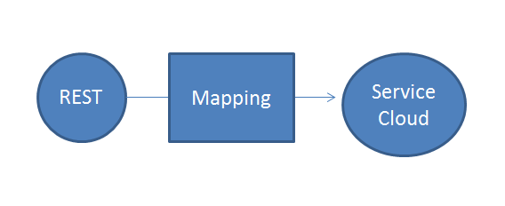
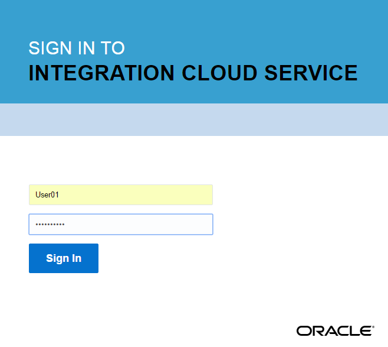
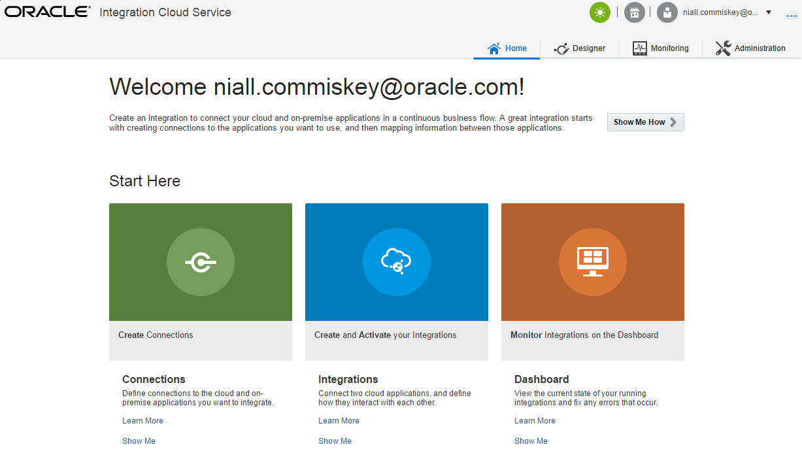
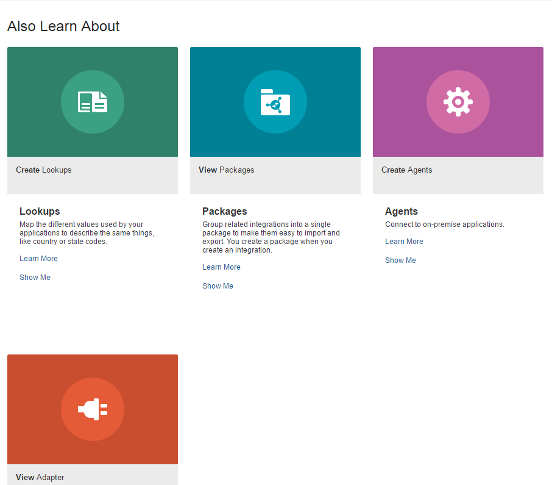
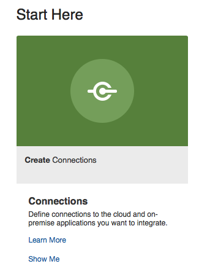

# Integration Cloud Services - Lab 1.0 #

Introduction to the Lab and Logging-in

##2	Lab Scenario##
Our fictional company is using Oracle Service Cloud (RightNow) as their Field Service SaaS application. Business has requested that IT delivers a mobile application for the field service personnel – one that will enable them to quickly query and create customer records in RightNow whilst on the road.
Note that in RightNow customers are known as “organizations”. To achieve their goal, our developers require a simple REST interface which masks the complexity of the “organization” data structure in Service Cloud. To this end, we will leverage Oracle Integration Cloud Service (ICS) to create a basic Map Data pattern integration between Rightnow and a mobile REST connection. 
We will then use that to connection to create a new “organization” (i.e. customer) in Oracle Service Cloud. 

###2.1	Logging in to ICS###
Your instructor will assign you a URL and a username with a password to login. Please view the relevant “Access Credentials for all Labs” document. 
Your instructor will also assign a Prefix – you will not need it for now, only for later.
To avoid any possible cache issues:
•	In Chrome - Select New Incognito Window
•	In Mozilla - Select New private window
•	In Safari – Select File > New Private Window
Login with the credentials assigned to you

###2.2	The ICS Environment###
Here is what you will see as soon as you login into Integration Cloud Service:
 

Let’s go through each component quickly. There is nothing to do here yet.

###2.2.1	Connections###
Connections connect you to the apps with which you want to integrate. In our case, we will need two connections, one for the REST interface, the other for Service Cloud (RightNow).
Connections are based on Adapters. ICS provides 40+ adapters out of the box. Some of these are for SaaS apps such as Sales Cloud or Salesforce. Others are technical adapters such as SOAP and REST. ICS also provides on-premise adapters for E-Business Suite, Oracle DB, file etc.

2.2.2	Integrations
Integrations connect applications to each other, in our case, the mobile interface to Service Cloud. 
Integrations leverage connections and usually involve some mapping of data. In many cases, where we have App A connecting to App B, both may have the same logical business object e.g. Customer. However, the actual object field names may differ greatly.
2.2.3	Dashboards
Dashboards provide us with the ability to monitor our integrations. Through the use of payload Tracking fields, we can see, for example, when a specific customer got created in Service Cloud. 
2.2.4	Lookups
Lookups help us address where different apps use different values for the same things e.g.
Sales Cloud - AddressType	Service Cloud - AddressType
1	Billing
2	Shipping
2.2.5	Packages
Packages allow us to group related integrations and their artefacts to make it easier to import and export them.
2.2.6	Agents
The ICS on-premise agent allows us to create secure hybrid integrations between cloud and on-premise. A possible use case includes sales account synchronization between Sales Cloud and on-premise Siebel.

Next, let’s start to implement our scenario. 
Lab Execution
3	Creating Connections
As already mentioned, you will need 2 connections for this lab. You will create them now. Ensure you are logged in as per the instructions above.
3.1.1	Create Service Cloud connection
You will create a connection called <Your_Prefix>ServiceCloud such as AA1ServiceCloud.
•	Click Create Connections, then New Connection
 
•	Select the Oracle RightNow adapter (RightNow is the legacy name of Oracle Service Cloud).
 
 
•	Use the code assigned to you as the prefix of the connection name to give it a name of <Your_Prefix>ServiceCloud
o	In my case below, I used AA1 to give my connection the name AA1ServiceCloud
 
•	Click Create
You will now see the following:
 
•	Click Configure Connectivity.
•	This will allow us to specify the enterprise WSDL. This contains a list of Service Cloud public business objects and the operations that can be performed on them e.g. to create Organization.
•	Use the following:
https://gsefmwr11.rightnowdemo.com/cgi-bin/integration_test.cfg/services/soap?wsdl 
 

•	Click Configure Security.
o	Here we will specify the Service Cloud user and password, which will be used to connect.
 

o	Enter Admin1/gaudyVideo7%
 
•	Click Save and then, Test.
 

 

•	Click Save and Exit Connection.

 
3.1.2	Create REST Connection

•	Click New Connection
•	Select the REST adapter.
 

 
•	Enter the relevant Connection Name, again, using the prefix allocated to you.
•	Click Create
•	Click Configure Connectivity.
•	Select Connection Type as REST API Base URL
•	This will allow us to specify a dummy URL for connection definition purposes. Enter a dummy URL. We will specify the actual URL details, when we leverage this connection at design time.
•	Click OK
 
•	Click Configure Security to set the security credentials.
•	Set Security to No Security Policy, then OK.
 

•	Click Save and then Test.
 

 
•	Click Save and Exit Connection.

The two connections are now ready for use:
 
 
4	Creating Integrations
As already mentioned, we will do a simple data mapping integration. Begin by clicking on the Integrations icon.
 

•	Click New Integration
 
You will see the following options to choose from.  

Let’s look at each of the above:

FYI (no steps to follow here)

Basic Map My Data Pattern
This is the pattern we will choose for this lab.

Use this for doing basic synchronisation between application business objects, e.g. syncing Sales Accounts from Sales Cloud with Organizations from Service Cloud. This pattern has the format: 
 
We read the diagram above from left to right:
•	ICS is called(Triggered) with a Sales Cloud Sales Account Business Object.
•	This is transformed into a Service Cloud Organization Business Object vua the Mapping.
•	Service Cloud is called(Invoked) to create the new Organization.

This pattern can also include content based routing as shown in the next page
 

Orchestration Pattern
Allows us to do more complex processing, such as checking whether the organization exists, before we attempt to create it.

Basic Publish/Subscribe to ICS Patterns
Allows us to implement Pub/Sub style integrations.

4.1	Create the Basic Map Data Integration
•	Select the “Basic Map Data” option from the list of options
 

•	Enter a name for your integration using your prefix and “BasicCreateOrg” or anything else you wish.
o	Example: AA1BasicCreateOrg
•	Type in a package such as <Your_Prefix>OrgPackage
 
•	Click Create
You will now see the integration canvas where you can drag and drop your connections.
 

On the far-right side, we see the connections available e.g. your REST and Service Cloud connections. We will drop the REST connection as the Trigger and the Service Cloud connection as the Invoke.
•	Select your REST connection and drag and drop it on the Trigger icon. A popup wizard will appear

•	Provide the following information on the wizard’s Basic Info page:
Field	Enter
What do you want to call your endpoint	CreateOrg
What does this endpoint do?	Receive REST request to create an organization in RightNow.	
What is the endpoint’s relative resource URI	/createOrg
What action does the endpoint perform	GET
Add and review parameters for endpoint.	Check this box
Configure this endpoint to receive the response	Check this box

Your screen should look like the screenshot in the next page. 
•	If your screen looks like the below, click Next
 
•	Click the + and provide a parameter Name “orgName” Data Type “string” as per the screenshot below. 
•	Click Next.
 

You should now be in the Response panel:
•	Select the JSON Sample radio button.
•	Click on the <<<<< inline >>>>> link as shown below
  
•	Copy and paste in the JSON code below
{"OrgID":"orgID",
"OrgName":"orgName"
}
 

•	Click Ok, then click Next.
•	On the Summary screen, click Done.
 

Your Integration now should look like this:
 

Next, we will leverage the Service Cloud (Rightnow) connector. Drag and drop the Service Cloud connection from the right panel and onto the Invoke area to the right.

•	Provide the following information on the Basic Info page:

Field	Enter
What do you want to call your endpoint	CreateOrgServiceCloud
What does this endpoint do?	Create organization in Service Cloud.			

Your screen should look like the below. If so, click Next
 
•	Provide the following information on the Operations page, and click Next.
Field	Enter
Select an Operation Mode	Single Operation
Select an Operation Type	CRUD, then Create.
Your Selected Business Objects	Select Organization from Select Business Objects (RightNow 1_3 API) and use the right-arrow button to move it to the right listbox.

 
Your screen should look like the below:
 
•	Click Next and then review your selections on the Summary page. 
•	Click Done.

 

Your Integration should look as follows:
 

4.1.1	Map Request Data for Create Organization
Click on the map icon   so that a small plus button appears. Choose that to go into the data mapper.
 
 
Here we map the orgName from the direction of the REST request to the Organization name in Service Cloud.
•	Drag and drop the orgName to Name

 
•	Click Save and then click Exit Mapper.
 
Note: the color of the mapping icon has changed to green, indicating it has been implemented.

 
4.1.2	Map Response Data for Create Organization
Here we will map things in the opposite direction, from the direction of the Service Cloud application towards the REST connection. Click again on the correct map icon and select the plus button.
 
•	Expand CreateResponse->Organization->ID
o	Then map id to OrgID

 
Now we will map the OrgName and for this we will use the orgName value from the REST request. It is still available to us in the Response Mapping.
o	Collapse the CreateResponse data structure.
o	Expand $SourceApplicationObject->execute->QueryParameters so that you see orgName

 

•	Map orgName to OrgName
 

•	Click Save and then click Exit Mapper.
 
 
4.1.3	Add Tracking Information
Setting Tracking field(s) allows us to track integration instances as they pass through ICS. Usually this will be a business-related key from the payload. We will use the orgName as our tracking field.
•	Click Tracking from the top menu to bring up the relevant screen
 
•	Now drag orgName to Tracking Field

 
•	Click Done.
•	Click Save.

Note the Integration shows as 100% complete.
 

•	Click Save and then Exit Integration.
 
4.2	Activate the Integration
You should now be at the integrations list page where you should see the integration you just created. Note: status is “Pending Activation”.
 
•	Click the relevant button to Activate
 

•	You will see a confirmation dialog. Before selecting yes, make sure to enable tracing. This is useful for test purposes.

 

You will see your integration now as “Active”
 

 
4.3	Test the Integration
•	Click on the info icon – this will bring up a popup screen. Copy the Endpoint URL
 
 
•	Open another window in your browser and visit that URL
o	You will be asked to enter your ICS username and password - UserXX/Paudge2009
•	You should see something like the below
 
Amend the URL as follows:
•	Replace metadata in URL with createOrg?orgName=MyNewOrgYourPrefix 

•	e.g https://emeaicspm-a288938.integration.us2.oraclecloud.com/integration/flowapi/rest/AA1BASICCREATEORG/v01/createOrg?orgName=MyNewOrgAA1

•	Now visit the new URL 
•	The response is as follows
 
What you have done is to call the REST connection with the new information and in turn call ICS to create the new organization in Oracle Service Cloud (RightNow).

LAB COMPLETE

