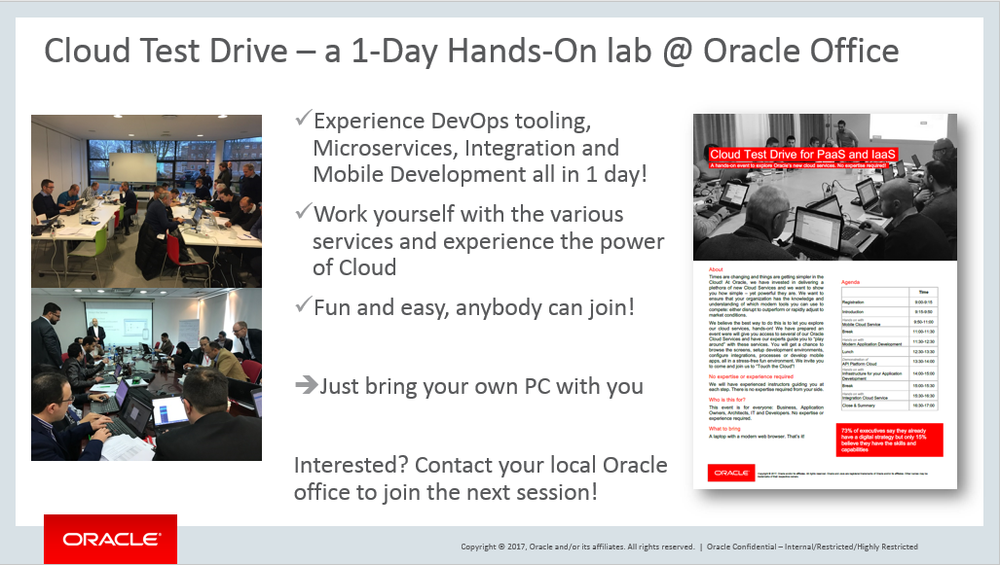

---
# ORACLE Cloud Test Drive #

## Introduction ##

This Oracle Cloud project contains the lab materials for the Oracle Cloud Test Drive events organized in various locations.  Participants can experiment through these labs with a series of Oracle Cloud Services from the IaaS and PaaS family.  

During this day you will be able to experience the various cloud services from Oracle hands-on.  Below you find the link to all labs already available : 

## Low Code Development ##

+ [Building an intelligent Banking Bot](Mobile/IntelligentBots/readme.md) - Define a simple ChatBot, create two intents and a few utterances.  Finally you'll train and test your bot to see how it works.

## Application Development ##

+ [AppDev Development lab](AppDev/Develop.md) - Building applications with DevOps: using Developer Cloud Service to build a SpringBoot application and deploying to Application Container Cloud Service
+ [AppDev Infrastructure lab](AppDev/AppDevInfra.md) - Set up the infrastructure to run your applications : create a Database and Application Servers, either using DBaaS or JCS, or use Docker Container to spin up any conainer from the Docker repository

## Container Native labs ##

+ [CI/CD with Container Pipelines, Container Registry and Kubernetes Cluster to deploy an Angular Node application](AppDev/K8S/readme.md)

## Prerequisites ##

The workshop is intended to work with the Oracle Cloud account information handed out to you during the event.  You will need the following information to start working on these exercises :

+ Oracle Cloud account **username** and **password**
+ Oracle Cloud **identity domain**
+ **Data center/region**

Alternatively you can request an Oracle PaaS trial account. To get an account look into [here](common/request.for.trial.md).

